# Mermaid Flowchart Animation

Generated 54 frames.

## Frame 1

```mermaid
flowchart TD
```

## Frame 2

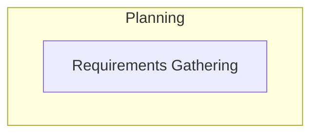

## Frame 3

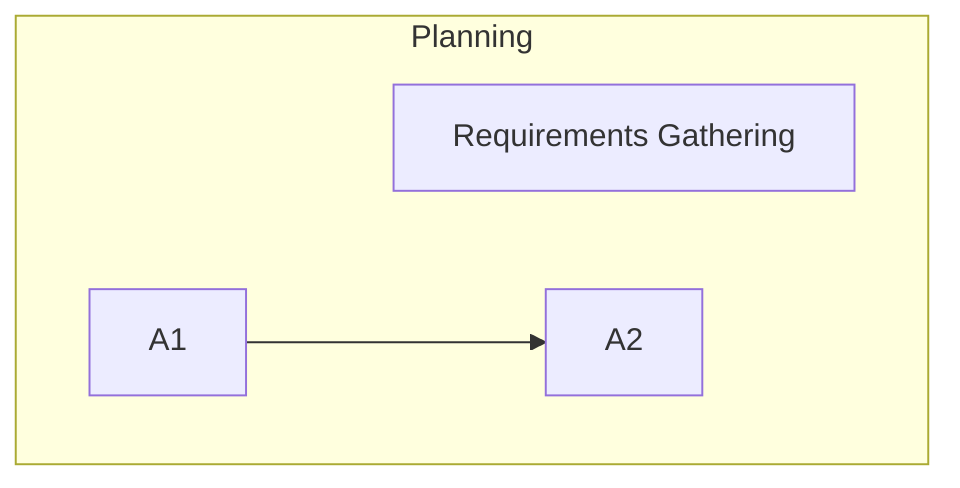

## Frame 4

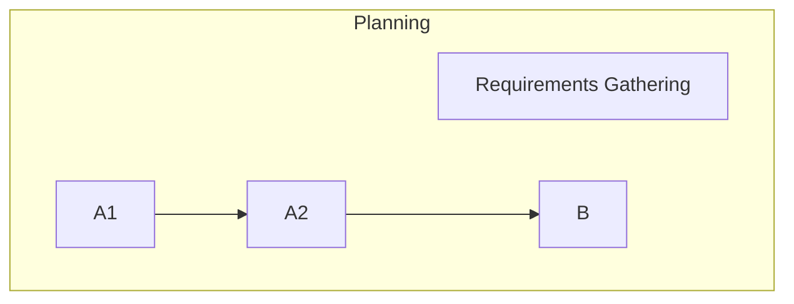

## Frame 5

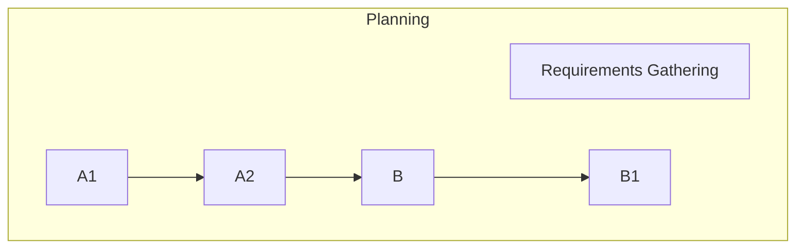

## Frame 6

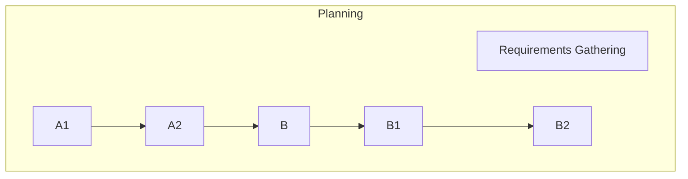

## Frame 7

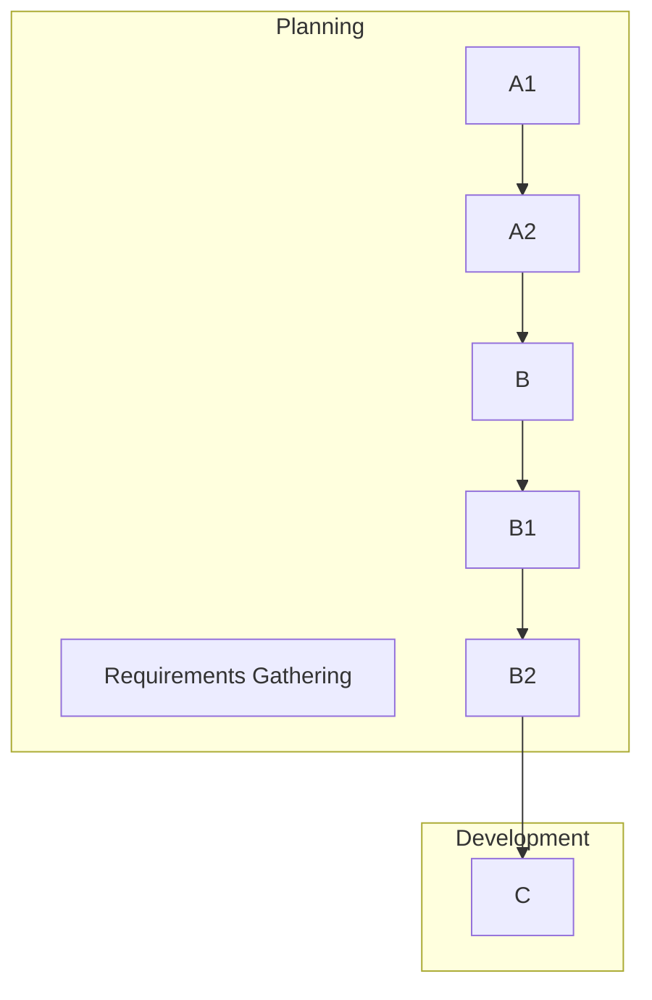

## Frame 8

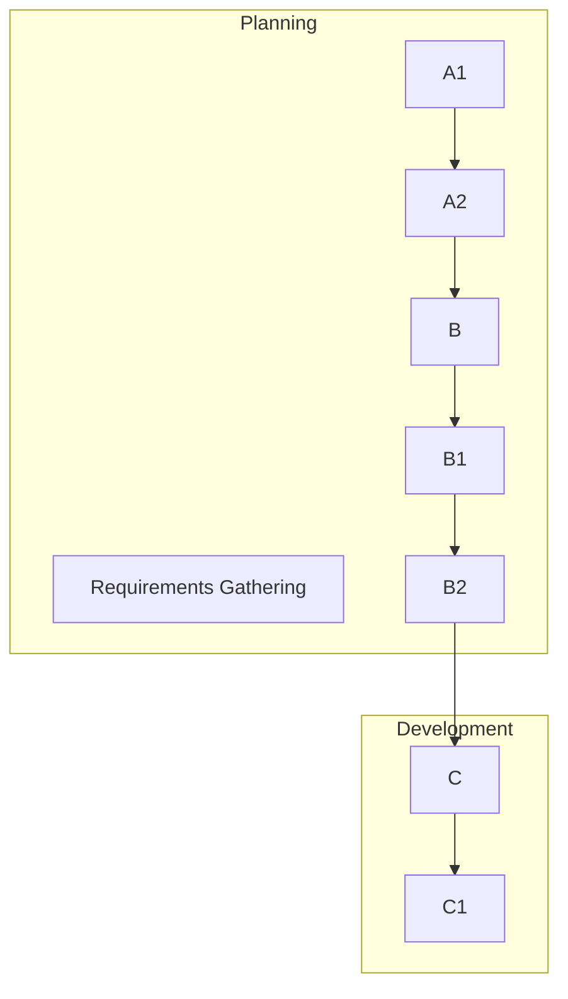

## Frame 9

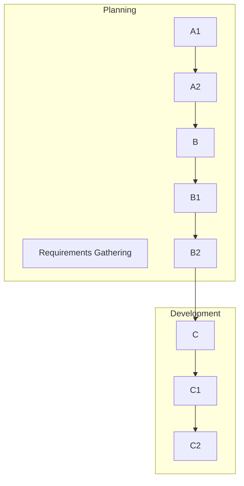

## Frame 10

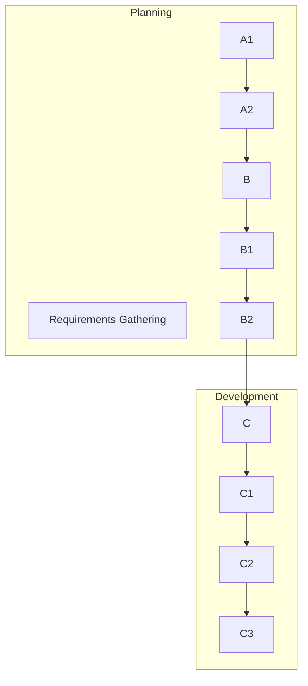

## Frame 11

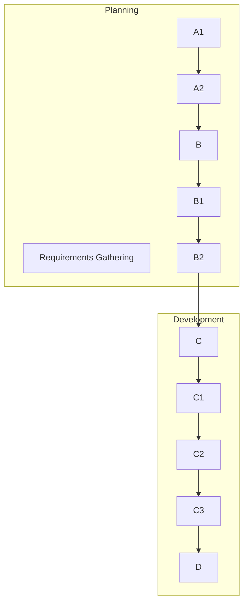

## Frame 12

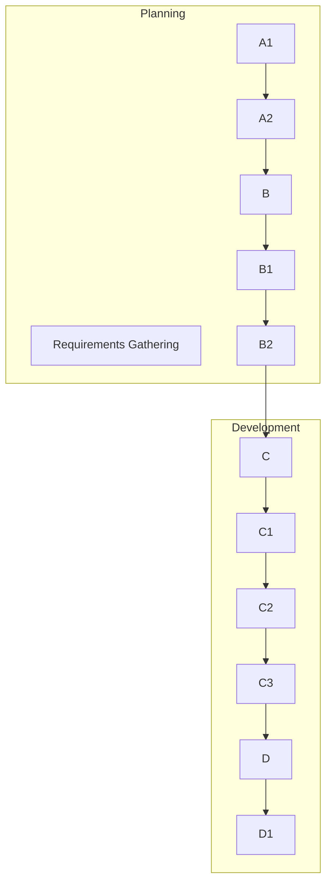

## Frame 13

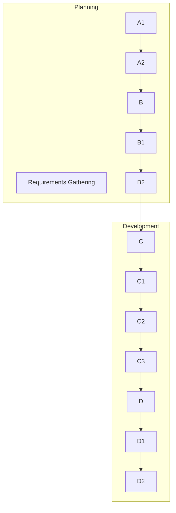

## Frame 14

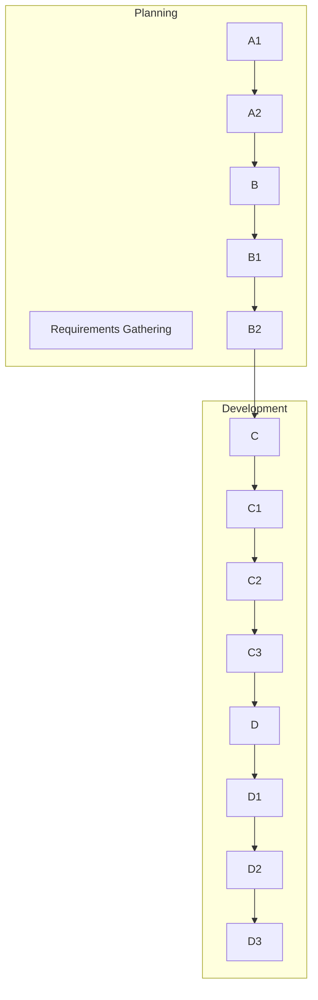

## Frame 15

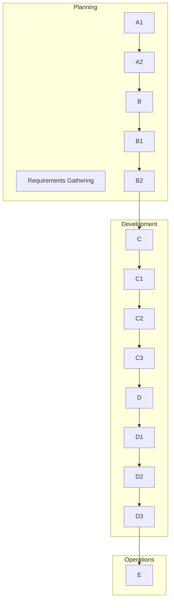

## Frame 16

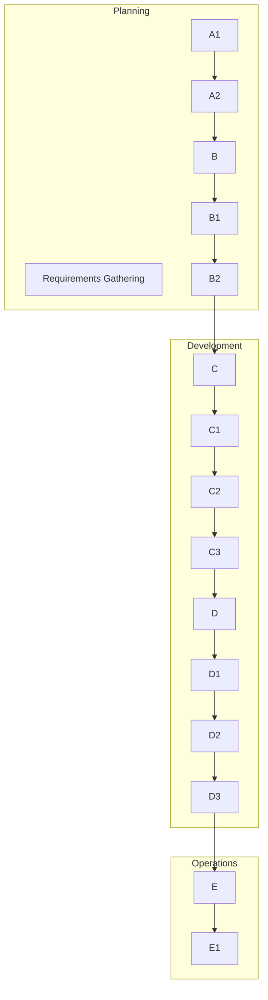

## Frame 17

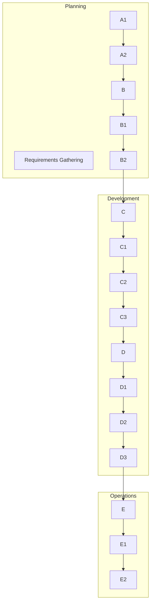

## Frame 18

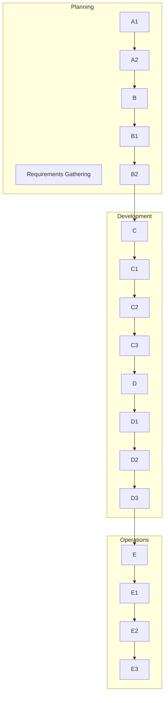

## Frame 19


## Frame 20

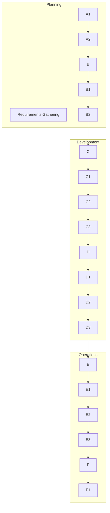

## Frame 21

```mermaid
flowchart TD
    A[Requirements Gathering]
    A1
    A2
    B
    B1
    B2
    C
    C1
    C2
    C3
    D
    D1
    D2
    D3
    E
    E1
    E2
    E3
    F
    F1
    F2
    A1 --> A2
    A2 --> B
    B --> B1
    B1 --> B2
    B2 --> C
    C --> C1
    C1 --> C2
    C2 --> C3
    C3 --> D
    D --> D1
    D1 --> D2
    D2 --> D3
    D3 --> E
    E --> E1
    E1 --> E2
    E2 --> E3
    E3 --> F
    F --> F1
    F1 --> F2
    subgraph Planning
        A
        A1
        A2
        B
        B1
        B2
    end
    subgraph Development
        C
        C1
        C2
        C3
        D
        D1
        D2
        D3
    end
    subgraph Operations
        E
        E1
        E2
        E3
        F
        F1
        F2
    end
```

## Frame 22

```mermaid
flowchart TD
    A[Requirements Gathering]
    A1
    A2
    B
    B1
    B2
    C
    C1
    C2
    C3
    D
    D1
    D2
    D3
    E
    E1
    E2
    E3
    F
    F1
    F2
    F3
    A1 --> A2
    A2 --> B
    B --> B1
    B1 --> B2
    B2 --> C
    C --> C1
    C1 --> C2
    C2 --> C3
    C3 --> D
    D --> D1
    D1 --> D2
    D2 --> D3
    D3 --> E
    E --> E1
    E1 --> E2
    E2 --> E3
    E3 --> F
    F --> F1
    F1 --> F2
    F2 --> F3
    subgraph Planning
        A
        A1
        A2
        B
        B1
        B2
    end
    subgraph Development
        C
        C1
        C2
        C3
        D
        D1
        D2
        D3
    end
    subgraph Operations
        E
        E1
        E2
        E3
        F
        F1
        F2
        F3
    end
```

## Frame 23

```mermaid
flowchart TD
    A[Requirements Gathering]
    A1
    A2
    B
    B1
    B2
    C
    C1
    C2
    C3
    D
    D1
    D2
    D3
    E
    E1
    E2
    E3
    F
    F1
    F2
    F3
    A1 --> A2
    A2 --> B
    B --> B1
    B1 --> B2
    B2 --> C
    C --> C1
    C1 --> C2
    C2 --> C3
    C3 --> D
    D --> D1
    D1 --> D2
    D2 --> D3
    D3 --> E
    E --> E1
    E1 --> E2
    E2 --> E3
    E3 --> F
    F --> F1
    F1 --> F2
    F2 --> F3
    D1 -->|Integration Issues| C1
    subgraph Planning
        A
        A1
        A2
        B
        B1
        B2
    end
    subgraph Development
        C
        C1
        C2
        C3
        D
        D1
        D2
        D3
    end
    subgraph Operations
        E
        E1
        E2
        E3
        F
        F1
        F2
        F3
    end
```

## Frame 24

```mermaid
flowchart TD
    A[Requirements Gathering]
    A1
    A2
    B
    B1
    B2
    C
    C1
    C2
    C3
    D
    D1
    D2
    D3
    E
    E1
    E2
    E3
    F
    F1
    F2
    F3
    A1 --> A2
    A2 --> B
    B --> B1
    B1 --> B2
    B2 --> C
    C --> C1
    C1 --> C2
    C2 --> C3
    C3 --> D
    D --> D1
    D1 --> D2
    D2 --> D3
    D3 --> E
    E --> E1
    E1 --> E2
    E2 --> E3
    E3 --> F
    F --> F1
    F1 --> F2
    F2 --> F3
    D1 -->|Integration Issues| C1
    D2 -->|System Bugs| C
    subgraph Planning
        A
        A1
        A2
        B
        B1
        B2
    end
    subgraph Development
        C
        C1
        C2
        C3
        D
        D1
        D2
        D3
    end
    subgraph Operations
        E
        E1
        E2
        E3
        F
        F1
        F2
        F3
    end
```

## Frame 25

```mermaid
flowchart TD
    A[Requirements Gathering]
    A1
    A2
    B
    B1
    B2
    C
    C1
    C2
    C3
    D
    D1
    D2
    D3
    E
    E1
    E2
    E3
    F
    F1
    F2
    F3
    A1 --> A2
    A2 --> B
    B --> B1
    B1 --> B2
    B2 --> C
    C --> C1
    C1 --> C2
    C2 --> C3
    C3 --> D
    D --> D1
    D1 --> D2
    D2 --> D3
    D3 --> E
    E --> E1
    E1 --> E2
    E2 --> E3
    E3 --> F
    F --> F1
    F1 --> F2
    F2 --> F3
    D1 -->|Integration Issues| C1
    D2 -->|System Bugs| C
    D3 -->|UAT Feedback| B2
    subgraph Planning
        A
        A1
        A2
        B
        B1
        B2
    end
    subgraph Development
        C
        C1
        C2
        C3
        D
        D1
        D2
        D3
    end
    subgraph Operations
        E
        E1
        E2
        E3
        F
        F1
        F2
        F3
    end
```

## Frame 26

```mermaid
flowchart TD
    A[Requirements Gathering]
    A1
    A2
    B
    B1
    B2
    C
    C1
    C2
    C3
    D
    D1
    D2
    D3
    E
    E1
    E2
    E3
    F
    F1
    F2
    F3
    A1 --> A2
    A2 --> B
    B --> B1
    B1 --> B2
    B2 --> C
    C --> C1
    C1 --> C2
    C2 --> C3
    C3 --> D
    D --> D1
    D1 --> D2
    D2 --> D3
    D3 --> E
    E --> E1
    E1 --> E2
    E2 --> E3
    E3 --> F
    F --> F1
    F1 --> F2
    F2 --> F3
    D1 -->|Integration Issues| C1
    D2 -->|System Bugs| C
    D3 -->|UAT Feedback| B2
    E3 -->|Deployment Issues| D2
    subgraph Planning
        A
        A1
        A2
        B
        B1
        B2
    end
    subgraph Development
        C
        C1
        C2
        C3
        D
        D1
        D2
        D3
    end
    subgraph Operations
        E
        E1
        E2
        E3
        F
        F1
        F2
        F3
    end
```

## Frame 27

```mermaid
flowchart TD
    A[Requirements Gathering]
    A1
    A2
    B
    B1
    B2
    C
    C1
    C2
    C3
    D
    D1
    D2
    D3
    E
    E1
    E2
    E3
    F
    F1
    F2
    F3
    A1 --> A2
    A2 --> B
    B --> B1
    B1 --> B2
    B2 --> C
    C --> C1
    C1 --> C2
    C2 --> C3
    C3 --> D
    D --> D1
    D1 --> D2
    D2 --> D3
    D3 --> E
    E --> E1
    E1 --> E2
    E2 --> E3
    E3 --> F
    F --> F1
    F1 --> F2
    F2 --> F3
    D1 -->|Integration Issues| C1
    D2 -->|System Bugs| C
    D3 -->|UAT Feedback| B2
    E3 -->|Deployment Issues| D2
    F1 -->|Critical Bugs| C1
    subgraph Planning
        A
        A1
        A2
        B
        B1
        B2
    end
    subgraph Development
        C
        C1
        C2
        C3
        D
        D1
        D2
        D3
    end
    subgraph Operations
        E
        E1
        E2
        E3
        F
        F1
        F2
        F3
    end
```

## Frame 28

```mermaid
flowchart TD
    A[Requirements Gathering]
    A1
    A2
    B
    B1
    B2
    C
    C1
    C2
    C3
    D
    D1
    D2
    D3
    E
    E1
    E2
    E3
    F
    F1
    F2
    F3
    A1 --> A2
    A2 --> B
    B --> B1
    B1 --> B2
    B2 --> C
    C --> C1
    C1 --> C2
    C2 --> C3
    C3 --> D
    D --> D1
    D1 --> D2
    D2 --> D3
    D3 --> E
    E --> E1
    E1 --> E2
    E2 --> E3
    E3 --> F
    F --> F1
    F1 --> F2
    F2 --> F3
    D1 -->|Integration Issues| C1
    D2 -->|System Bugs| C
    D3 -->|UAT Feedback| B2
    E3 -->|Deployment Issues| D2
    F1 -->|Critical Bugs| C1
    F2 -->|New Features Needed| A
    subgraph Planning
        A
        A1
        A2
        B
        B1
        B2
    end
    subgraph Development
        C
        C1
        C2
        C3
        D
        D1
        D2
        D3
    end
    subgraph Operations
        E
        E1
        E2
        E3
        F
        F1
        F2
        F3
    end
```

## Frame 29

```mermaid
flowchart TD
    A[Requirements Gathering]
    A1
    A2
    B
    B1
    B2
    C
    C1
    C2
    C3
    D
    D1
    D2
    D3
    E
    E1
    E2
    E3
    F
    F1
    F2
    F3
    A1 --> A2
    A2 --> B
    B --> B1
    B1 --> B2
    B2 --> C
    C --> C1
    C1 --> C2
    C2 --> C3
    C3 --> D
    D --> D1
    D1 --> D2
    D2 --> D3
    D3 --> E
    E --> E1
    E1 --> E2
    E2 --> E3
    E3 --> F
    F --> F1
    F1 --> F2
    F2 --> F3
    D1 -->|Integration Issues| C1
    D2 -->|System Bugs| C
    D3 -->|UAT Feedback| B2
    E3 -->|Deployment Issues| D2
    F1 -->|Critical Bugs| C1
    F2 -->|New Features Needed| A
    F3 -->|Architecture Limitations| B1
    subgraph Planning
        A
        A1
        A2
        B
        B1
        B2
    end
    subgraph Development
        C
        C1
        C2
        C3
        D
        D1
        D2
        D3
    end
    subgraph Operations
        E
        E1
        E2
        E3
        F
        F1
        F2
        F3
    end
```

## Frame 30

```mermaid
flowchart TD
    A[Requirements Gathering]
    A1
    A2
    B
    B1
    B2
    C
    C1
    C2
    C3
    D
    D1
    D2
    D3
    E
    E1
    E2
    E3
    F
    F1
    F2
    F3
    A1 --> A2
    A2 --> B
    B --> B1
    B1 --> B2
    B2 --> C
    C --> C1
    C1 --> C2
    C2 --> C3
    C3 --> D
    D --> D1
    D1 --> D2
    D2 --> D3
    D3 --> E
    E --> E1
    E1 --> E2
    E2 --> E3
    E3 --> F
    F --> F1
    F1 --> F2
    F2 --> F3
    D1 -->|Integration Issues| C1
    D2 -->|System Bugs| C
    D3 -->|UAT Feedback| B2
    E3 -->|Deployment Issues| D2
    F1 -->|Critical Bugs| C1
    F2 -->|New Features Needed| A
    F3 -->|Architecture Limitations| B1
    A1 -.->|Feasibility Check| B1
    subgraph Planning
        A
        A1
        A2
        B
        B1
        B2
    end
    subgraph Development
        C
        C1
        C2
        C3
        D
        D1
        D2
        D3
    end
    subgraph Operations
        E
        E1
        E2
        E3
        F
        F1
        F2
        F3
    end
```

## Frame 31

```mermaid
flowchart TD
    A[Requirements Gathering]
    A1
    A2
    B
    B1
    B2
    C
    C1
    C2
    C3
    D
    D1
    D2
    D3
    E
    E1
    E2
    E3
    F
    F1
    F2
    F3
    A1 --> A2
    A2 --> B
    B --> B1
    B1 --> B2
    B2 --> C
    C --> C1
    C1 --> C2
    C2 --> C3
    C3 --> D
    D --> D1
    D1 --> D2
    D2 --> D3
    D3 --> E
    E --> E1
    E1 --> E2
    E2 --> E3
    E3 --> F
    F --> F1
    F1 --> F2
    F2 --> F3
    D1 -->|Integration Issues| C1
    D2 -->|System Bugs| C
    D3 -->|UAT Feedback| B2
    E3 -->|Deployment Issues| D2
    F1 -->|Critical Bugs| C1
    F2 -->|New Features Needed| A
    F3 -->|Architecture Limitations| B1
    A1 -.->|Feasibility Check| B1
    B2 -.->|Design Review| A2
    subgraph Planning
        A
        A1
        A2
        B
        B1
        B2
    end
    subgraph Development
        C
        C1
        C2
        C3
        D
        D1
        D2
        D3
    end
    subgraph Operations
        E
        E1
        E2
        E3
        F
        F1
        F2
        F3
    end
```

## Frame 32

```mermaid
flowchart TD
    A[Requirements Gathering]
    A1
    A2
    B
    B1
    B2
    C
    C1
    C2
    C3
    D
    D1
    D2
    D3
    E
    E1
    E2
    E3
    F
    F1
    F2
    F3
    A1 --> A2
    A2 --> B
    B --> B1
    B1 --> B2
    B2 --> C
    C --> C1
    C1 --> C2
    C2 --> C3
    C3 --> D
    D --> D1
    D1 --> D2
    D2 --> D3
    D3 --> E
    E --> E1
    E1 --> E2
    E2 --> E3
    E3 --> F
    F --> F1
    F1 --> F2
    F2 --> F3
    D1 -->|Integration Issues| C1
    D2 -->|System Bugs| C
    D3 -->|UAT Feedback| B2
    E3 -->|Deployment Issues| D2
    F1 -->|Critical Bugs| C1
    F2 -->|New Features Needed| A
    F3 -->|Architecture Limitations| B1
    A1 -.->|Feasibility Check| B1
    B2 -.->|Design Review| A2
    C2 -.->|Standards Compliance| B2
    subgraph Planning
        A
        A1
        A2
        B
        B1
        B2
    end
    subgraph Development
        C
        C1
        C2
        C3
        D
        D1
        D2
        D3
    end
    subgraph Operations
        E
        E1
        E2
        E3
        F
        F1
        F2
        F3
    end
```

## Frame 33

```mermaid
flowchart TD
    A[Requirements Gathering]
    A1
    A2
    B
    B1
    B2
    C
    C1
    C2
    C3
    D
    D1
    D2
    D3
    E
    E1
    E2
    E3
    F
    F1
    F2
    F3
    A1 --> A2
    A2 --> B
    B --> B1
    B1 --> B2
    B2 --> C
    C --> C1
    C1 --> C2
    C2 --> C3
    C3 --> D
    D --> D1
    D1 --> D2
    D2 --> D3
    D3 --> E
    E --> E1
    E1 --> E2
    E2 --> E3
    E3 --> F
    F --> F1
    F1 --> F2
    F2 --> F3
    D1 -->|Integration Issues| C1
    D2 -->|System Bugs| C
    D3 -->|UAT Feedback| B2
    E3 -->|Deployment Issues| D2
    F1 -->|Critical Bugs| C1
    F2 -->|New Features Needed| A
    F3 -->|Architecture Limitations| B1
    A1 -.->|Feasibility Check| B1
    B2 -.->|Design Review| A2
    C2 -.->|Standards Compliance| B2
    E1 -.->|Infrastructure Requirements| B1
    subgraph Planning
        A
        A1
        A2
        B
        B1
        B2
    end
    subgraph Development
        C
        C1
        C2
        C3
        D
        D1
        D2
        D3
    end
    subgraph Operations
        E
        E1
        E2
        E3
        F
        F1
        F2
        F3
    end
```

## Frame 34

```mermaid
flowchart TD
    A[Requirements Gathering]
    A1
    A2
    B
    B1
    B2
    C
    C1
    C2
    C3
    D
    D1
    D2
    D3
    E
    E1
    E2
    E3
    F
    F1
    F2
    F3
    PM[Project Initiation]
    A1 --> A2
    A2 --> B
    B --> B1
    B1 --> B2
    B2 --> C
    C --> C1
    C1 --> C2
    C2 --> C3
    C3 --> D
    D --> D1
    D1 --> D2
    D2 --> D3
    D3 --> E
    E --> E1
    E1 --> E2
    E2 --> E3
    E3 --> F
    F --> F1
    F1 --> F2
    F2 --> F3
    D1 -->|Integration Issues| C1
    D2 -->|System Bugs| C
    D3 -->|UAT Feedback| B2
    E3 -->|Deployment Issues| D2
    F1 -->|Critical Bugs| C1
    F2 -->|New Features Needed| A
    F3 -->|Architecture Limitations| B1
    A1 -.->|Feasibility Check| B1
    B2 -.->|Design Review| A2
    C2 -.->|Standards Compliance| B2
    E1 -.->|Infrastructure Requirements| B1
    subgraph Planning
        A
        A1
        A2
        B
        B1
        B2
        PM
    end
    subgraph Development
        C
        C1
        C2
        C3
        D
        D1
        D2
        D3
    end
    subgraph Operations
        E
        E1
        E2
        E3
        F
        F1
        F2
        F3
    end
```

## Frame 35

```mermaid
flowchart TD
    A[Requirements Gathering]
    A1
    A2
    B
    B1
    B2
    C
    C1
    C2
    C3
    D
    D1
    D2
    D3
    E
    E1
    E2
    E3
    F
    F1
    F2
    F3
    PM[Project Initiation]
    PM1
    PM2
    A1 --> A2
    A2 --> B
    B --> B1
    B1 --> B2
    B2 --> C
    C --> C1
    C1 --> C2
    C2 --> C3
    C3 --> D
    D --> D1
    D1 --> D2
    D2 --> D3
    D3 --> E
    E --> E1
    E1 --> E2
    E2 --> E3
    E3 --> F
    F --> F1
    F1 --> F2
    F2 --> F3
    D1 -->|Integration Issues| C1
    D2 -->|System Bugs| C
    D3 -->|UAT Feedback| B2
    E3 -->|Deployment Issues| D2
    F1 -->|Critical Bugs| C1
    F2 -->|New Features Needed| A
    F3 -->|Architecture Limitations| B1
    A1 -.->|Feasibility Check| B1
    B2 -.->|Design Review| A2
    C2 -.->|Standards Compliance| B2
    E1 -.->|Infrastructure Requirements| B1
    PM1 --> PM2
    subgraph Planning
        A
        A1
        A2
        B
        B1
        B2
        PM
        PM1
        PM2
    end
    subgraph Development
        C
        C1
        C2
        C3
        D
        D1
        D2
        D3
    end
    subgraph Operations
        E
        E1
        E2
        E3
        F
        F1
        F2
        F3
    end
```

## Frame 36

```mermaid
flowchart TD
    A[Requirements Gathering]
    A1
    A2
    B
    B1
    B2
    C
    C1
    C2
    C3
    D
    D1
    D2
    D3
    E
    E1
    E2
    E3
    F
    F1
    F2
    F3
    PM[Project Initiation]
    PM1
    PM2
    PM3
    A1 --> A2
    A2 --> B
    B --> B1
    B1 --> B2
    B2 --> C
    C --> C1
    C1 --> C2
    C2 --> C3
    C3 --> D
    D --> D1
    D1 --> D2
    D2 --> D3
    D3 --> E
    E --> E1
    E1 --> E2
    E2 --> E3
    E3 --> F
    F --> F1
    F1 --> F2
    F2 --> F3
    D1 -->|Integration Issues| C1
    D2 -->|System Bugs| C
    D3 -->|UAT Feedback| B2
    E3 -->|Deployment Issues| D2
    F1 -->|Critical Bugs| C1
    F2 -->|New Features Needed| A
    F3 -->|Architecture Limitations| B1
    A1 -.->|Feasibility Check| B1
    B2 -.->|Design Review| A2
    C2 -.->|Standards Compliance| B2
    E1 -.->|Infrastructure Requirements| B1
    PM1 --> PM2
    PM2 --> PM3
    subgraph Planning
        A
        A1
        A2
        B
        B1
        B2
        PM
        PM1
        PM2
    end
    subgraph Development
        C
        C1
        C2
        C3
        D
        D1
        D2
        D3
        PM3
    end
    subgraph Operations
        E
        E1
        E2
        E3
        F
        F1
        F2
        F3
    end
```

## Frame 37

```mermaid
flowchart TD
    A[Requirements Gathering]
    A1
    A2
    B
    B1
    B2
    C
    C1
    C2
    C3
    D
    D1
    D2
    D3
    E
    E1
    E2
    E3
    F
    F1
    F2
    F3
    PM[Project Initiation]
    PM1
    PM2
    PM3
    PM4
    A1 --> A2
    A2 --> B
    B --> B1
    B1 --> B2
    B2 --> C
    C --> C1
    C1 --> C2
    C2 --> C3
    C3 --> D
    D --> D1
    D1 --> D2
    D2 --> D3
    D3 --> E
    E --> E1
    E1 --> E2
    E2 --> E3
    E3 --> F
    F --> F1
    F1 --> F2
    F2 --> F3
    D1 -->|Integration Issues| C1
    D2 -->|System Bugs| C
    D3 -->|UAT Feedback| B2
    E3 -->|Deployment Issues| D2
    F1 -->|Critical Bugs| C1
    F2 -->|New Features Needed| A
    F3 -->|Architecture Limitations| B1
    A1 -.->|Feasibility Check| B1
    B2 -.->|Design Review| A2
    C2 -.->|Standards Compliance| B2
    E1 -.->|Infrastructure Requirements| B1
    PM1 --> PM2
    PM2 --> PM3
    PM3 --> PM4
    subgraph Planning
        A
        A1
        A2
        B
        B1
        B2
        PM
        PM1
        PM2
    end
    subgraph Development
        C
        C1
        C2
        C3
        D
        D1
        D2
        D3
        PM3
        PM4
    end
    subgraph Operations
        E
        E1
        E2
        E3
        F
        F1
        F2
        F3
    end
```

## Frame 38

```mermaid
flowchart TD
    A[Requirements Gathering]
    A1
    A2
    B
    B1
    B2
    C
    C1
    C2
    C3
    D
    D1
    D2
    D3
    E
    E1
    E2
    E3
    F
    F1
    F2
    F3
    PM[Project Initiation]
    PM1
    PM2
    PM3
    PM4
    PM5
    A1 --> A2
    A2 --> B
    B --> B1
    B1 --> B2
    B2 --> C
    C --> C1
    C1 --> C2
    C2 --> C3
    C3 --> D
    D --> D1
    D1 --> D2
    D2 --> D3
    D3 --> E
    E --> E1
    E1 --> E2
    E2 --> E3
    E3 --> F
    F --> F1
    F1 --> F2
    F2 --> F3
    D1 -->|Integration Issues| C1
    D2 -->|System Bugs| C
    D3 -->|UAT Feedback| B2
    E3 -->|Deployment Issues| D2
    F1 -->|Critical Bugs| C1
    F2 -->|New Features Needed| A
    F3 -->|Architecture Limitations| B1
    A1 -.->|Feasibility Check| B1
    B2 -.->|Design Review| A2
    C2 -.->|Standards Compliance| B2
    E1 -.->|Infrastructure Requirements| B1
    PM1 --> PM2
    PM2 --> PM3
    PM3 --> PM4
    PM4 --> PM5
    subgraph Planning
        A
        A1
        A2
        B
        B1
        B2
        PM
        PM1
        PM2
    end
    subgraph Development
        C
        C1
        C2
        C3
        D
        D1
        D2
        D3
        PM3
        PM4
    end
    subgraph Operations
        E
        E1
        E2
        E3
        F
        F1
        F2
        F3
        PM5
    end
```

## Frame 39

```mermaid
flowchart TD
    A[Requirements Gathering]
    A1
    A2
    B
    B1
    B2
    C
    C1
    C2
    C3
    D
    D1
    D2
    D3
    E
    E1
    E2
    E3
    F
    F1
    F2
    F3
    PM[Project Initiation]
    PM1
    PM2
    PM3
    PM4
    PM5
    PM6
    A1 --> A2
    A2 --> B
    B --> B1
    B1 --> B2
    B2 --> C
    C --> C1
    C1 --> C2
    C2 --> C3
    C3 --> D
    D --> D1
    D1 --> D2
    D2 --> D3
    D3 --> E
    E --> E1
    E1 --> E2
    E2 --> E3
    E3 --> F
    F --> F1
    F1 --> F2
    F2 --> F3
    D1 -->|Integration Issues| C1
    D2 -->|System Bugs| C
    D3 -->|UAT Feedback| B2
    E3 -->|Deployment Issues| D2
    F1 -->|Critical Bugs| C1
    F2 -->|New Features Needed| A
    F3 -->|Architecture Limitations| B1
    A1 -.->|Feasibility Check| B1
    B2 -.->|Design Review| A2
    C2 -.->|Standards Compliance| B2
    E1 -.->|Infrastructure Requirements| B1
    PM1 --> PM2
    PM2 --> PM3
    PM3 --> PM4
    PM4 --> PM5
    PM5 --> PM6
    subgraph Planning
        A
        A1
        A2
        B
        B1
        B2
        PM
        PM1
        PM2
    end
    subgraph Development
        C
        C1
        C2
        C3
        D
        D1
        D2
        D3
        PM3
        PM4
    end
    subgraph Operations
        E
        E1
        E2
        E3
        F
        F1
        F2
        F3
        PM5
        PM6
    end
```

## Frame 40

```mermaid
flowchart TD
    A[Requirements Gathering]
    A1
    A2
    B
    B1
    B2
    C
    C1
    C2
    C3
    D
    D1
    D2
    D3
    E
    E1
    E2
    E3
    F
    F1
    F2
    F3
    PM[Project Initiation]
    PM1
    PM2
    PM3
    PM4
    PM5
    PM6
    A1 --> A2
    A2 --> B
    B --> B1
    B1 --> B2
    B2 --> C
    C --> C1
    C1 --> C2
    C2 --> C3
    C3 --> D
    D --> D1
    D1 --> D2
    D2 --> D3
    D3 --> E
    E --> E1
    E1 --> E2
    E2 --> E3
    E3 --> F
    F --> F1
    F1 --> F2
    F2 --> F3
    D1 -->|Integration Issues| C1
    D2 -->|System Bugs| C
    D3 -->|UAT Feedback| B2
    E3 -->|Deployment Issues| D2
    F1 -->|Critical Bugs| C1
    F2 -->|New Features Needed| A
    F3 -->|Architecture Limitations| B1
    A1 -.->|Feasibility Check| B1
    B2 -.->|Design Review| A2
    C2 -.->|Standards Compliance| B2
    E1 -.->|Infrastructure Requirements| B1
    PM1 --> PM2
    PM2 --> PM3
    PM3 --> PM4
    PM4 --> PM5
    PM5 --> PM6
    PM1 -.-> A
    subgraph Planning
        A
        A1
        A2
        B
        B1
        B2
        PM
        PM1
        PM2
    end
    subgraph Development
        C
        C1
        C2
        C3
        D
        D1
        D2
        D3
        PM3
        PM4
    end
    subgraph Operations
        E
        E1
        E2
        E3
        F
        F1
        F2
        F3
        PM5
        PM6
    end
```

## Frame 41

```mermaid
flowchart TD
    A[Requirements Gathering]
    A1
    A2
    B
    B1
    B2
    C
    C1
    C2
    C3
    D
    D1
    D2
    D3
    E
    E1
    E2
    E3
    F
    F1
    F2
    F3
    PM[Project Initiation]
    PM1
    PM2
    PM3
    PM4
    PM5
    PM6
    A1 --> A2
    A2 --> B
    B --> B1
    B1 --> B2
    B2 --> C
    C --> C1
    C1 --> C2
    C2 --> C3
    C3 --> D
    D --> D1
    D1 --> D2
    D2 --> D3
    D3 --> E
    E --> E1
    E1 --> E2
    E2 --> E3
    E3 --> F
    F --> F1
    F1 --> F2
    F2 --> F3
    D1 -->|Integration Issues| C1
    D2 -->|System Bugs| C
    D3 -->|UAT Feedback| B2
    E3 -->|Deployment Issues| D2
    F1 -->|Critical Bugs| C1
    F2 -->|New Features Needed| A
    F3 -->|Architecture Limitations| B1
    A1 -.->|Feasibility Check| B1
    B2 -.->|Design Review| A2
    C2 -.->|Standards Compliance| B2
    E1 -.->|Infrastructure Requirements| B1
    PM1 --> PM2
    PM2 --> PM3
    PM3 --> PM4
    PM4 --> PM5
    PM5 --> PM6
    PM1 -.-> A
    PM2 -.-> B
    subgraph Planning
        A
        A1
        A2
        B
        B1
        B2
        PM
        PM1
        PM2
    end
    subgraph Development
        C
        C1
        C2
        C3
        D
        D1
        D2
        D3
        PM3
        PM4
    end
    subgraph Operations
        E
        E1
        E2
        E3
        F
        F1
        F2
        F3
        PM5
        PM6
    end
```

## Frame 42

```mermaid
flowchart TD
    A[Requirements Gathering]
    A1
    A2
    B
    B1
    B2
    C
    C1
    C2
    C3
    D
    D1
    D2
    D3
    E
    E1
    E2
    E3
    F
    F1
    F2
    F3
    PM[Project Initiation]
    PM1
    PM2
    PM3
    PM4
    PM5
    PM6
    A1 --> A2
    A2 --> B
    B --> B1
    B1 --> B2
    B2 --> C
    C --> C1
    C1 --> C2
    C2 --> C3
    C3 --> D
    D --> D1
    D1 --> D2
    D2 --> D3
    D3 --> E
    E --> E1
    E1 --> E2
    E2 --> E3
    E3 --> F
    F --> F1
    F1 --> F2
    F2 --> F3
    D1 -->|Integration Issues| C1
    D2 -->|System Bugs| C
    D3 -->|UAT Feedback| B2
    E3 -->|Deployment Issues| D2
    F1 -->|Critical Bugs| C1
    F2 -->|New Features Needed| A
    F3 -->|Architecture Limitations| B1
    A1 -.->|Feasibility Check| B1
    B2 -.->|Design Review| A2
    C2 -.->|Standards Compliance| B2
    E1 -.->|Infrastructure Requirements| B1
    PM1 --> PM2
    PM2 --> PM3
    PM3 --> PM4
    PM4 --> PM5
    PM5 --> PM6
    PM1 -.-> A
    PM2 -.-> B
    PM3 -.-> C
    subgraph Planning
        A
        A1
        A2
        B
        B1
        B2
        PM
        PM1
        PM2
    end
    subgraph Development
        C
        C1
        C2
        C3
        D
        D1
        D2
        D3
        PM3
        PM4
    end
    subgraph Operations
        E
        E1
        E2
        E3
        F
        F1
        F2
        F3
        PM5
        PM6
    end
```

## Frame 43

```mermaid
flowchart TD
    A[Requirements Gathering]
    A1
    A2
    B
    B1
    B2
    C
    C1
    C2
    C3
    D
    D1
    D2
    D3
    E
    E1
    E2
    E3
    F
    F1
    F2
    F3
    PM[Project Initiation]
    PM1
    PM2
    PM3
    PM4
    PM5
    PM6
    A1 --> A2
    A2 --> B
    B --> B1
    B1 --> B2
    B2 --> C
    C --> C1
    C1 --> C2
    C2 --> C3
    C3 --> D
    D --> D1
    D1 --> D2
    D2 --> D3
    D3 --> E
    E --> E1
    E1 --> E2
    E2 --> E3
    E3 --> F
    F --> F1
    F1 --> F2
    F2 --> F3
    D1 -->|Integration Issues| C1
    D2 -->|System Bugs| C
    D3 -->|UAT Feedback| B2
    E3 -->|Deployment Issues| D2
    F1 -->|Critical Bugs| C1
    F2 -->|New Features Needed| A
    F3 -->|Architecture Limitations| B1
    A1 -.->|Feasibility Check| B1
    B2 -.->|Design Review| A2
    C2 -.->|Standards Compliance| B2
    E1 -.->|Infrastructure Requirements| B1
    PM1 --> PM2
    PM2 --> PM3
    PM3 --> PM4
    PM4 --> PM5
    PM5 --> PM6
    PM1 -.-> A
    PM2 -.-> B
    PM3 -.-> C
    PM4 -.-> D
    subgraph Planning
        A
        A1
        A2
        B
        B1
        B2
        PM
        PM1
        PM2
    end
    subgraph Development
        C
        C1
        C2
        C3
        D
        D1
        D2
        D3
        PM3
        PM4
    end
    subgraph Operations
        E
        E1
        E2
        E3
        F
        F1
        F2
        F3
        PM5
        PM6
    end
```

## Frame 44

```mermaid
flowchart TD
    A[Requirements Gathering]
    A1
    A2
    B
    B1
    B2
    C
    C1
    C2
    C3
    D
    D1
    D2
    D3
    E
    E1
    E2
    E3
    F
    F1
    F2
    F3
    PM[Project Initiation]
    PM1
    PM2
    PM3
    PM4
    PM5
    PM6
    A1 --> A2
    A2 --> B
    B --> B1
    B1 --> B2
    B2 --> C
    C --> C1
    C1 --> C2
    C2 --> C3
    C3 --> D
    D --> D1
    D1 --> D2
    D2 --> D3
    D3 --> E
    E --> E1
    E1 --> E2
    E2 --> E3
    E3 --> F
    F --> F1
    F1 --> F2
    F2 --> F3
    D1 -->|Integration Issues| C1
    D2 -->|System Bugs| C
    D3 -->|UAT Feedback| B2
    E3 -->|Deployment Issues| D2
    F1 -->|Critical Bugs| C1
    F2 -->|New Features Needed| A
    F3 -->|Architecture Limitations| B1
    A1 -.->|Feasibility Check| B1
    B2 -.->|Design Review| A2
    C2 -.->|Standards Compliance| B2
    E1 -.->|Infrastructure Requirements| B1
    PM1 --> PM2
    PM2 --> PM3
    PM3 --> PM4
    PM4 --> PM5
    PM5 --> PM6
    PM1 -.-> A
    PM2 -.-> B
    PM3 -.-> C
    PM4 -.-> D
    PM5 -.-> E
    subgraph Planning
        A
        A1
        A2
        B
        B1
        B2
        PM
        PM1
        PM2
    end
    subgraph Development
        C
        C1
        C2
        C3
        D
        D1
        D2
        D3
        PM3
        PM4
    end
    subgraph Operations
        E
        E1
        E2
        E3
        F
        F1
        F2
        F3
        PM5
        PM6
    end
```

## Frame 45

```mermaid
flowchart TD
    A[Requirements Gathering]
    A1
    A2
    B
    B1
    B2
    C
    C1
    C2
    C3
    D
    D1
    D2
    D3
    E
    E1
    E2
    E3
    F
    F1
    F2
    F3
    PM[Project Initiation]
    PM1
    PM2
    PM3
    PM4
    PM5
    PM6
    A1 --> A2
    A2 --> B
    B --> B1
    B1 --> B2
    B2 --> C
    C --> C1
    C1 --> C2
    C2 --> C3
    C3 --> D
    D --> D1
    D1 --> D2
    D2 --> D3
    D3 --> E
    E --> E1
    E1 --> E2
    E2 --> E3
    E3 --> F
    F --> F1
    F1 --> F2
    F2 --> F3
    D1 -->|Integration Issues| C1
    D2 -->|System Bugs| C
    D3 -->|UAT Feedback| B2
    E3 -->|Deployment Issues| D2
    F1 -->|Critical Bugs| C1
    F2 -->|New Features Needed| A
    F3 -->|Architecture Limitations| B1
    A1 -.->|Feasibility Check| B1
    B2 -.->|Design Review| A2
    C2 -.->|Standards Compliance| B2
    E1 -.->|Infrastructure Requirements| B1
    PM1 --> PM2
    PM2 --> PM3
    PM3 --> PM4
    PM4 --> PM5
    PM5 --> PM6
    PM1 -.-> A
    PM2 -.-> B
    PM3 -.-> C
    PM4 -.-> D
    PM5 -.-> E
    PM6 -.-> F
    subgraph Planning
        A
        A1
        A2
        B
        B1
        B2
        PM
        PM1
        PM2
    end
    subgraph Development
        C
        C1
        C2
        C3
        D
        D1
        D2
        D3
        PM3
        PM4
    end
    subgraph Operations
        E
        E1
        E2
        E3
        F
        F1
        F2
        F3
        PM5
        PM6
    end
```

## Frame 46

```mermaid
flowchart TD
    A[Requirements Gathering]
    A1
    A2
    B
    B1
    B2
    C
    C1
    C2
    C3
    D
    D1
    D2
    D3
    E
    E1
    E2
    E3
    F
    F1
    F2
    F3
    PM[Project Initiation]
    PM1
    PM2
    PM3
    PM4
    PM5
    PM6
    QA[Quality Planning]
    A1 --> A2
    A2 --> B
    B --> B1
    B1 --> B2
    B2 --> C
    C --> C1
    C1 --> C2
    C2 --> C3
    C3 --> D
    D --> D1
    D1 --> D2
    D2 --> D3
    D3 --> E
    E --> E1
    E1 --> E2
    E2 --> E3
    E3 --> F
    F --> F1
    F1 --> F2
    F2 --> F3
    D1 -->|Integration Issues| C1
    D2 -->|System Bugs| C
    D3 -->|UAT Feedback| B2
    E3 -->|Deployment Issues| D2
    F1 -->|Critical Bugs| C1
    F2 -->|New Features Needed| A
    F3 -->|Architecture Limitations| B1
    A1 -.->|Feasibility Check| B1
    B2 -.->|Design Review| A2
    C2 -.->|Standards Compliance| B2
    E1 -.->|Infrastructure Requirements| B1
    PM1 --> PM2
    PM2 --> PM3
    PM3 --> PM4
    PM4 --> PM5
    PM5 --> PM6
    PM1 -.-> A
    PM2 -.-> B
    PM3 -.-> C
    PM4 -.-> D
    PM5 -.-> E
    PM6 -.-> F
    subgraph Planning
        A
        A1
        A2
        B
        B1
        B2
        PM
        PM1
        PM2
        QA
    end
    subgraph Development
        C
        C1
        C2
        C3
        D
        D1
        D2
        D3
        PM3
        PM4
    end
    subgraph Operations
        E
        E1
        E2
        E3
        F
        F1
        F2
        F3
        PM5
        PM6
    end
```

## Frame 47

```mermaid
flowchart TD
    A[Requirements Gathering]
    A1
    A2
    B
    B1
    B2
    C
    C1
    C2
    C3
    D
    D1
    D2
    D3
    E
    E1
    E2
    E3
    F
    F1
    F2
    F3
    PM[Project Initiation]
    PM1
    PM2
    PM3
    PM4
    PM5
    PM6
    QA[Quality Planning]
    QA1
    QA2
    A1 --> A2
    A2 --> B
    B --> B1
    B1 --> B2
    B2 --> C
    C --> C1
    C1 --> C2
    C2 --> C3
    C3 --> D
    D --> D1
    D1 --> D2
    D2 --> D3
    D3 --> E
    E --> E1
    E1 --> E2
    E2 --> E3
    E3 --> F
    F --> F1
    F1 --> F2
    F2 --> F3
    D1 -->|Integration Issues| C1
    D2 -->|System Bugs| C
    D3 -->|UAT Feedback| B2
    E3 -->|Deployment Issues| D2
    F1 -->|Critical Bugs| C1
    F2 -->|New Features Needed| A
    F3 -->|Architecture Limitations| B1
    A1 -.->|Feasibility Check| B1
    B2 -.->|Design Review| A2
    C2 -.->|Standards Compliance| B2
    E1 -.->|Infrastructure Requirements| B1
    PM1 --> PM2
    PM2 --> PM3
    PM3 --> PM4
    PM4 --> PM5
    PM5 --> PM6
    PM1 -.-> A
    PM2 -.-> B
    PM3 -.-> C
    PM4 -.-> D
    PM5 -.-> E
    PM6 -.-> F
    QA1 --> QA2
    subgraph Planning
        A
        A1
        A2
        B
        B1
        B2
        PM
        PM1
        PM2
        QA
        QA1
    end
    subgraph Development
        C
        C1
        C2
        C3
        D
        D1
        D2
        D3
        PM3
        PM4
        QA2
    end
    subgraph Operations
        E
        E1
        E2
        E3
        F
        F1
        F2
        F3
        PM5
        PM6
    end
```

## Frame 48

```mermaid
flowchart TD
    A[Requirements Gathering]
    A1
    A2
    B
    B1
    B2
    C
    C1
    C2
    C3
    D
    D1
    D2
    D3
    E
    E1
    E2
    E3
    F
    F1
    F2
    F3
    PM[Project Initiation]
    PM1
    PM2
    PM3
    PM4
    PM5
    PM6
    QA[Quality Planning]
    QA1
    QA2
    QA3
    A1 --> A2
    A2 --> B
    B --> B1
    B1 --> B2
    B2 --> C
    C --> C1
    C1 --> C2
    C2 --> C3
    C3 --> D
    D --> D1
    D1 --> D2
    D2 --> D3
    D3 --> E
    E --> E1
    E1 --> E2
    E2 --> E3
    E3 --> F
    F --> F1
    F1 --> F2
    F2 --> F3
    D1 -->|Integration Issues| C1
    D2 -->|System Bugs| C
    D3 -->|UAT Feedback| B2
    E3 -->|Deployment Issues| D2
    F1 -->|Critical Bugs| C1
    F2 -->|New Features Needed| A
    F3 -->|Architecture Limitations| B1
    A1 -.->|Feasibility Check| B1
    B2 -.->|Design Review| A2
    C2 -.->|Standards Compliance| B2
    E1 -.->|Infrastructure Requirements| B1
    PM1 --> PM2
    PM2 --> PM3
    PM3 --> PM4
    PM4 --> PM5
    PM5 --> PM6
    PM1 -.-> A
    PM2 -.-> B
    PM3 -.-> C
    PM4 -.-> D
    PM5 -.-> E
    PM6 -.-> F
    QA1 --> QA2
    QA2 --> QA3
    subgraph Planning
        A
        A1
        A2
        B
        B1
        B2
        PM
        PM1
        PM2
        QA
        QA1
    end
    subgraph Development
        C
        C1
        C2
        C3
        D
        D1
        D2
        D3
        PM3
        PM4
        QA2
        QA3
    end
    subgraph Operations
        E
        E1
        E2
        E3
        F
        F1
        F2
        F3
        PM5
        PM6
    end
```

## Frame 49

```mermaid
flowchart TD
    A[Requirements Gathering]
    A1
    A2
    B
    B1
    B2
    C
    C1
    C2
    C3
    D
    D1
    D2
    D3
    E
    E1
    E2
    E3
    F
    F1
    F2
    F3
    PM[Project Initiation]
    PM1
    PM2
    PM3
    PM4
    PM5
    PM6
    QA[Quality Planning]
    QA1
    QA2
    QA3
    QA4
    A1 --> A2
    A2 --> B
    B --> B1
    B1 --> B2
    B2 --> C
    C --> C1
    C1 --> C2
    C2 --> C3
    C3 --> D
    D --> D1
    D1 --> D2
    D2 --> D3
    D3 --> E
    E --> E1
    E1 --> E2
    E2 --> E3
    E3 --> F
    F --> F1
    F1 --> F2
    F2 --> F3
    D1 -->|Integration Issues| C1
    D2 -->|System Bugs| C
    D3 -->|UAT Feedback| B2
    E3 -->|Deployment Issues| D2
    F1 -->|Critical Bugs| C1
    F2 -->|New Features Needed| A
    F3 -->|Architecture Limitations| B1
    A1 -.->|Feasibility Check| B1
    B2 -.->|Design Review| A2
    C2 -.->|Standards Compliance| B2
    E1 -.->|Infrastructure Requirements| B1
    PM1 --> PM2
    PM2 --> PM3
    PM3 --> PM4
    PM4 --> PM5
    PM5 --> PM6
    PM1 -.-> A
    PM2 -.-> B
    PM3 -.-> C
    PM4 -.-> D
    PM5 -.-> E
    PM6 -.-> F
    QA1 --> QA2
    QA2 --> QA3
    QA3 --> QA4
    subgraph Planning
        A
        A1
        A2
        B
        B1
        B2
        PM
        PM1
        PM2
        QA
        QA1
    end
    subgraph Development
        C
        C1
        C2
        C3
        D
        D1
        D2
        D3
        PM3
        PM4
        QA2
        QA3
    end
    subgraph Operations
        E
        E1
        E2
        E3
        F
        F1
        F2
        F3
        PM5
        PM6
        QA4
    end
```

## Frame 50

```mermaid
flowchart TD
    A[Requirements Gathering]
    A1
    A2
    B
    B1
    B2
    C
    C1
    C2
    C3
    D
    D1
    D2
    D3
    E
    E1
    E2
    E3
    F
    F1
    F2
    F3
    PM[Project Initiation]
    PM1
    PM2
    PM3
    PM4
    PM5
    PM6
    QA[Quality Planning]
    QA1
    QA2
    QA3
    QA4
    A1 --> A2
    A2 --> B
    B --> B1
    B1 --> B2
    B2 --> C
    C --> C1
    C1 --> C2
    C2 --> C3
    C3 --> D
    D --> D1
    D1 --> D2
    D2 --> D3
    D3 --> E
    E --> E1
    E1 --> E2
    E2 --> E3
    E3 --> F
    F --> F1
    F1 --> F2
    F2 --> F3
    D1 -->|Integration Issues| C1
    D2 -->|System Bugs| C
    D3 -->|UAT Feedback| B2
    E3 -->|Deployment Issues| D2
    F1 -->|Critical Bugs| C1
    F2 -->|New Features Needed| A
    F3 -->|Architecture Limitations| B1
    A1 -.->|Feasibility Check| B1
    B2 -.->|Design Review| A2
    C2 -.->|Standards Compliance| B2
    E1 -.->|Infrastructure Requirements| B1
    PM1 --> PM2
    PM2 --> PM3
    PM3 --> PM4
    PM4 --> PM5
    PM5 --> PM6
    PM1 -.-> A
    PM2 -.-> B
    PM3 -.-> C
    PM4 -.-> D
    PM5 -.-> E
    PM6 -.-> F
    QA1 --> QA2
    QA2 --> QA3
    QA3 --> QA4
    QA1 -.-> A2
    subgraph Planning
        A
        A1
        A2
        B
        B1
        B2
        PM
        PM1
        PM2
        QA
        QA1
    end
    subgraph Development
        C
        C1
        C2
        C3
        D
        D1
        D2
        D3
        PM3
        PM4
        QA2
        QA3
    end
    subgraph Operations
        E
        E1
        E2
        E3
        F
        F1
        F2
        F3
        PM5
        PM6
        QA4
    end
```

## Frame 51

```mermaid
flowchart TD
    A[Requirements Gathering]
    A1
    A2
    B
    B1
    B2
    C
    C1
    C2
    C3
    D
    D1
    D2
    D3
    E
    E1
    E2
    E3
    F
    F1
    F2
    F3
    PM[Project Initiation]
    PM1
    PM2
    PM3
    PM4
    PM5
    PM6
    QA[Quality Planning]
    QA1
    QA2
    QA3
    QA4
    A1 --> A2
    A2 --> B
    B --> B1
    B1 --> B2
    B2 --> C
    C --> C1
    C1 --> C2
    C2 --> C3
    C3 --> D
    D --> D1
    D1 --> D2
    D2 --> D3
    D3 --> E
    E --> E1
    E1 --> E2
    E2 --> E3
    E3 --> F
    F --> F1
    F1 --> F2
    F2 --> F3
    D1 -->|Integration Issues| C1
    D2 -->|System Bugs| C
    D3 -->|UAT Feedback| B2
    E3 -->|Deployment Issues| D2
    F1 -->|Critical Bugs| C1
    F2 -->|New Features Needed| A
    F3 -->|Architecture Limitations| B1
    A1 -.->|Feasibility Check| B1
    B2 -.->|Design Review| A2
    C2 -.->|Standards Compliance| B2
    E1 -.->|Infrastructure Requirements| B1
    PM1 --> PM2
    PM2 --> PM3
    PM3 --> PM4
    PM4 --> PM5
    PM5 --> PM6
    PM1 -.-> A
    PM2 -.-> B
    PM3 -.-> C
    PM4 -.-> D
    PM5 -.-> E
    PM6 -.-> F
    QA1 --> QA2
    QA2 --> QA3
    QA3 --> QA4
    QA1 -.-> A2
    QA2 -.-> B2
    subgraph Planning
        A
        A1
        A2
        B
        B1
        B2
        PM
        PM1
        PM2
        QA
        QA1
    end
    subgraph Development
        C
        C1
        C2
        C3
        D
        D1
        D2
        D3
        PM3
        PM4
        QA2
        QA3
    end
    subgraph Operations
        E
        E1
        E2
        E3
        F
        F1
        F2
        F3
        PM5
        PM6
        QA4
    end
```

## Frame 52

```mermaid
flowchart TD
    A[Requirements Gathering]
    A1
    A2
    B
    B1
    B2
    C
    C1
    C2
    C3
    D
    D1
    D2
    D3
    E
    E1
    E2
    E3
    F
    F1
    F2
    F3
    PM[Project Initiation]
    PM1
    PM2
    PM3
    PM4
    PM5
    PM6
    QA[Quality Planning]
    QA1
    QA2
    QA3
    QA4
    A1 --> A2
    A2 --> B
    B --> B1
    B1 --> B2
    B2 --> C
    C --> C1
    C1 --> C2
    C2 --> C3
    C3 --> D
    D --> D1
    D1 --> D2
    D2 --> D3
    D3 --> E
    E --> E1
    E1 --> E2
    E2 --> E3
    E3 --> F
    F --> F1
    F1 --> F2
    F2 --> F3
    D1 -->|Integration Issues| C1
    D2 -->|System Bugs| C
    D3 -->|UAT Feedback| B2
    E3 -->|Deployment Issues| D2
    F1 -->|Critical Bugs| C1
    F2 -->|New Features Needed| A
    F3 -->|Architecture Limitations| B1
    A1 -.->|Feasibility Check| B1
    B2 -.->|Design Review| A2
    C2 -.->|Standards Compliance| B2
    E1 -.->|Infrastructure Requirements| B1
    PM1 --> PM2
    PM2 --> PM3
    PM3 --> PM4
    PM4 --> PM5
    PM5 --> PM6
    PM1 -.-> A
    PM2 -.-> B
    PM3 -.-> C
    PM4 -.-> D
    PM5 -.-> E
    PM6 -.-> F
    QA1 --> QA2
    QA2 --> QA3
    QA3 --> QA4
    QA1 -.-> A2
    QA2 -.-> B2
    QA3 -.-> C2
    subgraph Planning
        A
        A1
        A2
        B
        B1
        B2
        PM
        PM1
        PM2
        QA
        QA1
    end
    subgraph Development
        C
        C1
        C2
        C3
        D
        D1
        D2
        D3
        PM3
        PM4
        QA2
        QA3
    end
    subgraph Operations
        E
        E1
        E2
        E3
        F
        F1
        F2
        F3
        PM5
        PM6
        QA4
    end
```

## Frame 53

```mermaid
flowchart TD
    A[Requirements Gathering]
    A1
    A2
    B
    B1
    B2
    C
    C1
    C2
    C3
    D
    D1
    D2
    D3
    E
    E1
    E2
    E3
    F
    F1
    F2
    F3
    PM[Project Initiation]
    PM1
    PM2
    PM3
    PM4
    PM5
    PM6
    QA[Quality Planning]
    QA1
    QA2
    QA3
    QA4
    A1 --> A2
    A2 --> B
    B --> B1
    B1 --> B2
    B2 --> C
    C --> C1
    C1 --> C2
    C2 --> C3
    C3 --> D
    D --> D1
    D1 --> D2
    D2 --> D3
    D3 --> E
    E --> E1
    E1 --> E2
    E2 --> E3
    E3 --> F
    F --> F1
    F1 --> F2
    F2 --> F3
    D1 -->|Integration Issues| C1
    D2 -->|System Bugs| C
    D3 -->|UAT Feedback| B2
    E3 -->|Deployment Issues| D2
    F1 -->|Critical Bugs| C1
    F2 -->|New Features Needed| A
    F3 -->|Architecture Limitations| B1
    A1 -.->|Feasibility Check| B1
    B2 -.->|Design Review| A2
    C2 -.->|Standards Compliance| B2
    E1 -.->|Infrastructure Requirements| B1
    PM1 --> PM2
    PM2 --> PM3
    PM3 --> PM4
    PM4 --> PM5
    PM5 --> PM6
    PM1 -.-> A
    PM2 -.-> B
    PM3 -.-> C
    PM4 -.-> D
    PM5 -.-> E
    PM6 -.-> F
    QA1 --> QA2
    QA2 --> QA3
    QA3 --> QA4
    QA1 -.-> A2
    QA2 -.-> B2
    QA3 -.-> C2
    QA3 -.-> D
    subgraph Planning
        A
        A1
        A2
        B
        B1
        B2
        PM
        PM1
        PM2
        QA
        QA1
    end
    subgraph Development
        C
        C1
        C2
        C3
        D
        D1
        D2
        D3
        PM3
        PM4
        QA2
        QA3
    end
    subgraph Operations
        E
        E1
        E2
        E3
        F
        F1
        F2
        F3
        PM5
        PM6
        QA4
    end
```

## Frame 54

```mermaid
flowchart TD
    A[Requirements Gathering]
    A1
    A2
    B
    B1
    B2
    C
    C1
    C2
    C3
    D
    D1
    D2
    D3
    E
    E1
    E2
    E3
    F
    F1
    F2
    F3
    PM[Project Initiation]
    PM1
    PM2
    PM3
    PM4
    PM5
    PM6
    QA[Quality Planning]
    QA1
    QA2
    QA3
    QA4
    A1 --> A2
    A2 --> B
    B --> B1
    B1 --> B2
    B2 --> C
    C --> C1
    C1 --> C2
    C2 --> C3
    C3 --> D
    D --> D1
    D1 --> D2
    D2 --> D3
    D3 --> E
    E --> E1
    E1 --> E2
    E2 --> E3
    E3 --> F
    F --> F1
    F1 --> F2
    F2 --> F3
    D1 -->|Integration Issues| C1
    D2 -->|System Bugs| C
    D3 -->|UAT Feedback| B2
    E3 -->|Deployment Issues| D2
    F1 -->|Critical Bugs| C1
    F2 -->|New Features Needed| A
    F3 -->|Architecture Limitations| B1
    A1 -.->|Feasibility Check| B1
    B2 -.->|Design Review| A2
    C2 -.->|Standards Compliance| B2
    E1 -.->|Infrastructure Requirements| B1
    PM1 --> PM2
    PM2 --> PM3
    PM3 --> PM4
    PM4 --> PM5
    PM5 --> PM6
    PM1 -.-> A
    PM2 -.-> B
    PM3 -.-> C
    PM4 -.-> D
    PM5 -.-> E
    PM6 -.-> F
    QA1 --> QA2
    QA2 --> QA3
    QA3 --> QA4
    QA1 -.-> A2
    QA2 -.-> B2
    QA3 -.-> C2
    QA3 -.-> D
    QA4 -.-> F
    subgraph Planning
        A
        A1
        A2
        B
        B1
        B2
        PM
        PM1
        PM2
        QA
        QA1
    end
    subgraph Development
        C
        C1
        C2
        C3
        D
        D1
        D2
        D3
        PM3
        PM4
        QA2
        QA3
    end
    subgraph Operations
        E
        E1
        E2
        E3
        F
        F1
        F2
        F3
        PM5
        PM6
        QA4
    end
```

