# Mermaid Flowchart Animation

Generated 37 frames.

## Frame 1

```mermaid
flowchart TD
```

## Frame 2

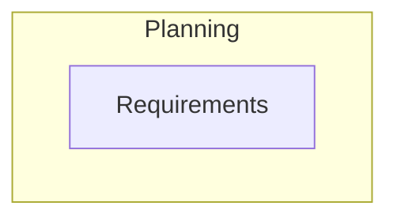
```mermaid
flowchart TD
    A[Requirements]
    subgraph Planning
        A
    end
```

## Frame 3

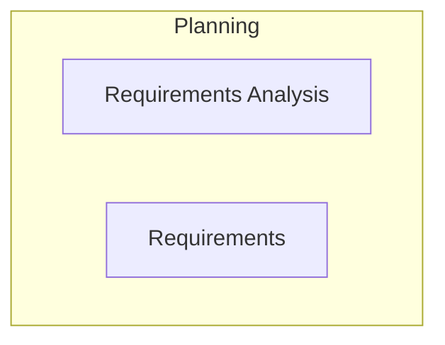
```mermaid
flowchart TD
    A1[Requirements Analysis]
    A[Requirements]
    subgraph Planning
        A
        A1
    end
```

## Frame 4

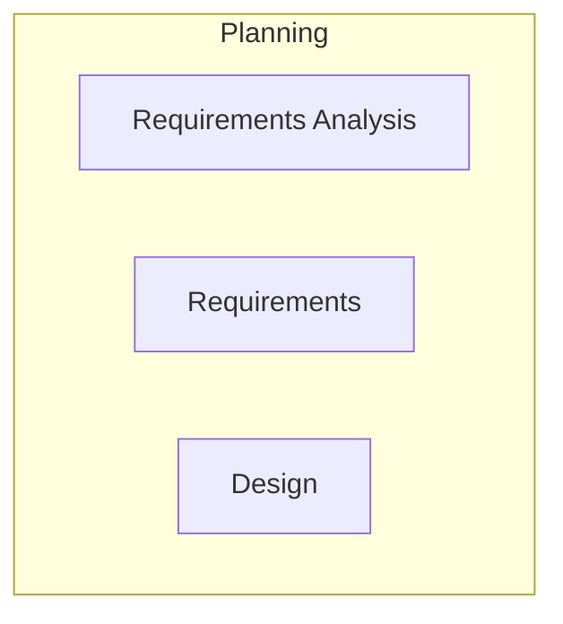
```mermaid
flowchart TD
    A1[Requirements Analysis]
    A[Requirements]
    B[Design]
    subgraph Planning
        A
        A1
        B
    end
```

## Frame 5

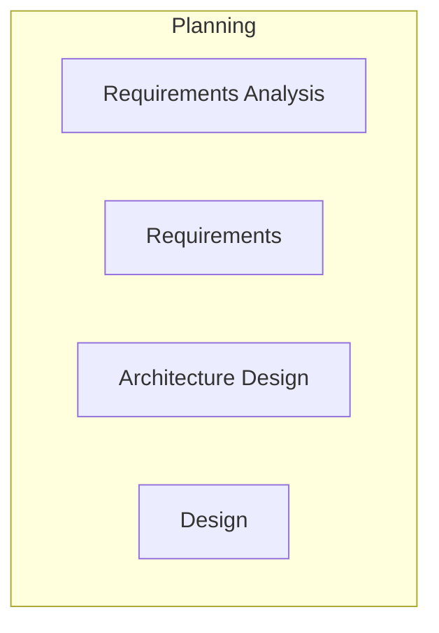
```mermaid
flowchart TD
    A1[Requirements Analysis]
    A[Requirements]
    B1[Architecture Design]
    B[Design]
    subgraph Planning
        A
        A1
        B
        B1
    end
```

## Frame 6

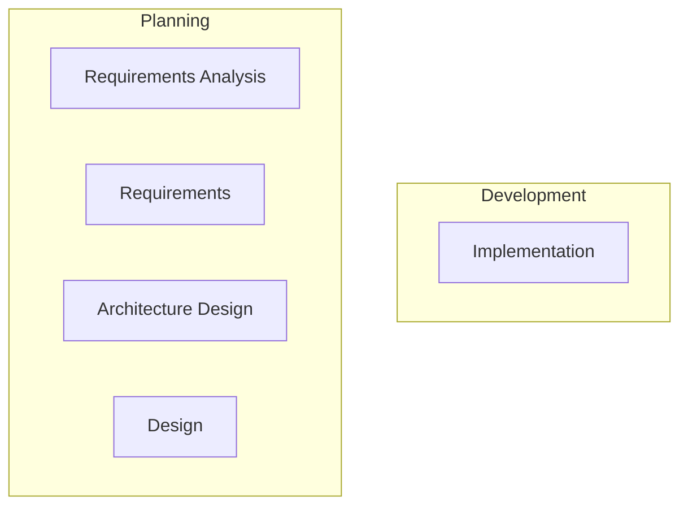
```mermaid
flowchart TD
    A1[Requirements Analysis]
    A[Requirements]
    B1[Architecture Design]
    B[Design]
    C[Implementation]
    subgraph Development
        C
    end
    subgraph Planning
        A
        A1
        B
        B1
    end
```

## Frame 7

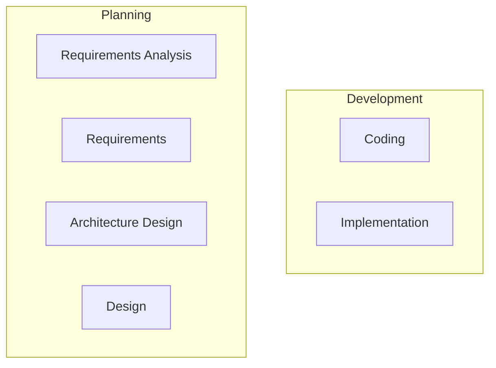
```mermaid
flowchart TD
    A1[Requirements Analysis]
    A[Requirements]
    B1[Architecture Design]
    B[Design]
    C1[Coding]
    C[Implementation]
    subgraph Development
        C
        C1
    end
    subgraph Planning
        A
        A1
        B
        B1
    end
```

## Frame 8

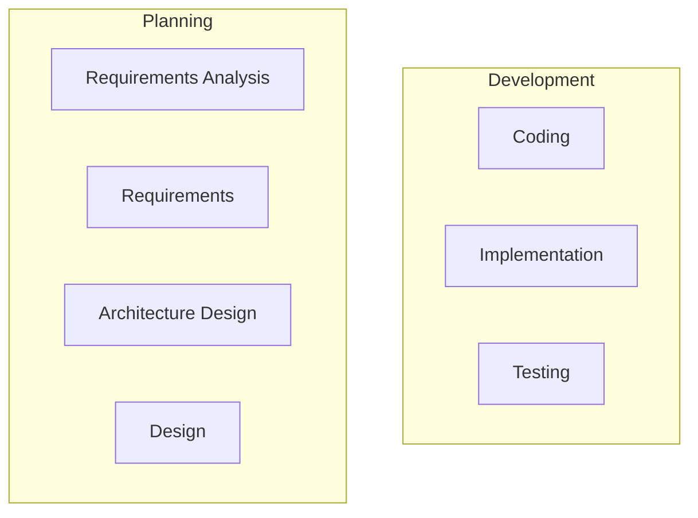
```mermaid
flowchart TD
    A1[Requirements Analysis]
    A[Requirements]
    B1[Architecture Design]
    B[Design]
    C1[Coding]
    C[Implementation]
    D[Testing]
    subgraph Development
        C
        C1
        D
    end
    subgraph Planning
        A
        A1
        B
        B1
    end
```

## Frame 9

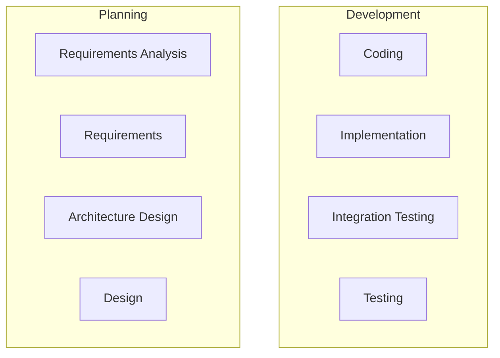
```mermaid
flowchart TD
    A1[Requirements Analysis]
    A[Requirements]
    B1[Architecture Design]
    B[Design]
    C1[Coding]
    C[Implementation]
    D1[Integration Testing]
    D[Testing]
    subgraph Development
        C
        C1
        D
        D1
    end
    subgraph Planning
        A
        A1
        B
        B1
    end
```

## Frame 10

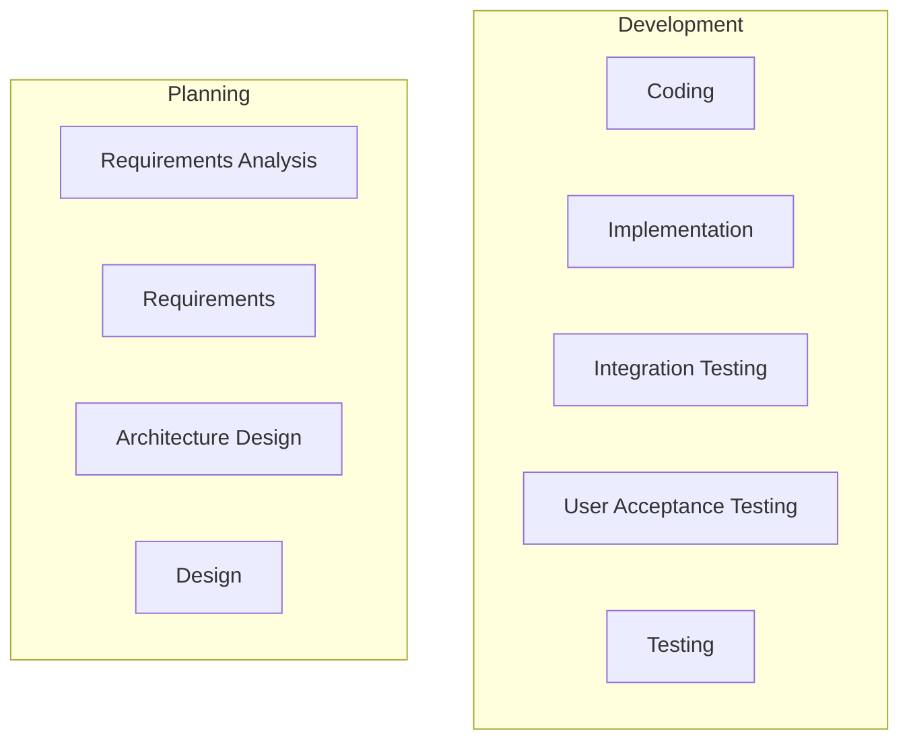
```mermaid
flowchart TD
    A1[Requirements Analysis]
    A[Requirements]
    B1[Architecture Design]
    B[Design]
    C1[Coding]
    C[Implementation]
    D1[Integration Testing]
    D2[User Acceptance Testing]
    D[Testing]
    subgraph Development
        C
        C1
        D
        D1
        D2
    end
    subgraph Planning
        A
        A1
        B
        B1
    end
```

## Frame 11

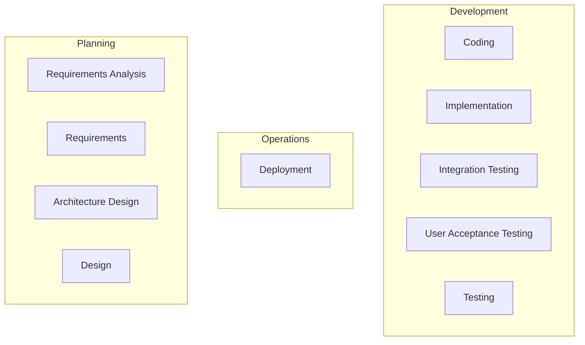
```mermaid
flowchart TD
    A1[Requirements Analysis]
    A[Requirements]
    B1[Architecture Design]
    B[Design]
    C1[Coding]
    C[Implementation]
    D1[Integration Testing]
    D2[User Acceptance Testing]
    D[Testing]
    E[Deployment]
    subgraph Development
        C
        C1
        D
        D1
        D2
    end
    subgraph Operations
        E
    end
    subgraph Planning
        A
        A1
        B
        B1
    end
```

## Frame 12

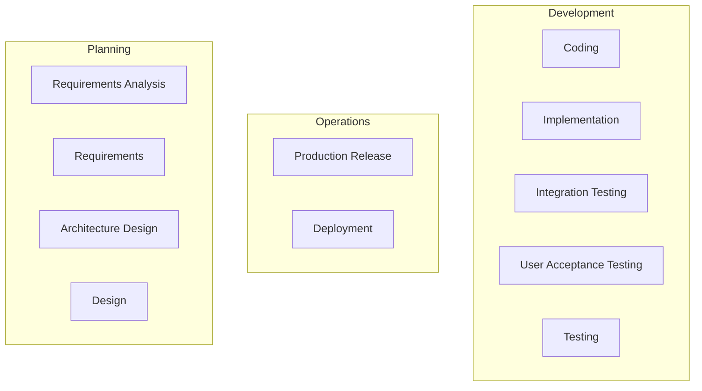
```mermaid
flowchart TD
    A1[Requirements Analysis]
    A[Requirements]
    B1[Architecture Design]
    B[Design]
    C1[Coding]
    C[Implementation]
    D1[Integration Testing]
    D2[User Acceptance Testing]
    D[Testing]
    E1[Production Release]
    E[Deployment]
    subgraph Development
        C
        C1
        D
        D1
        D2
    end
    subgraph Operations
        E
        E1
    end
    subgraph Planning
        A
        A1
        B
        B1
    end
```

## Frame 13

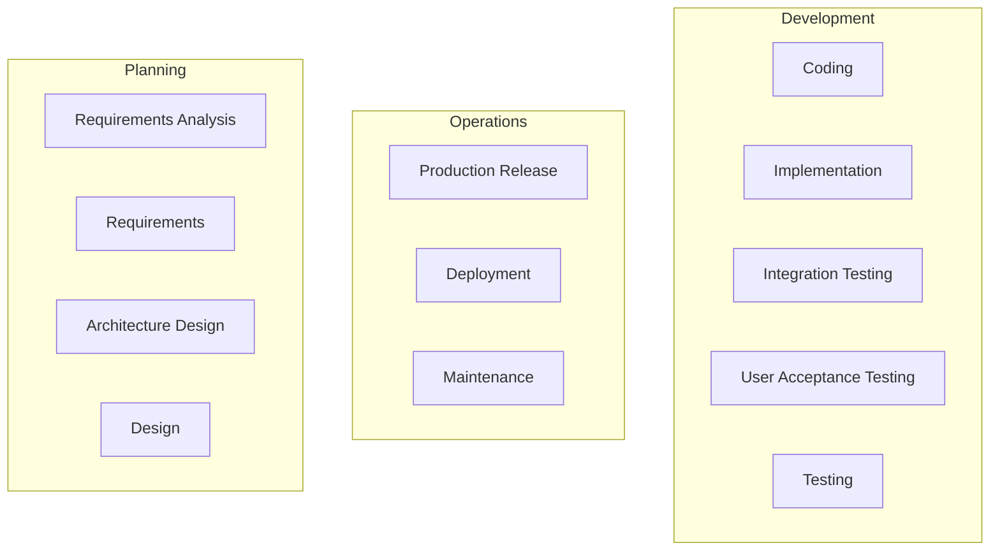
```mermaid
flowchart TD
    A1[Requirements Analysis]
    A[Requirements]
    B1[Architecture Design]
    B[Design]
    C1[Coding]
    C[Implementation]
    D1[Integration Testing]
    D2[User Acceptance Testing]
    D[Testing]
    E1[Production Release]
    E[Deployment]
    F[Maintenance]
    subgraph Development
        C
        C1
        D
        D1
        D2
    end
    subgraph Operations
        E
        E1
        F
    end
    subgraph Planning
        A
        A1
        B
        B1
    end
```

## Frame 14

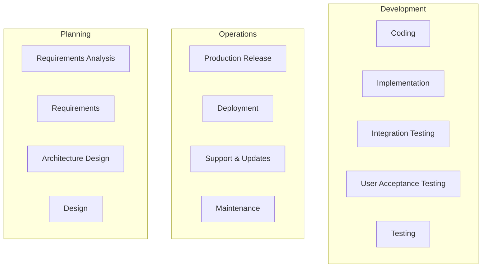
```mermaid
flowchart TD
    A1[Requirements Analysis]
    A[Requirements]
    B1[Architecture Design]
    B[Design]
    C1[Coding]
    C[Implementation]
    D1[Integration Testing]
    D2[User Acceptance Testing]
    D[Testing]
    E1[Production Release]
    E[Deployment]
    F1[Support & Updates]
    F[Maintenance]
    subgraph Development
        C
        C1
        D
        D1
        D2
    end
    subgraph Operations
        E
        E1
        F
        F1
    end
    subgraph Planning
        A
        A1
        B
        B1
    end
```

## Frame 15

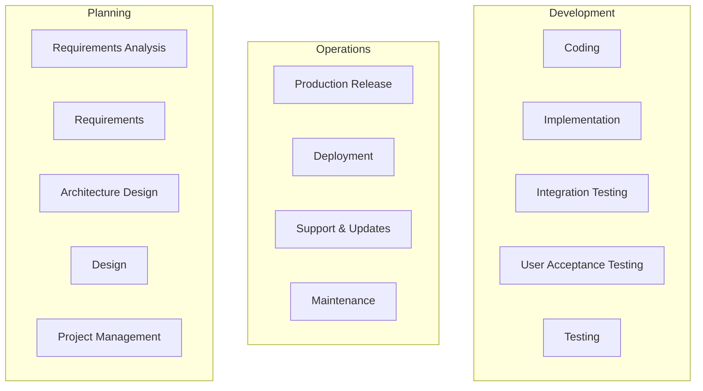
```mermaid
flowchart TD
    A1[Requirements Analysis]
    A[Requirements]
    B1[Architecture Design]
    B[Design]
    C1[Coding]
    C[Implementation]
    D1[Integration Testing]
    D2[User Acceptance Testing]
    D[Testing]
    E1[Production Release]
    E[Deployment]
    F1[Support & Updates]
    F[Maintenance]
    PM[Project Management]
    subgraph Development
        C
        C1
        D
        D1
        D2
    end
    subgraph Operations
        E
        E1
        F
        F1
    end
    subgraph Planning
        A
        A1
        B
        B1
        PM
    end
```

## Frame 16

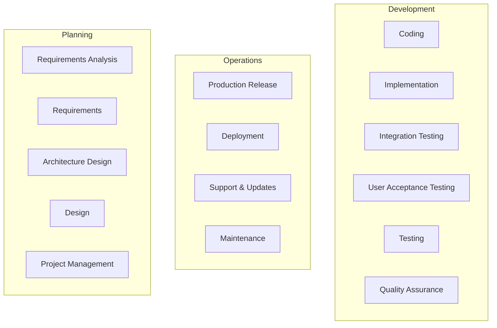
```mermaid
flowchart TD
    A1[Requirements Analysis]
    A[Requirements]
    B1[Architecture Design]
    B[Design]
    C1[Coding]
    C[Implementation]
    D1[Integration Testing]
    D2[User Acceptance Testing]
    D[Testing]
    E1[Production Release]
    E[Deployment]
    F1[Support & Updates]
    F[Maintenance]
    PM[Project Management]
    QA[Quality Assurance]
    subgraph Development
        C
        C1
        D
        D1
        D2
        QA
    end
    subgraph Operations
        E
        E1
        F
        F1
    end
    subgraph Planning
        A
        A1
        B
        B1
        PM
    end
```

## Frame 17

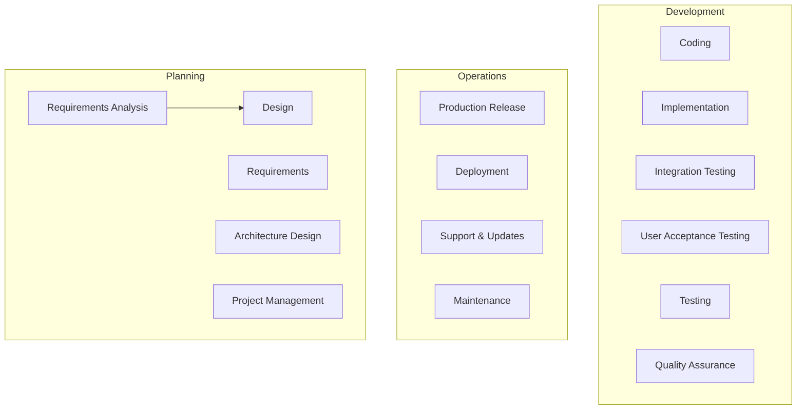
```mermaid
flowchart TD
    A1[Requirements Analysis]
    A[Requirements]
    B1[Architecture Design]
    B[Design]
    C1[Coding]
    C[Implementation]
    D1[Integration Testing]
    D2[User Acceptance Testing]
    D[Testing]
    E1[Production Release]
    E[Deployment]
    F1[Support & Updates]
    F[Maintenance]
    PM[Project Management]
    QA[Quality Assurance]
    A1 --> B
    subgraph Development
        C
        C1
        D
        D1
        D2
        QA
    end
    subgraph Operations
        E
        E1
        F
        F1
    end
    subgraph Planning
        A
        A1
        B
        B1
        PM
    end
```

## Frame 18

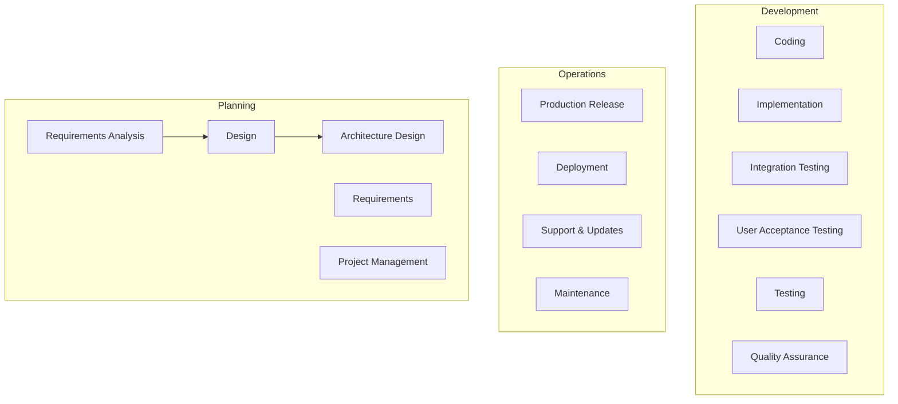
```mermaid
flowchart TD
    A1[Requirements Analysis]
    A[Requirements]
    B1[Architecture Design]
    B[Design]
    C1[Coding]
    C[Implementation]
    D1[Integration Testing]
    D2[User Acceptance Testing]
    D[Testing]
    E1[Production Release]
    E[Deployment]
    F1[Support & Updates]
    F[Maintenance]
    PM[Project Management]
    QA[Quality Assurance]
    A1 --> B
    B --> B1
    subgraph Development
        C
        C1
        D
        D1
        D2
        QA
    end
    subgraph Operations
        E
        E1
        F
        F1
    end
    subgraph Planning
        A
        A1
        B
        B1
        PM
    end
```

## Frame 19

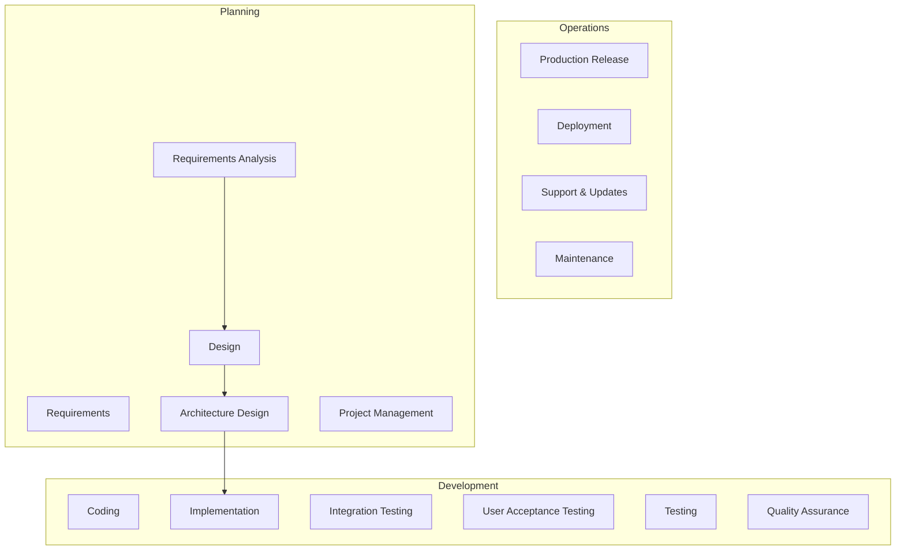
```mermaid
flowchart TD
    A1[Requirements Analysis]
    A[Requirements]
    B1[Architecture Design]
    B[Design]
    C1[Coding]
    C[Implementation]
    D1[Integration Testing]
    D2[User Acceptance Testing]
    D[Testing]
    E1[Production Release]
    E[Deployment]
    F1[Support & Updates]
    F[Maintenance]
    PM[Project Management]
    QA[Quality Assurance]
    A1 --> B
    B --> B1
    B1 --> C
    subgraph Development
        C
        C1
        D
        D1
        D2
        QA
    end
    subgraph Operations
        E
        E1
        F
        F1
    end
    subgraph Planning
        A
        A1
        B
        B1
        PM
    end
```

## Frame 20

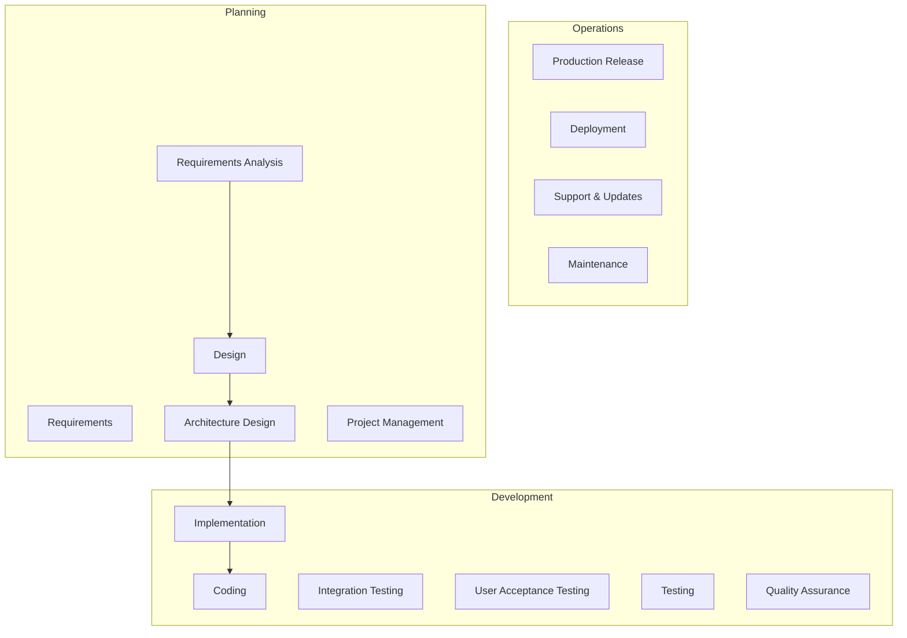
```mermaid
flowchart TD
    A1[Requirements Analysis]
    A[Requirements]
    B1[Architecture Design]
    B[Design]
    C1[Coding]
    C[Implementation]
    D1[Integration Testing]
    D2[User Acceptance Testing]
    D[Testing]
    E1[Production Release]
    E[Deployment]
    F1[Support & Updates]
    F[Maintenance]
    PM[Project Management]
    QA[Quality Assurance]
    A1 --> B
    B --> B1
    B1 --> C
    C --> C1
    subgraph Development
        C
        C1
        D
        D1
        D2
        QA
    end
    subgraph Operations
        E
        E1
        F
        F1
    end
    subgraph Planning
        A
        A1
        B
        B1
        PM
    end
```

## Frame 21

```mermaid
flowchart TD
    A1[Requirements Analysis]
    A[Requirements]
    B1[Architecture Design]
    B[Design]
    C1[Coding]
    C[Implementation]
    D1[Integration Testing]
    D2[User Acceptance Testing]
    D[Testing]
    E1[Production Release]
    E[Deployment]
    F1[Support & Updates]
    F[Maintenance]
    PM[Project Management]
    QA[Quality Assurance]
    A1 --> B
    B --> B1
    B1 --> C
    C --> C1
    C1 --> D
    subgraph Development
        C
        C1
        D
        D1
        D2
        QA
    end
    subgraph Operations
        E
        E1
        F
        F1
    end
    subgraph Planning
        A
        A1
        B
        B1
        PM
    end
```

## Frame 22

```mermaid
flowchart TD
    A1[Requirements Analysis]
    A[Requirements]
    B1[Architecture Design]
    B[Design]
    C1[Coding]
    C[Implementation]
    D1[Integration Testing]
    D2[User Acceptance Testing]
    D[Testing]
    E1[Production Release]
    E[Deployment]
    F1[Support & Updates]
    F[Maintenance]
    PM[Project Management]
    QA[Quality Assurance]
    A1 --> B
    B --> B1
    B1 --> C
    C --> C1
    C1 --> D
    D --> D1
    subgraph Development
        C
        C1
        D
        D1
        D2
        QA
    end
    subgraph Operations
        E
        E1
        F
        F1
    end
    subgraph Planning
        A
        A1
        B
        B1
        PM
    end
```

## Frame 23

```mermaid
flowchart TD
    A1[Requirements Analysis]
    A[Requirements]
    B1[Architecture Design]
    B[Design]
    C1[Coding]
    C[Implementation]
    D1[Integration Testing]
    D2[User Acceptance Testing]
    D[Testing]
    E1[Production Release]
    E[Deployment]
    F1[Support & Updates]
    F[Maintenance]
    PM[Project Management]
    QA[Quality Assurance]
    A1 --> B
    B --> B1
    B1 --> C
    C --> C1
    C1 --> D
    D --> D1
    D1 --> D2
    subgraph Development
        C
        C1
        D
        D1
        D2
        QA
    end
    subgraph Operations
        E
        E1
        F
        F1
    end
    subgraph Planning
        A
        A1
        B
        B1
        PM
    end
```

## Frame 24

```mermaid
flowchart TD
    A1[Requirements Analysis]
    A[Requirements]
    B1[Architecture Design]
    B[Design]
    C1[Coding]
    C[Implementation]
    D1[Integration Testing]
    D2[User Acceptance Testing]
    D[Testing]
    E1[Production Release]
    E[Deployment]
    F1[Support & Updates]
    F[Maintenance]
    PM[Project Management]
    QA[Quality Assurance]
    A1 --> B
    B --> B1
    B1 --> C
    C --> C1
    C1 --> D
    D --> D1
    D1 --> D2
    D2 --> E
    subgraph Development
        C
        C1
        D
        D1
        D2
        QA
    end
    subgraph Operations
        E
        E1
        F
        F1
    end
    subgraph Planning
        A
        A1
        B
        B1
        PM
    end
```

## Frame 25

```mermaid
flowchart TD
    A1[Requirements Analysis]
    A[Requirements]
    B1[Architecture Design]
    B[Design]
    C1[Coding]
    C[Implementation]
    D1[Integration Testing]
    D2[User Acceptance Testing]
    D[Testing]
    E1[Production Release]
    E[Deployment]
    F1[Support & Updates]
    F[Maintenance]
    PM[Project Management]
    QA[Quality Assurance]
    A1 --> B
    B --> B1
    B1 --> C
    C --> C1
    C1 --> D
    D --> D1
    D1 --> D2
    D2 --> E
    E --> E1
    subgraph Development
        C
        C1
        D
        D1
        D2
        QA
    end
    subgraph Operations
        E
        E1
        F
        F1
    end
    subgraph Planning
        A
        A1
        B
        B1
        PM
    end
```

## Frame 26

```mermaid
flowchart TD
    A1[Requirements Analysis]
    A[Requirements]
    B1[Architecture Design]
    B[Design]
    C1[Coding]
    C[Implementation]
    D1[Integration Testing]
    D2[User Acceptance Testing]
    D[Testing]
    E1[Production Release]
    E[Deployment]
    F1[Support & Updates]
    F[Maintenance]
    PM[Project Management]
    QA[Quality Assurance]
    A1 --> B
    B --> B1
    B1 --> C
    C --> C1
    C1 --> D
    D --> D1
    D1 --> D2
    D2 --> E
    E --> E1
    E1 --> F
    subgraph Development
        C
        C1
        D
        D1
        D2
        QA
    end
    subgraph Operations
        E
        E1
        F
        F1
    end
    subgraph Planning
        A
        A1
        B
        B1
        PM
    end
```

## Frame 27

```mermaid
flowchart TD
    A1[Requirements Analysis]
    A[Requirements]
    B1[Architecture Design]
    B[Design]
    C1[Coding]
    C[Implementation]
    D1[Integration Testing]
    D2[User Acceptance Testing]
    D[Testing]
    E1[Production Release]
    E[Deployment]
    F1[Support & Updates]
    F[Maintenance]
    PM[Project Management]
    QA[Quality Assurance]
    A1 --> B
    B --> B1
    B1 --> C
    C --> C1
    C1 --> D
    D --> D1
    D1 --> D2
    D2 --> E
    E --> E1
    E1 --> F
    F --> F1
    subgraph Development
        C
        C1
        D
        D1
        D2
        QA
    end
    subgraph Operations
        E
        E1
        F
        F1
    end
    subgraph Planning
        A
        A1
        B
        B1
        PM
    end
```

## Frame 28

```mermaid
flowchart TD
    A1[Requirements Analysis]
    A[Requirements]
    B1[Architecture Design]
    B[Design]
    C1[Coding]
    C[Implementation]
    D1[Integration Testing]
    D2[User Acceptance Testing]
    D[Testing]
    E1[Production Release]
    E[Deployment]
    F1[Support & Updates]
    F[Maintenance]
    PM[Project Management]
    QA[Quality Assurance]
    A1 --> B
    B --> B1
    B1 --> C
    C --> C1
    C1 --> D
    D --> D1
    D -->|Bugs found| C
    D1 --> D2
    D2 --> E
    E --> E1
    E1 --> F
    F --> F1
    subgraph Development
        C
        C1
        D
        D1
        D2
        QA
    end
    subgraph Operations
        E
        E1
        F
        F1
    end
    subgraph Planning
        A
        A1
        B
        B1
        PM
    end
```

## Frame 29

```mermaid
flowchart TD
    A1[Requirements Analysis]
    A[Requirements]
    B1[Architecture Design]
    B[Design]
    C1[Coding]
    C[Implementation]
    D1[Integration Testing]
    D2[User Acceptance Testing]
    D[Testing]
    E1[Production Release]
    E[Deployment]
    F1[Support & Updates]
    F[Maintenance]
    PM[Project Management]
    QA[Quality Assurance]
    A1 --> B
    B --> B1
    B1 --> C
    C --> C1
    C1 --> D
    D --> D1
    D -->|Bugs found| C
    D1 --> D2
    D2 --> E
    D2 -->|UAT Feedback| B
    E --> E1
    E1 --> F
    F --> F1
    subgraph Development
        C
        C1
        D
        D1
        D2
        QA
    end
    subgraph Operations
        E
        E1
        F
        F1
    end
    subgraph Planning
        A
        A1
        B
        B1
        PM
    end
```

## Frame 30

```mermaid
flowchart TD
    A1[Requirements Analysis]
    A[Requirements]
    B1[Architecture Design]
    B[Design]
    C1[Coding]
    C[Implementation]
    D1[Integration Testing]
    D2[User Acceptance Testing]
    D[Testing]
    E1[Production Release]
    E[Deployment]
    F1[Support & Updates]
    F[Maintenance]
    PM[Project Management]
    QA[Quality Assurance]
    A1 --> B
    B --> B1
    B1 --> C
    C --> C1
    C1 --> D
    D --> D1
    D -->|Bugs found| C
    D1 --> D2
    D2 --> E
    D2 -->|UAT Feedback| B
    E --> E1
    E1 --> F
    E1 -->|Deployment Issues| D
    F --> F1
    subgraph Development
        C
        C1
        D
        D1
        D2
        QA
    end
    subgraph Operations
        E
        E1
        F
        F1
    end
    subgraph Planning
        A
        A1
        B
        B1
        PM
    end
```

## Frame 31

```mermaid
flowchart TD
    A1[Requirements Analysis]
    A[Requirements]
    B1[Architecture Design]
    B[Design]
    C1[Coding]
    C[Implementation]
    D1[Integration Testing]
    D2[User Acceptance Testing]
    D[Testing]
    E1[Production Release]
    E[Deployment]
    F1[Support & Updates]
    F[Maintenance]
    PM[Project Management]
    QA[Quality Assurance]
    A1 --> B
    B --> B1
    B1 --> C
    C --> C1
    C1 --> D
    D --> D1
    D -->|Bugs found| C
    D1 --> D2
    D2 --> E
    D2 -->|UAT Feedback| B
    E --> E1
    E1 --> F
    E1 -->|Deployment Issues| D
    F --> F1
    F1 -->|New Features| A
    subgraph Development
        C
        C1
        D
        D1
        D2
        QA
    end
    subgraph Operations
        E
        E1
        F
        F1
    end
    subgraph Planning
        A
        A1
        B
        B1
        PM
    end
```

## Frame 32

```mermaid
flowchart TD
    A1[Requirements Analysis]
    A[Requirements]
    B1[Architecture Design]
    B[Design]
    C1[Coding]
    C[Implementation]
    D1[Integration Testing]
    D2[User Acceptance Testing]
    D[Testing]
    E1[Production Release]
    E[Deployment]
    F1[Support & Updates]
    F[Maintenance]
    PM[Project Management]
    QA[Quality Assurance]
    A1 --> B
    B --> B1
    B -.->|Design Review| A1
    B1 --> C
    C --> C1
    C1 --> D
    D --> D1
    D -->|Bugs found| C
    D1 --> D2
    D2 --> E
    D2 -->|UAT Feedback| B
    E --> E1
    E1 --> F
    E1 -->|Deployment Issues| D
    F --> F1
    F1 -->|New Features| A
    subgraph Development
        C
        C1
        D
        D1
        D2
        QA
    end
    subgraph Operations
        E
        E1
        F
        F1
    end
    subgraph Planning
        A
        A1
        B
        B1
        PM
    end
```

## Frame 33

```mermaid
flowchart TD
    A1[Requirements Analysis]
    A[Requirements]
    B1[Architecture Design]
    B[Design]
    C1[Coding]
    C[Implementation]
    D1[Integration Testing]
    D2[User Acceptance Testing]
    D[Testing]
    E1[Production Release]
    E[Deployment]
    F1[Support & Updates]
    F[Maintenance]
    PM[Project Management]
    QA[Quality Assurance]
    A1 --> B
    B --> B1
    B -.->|Design Review| A1
    B1 --> C
    C --> C1
    C -.->|Technical Constraints| B
    C1 --> D
    D --> D1
    D -->|Bugs found| C
    D1 --> D2
    D2 --> E
    D2 -->|UAT Feedback| B
    E --> E1
    E1 --> F
    E1 -->|Deployment Issues| D
    F --> F1
    F1 -->|New Features| A
    subgraph Development
        C
        C1
        D
        D1
        D2
        QA
    end
    subgraph Operations
        E
        E1
        F
        F1
    end
    subgraph Planning
        A
        A1
        B
        B1
        PM
    end
```

## Frame 34

```mermaid
flowchart TD
    A1[Requirements Analysis]
    A[Requirements]
    B1[Architecture Design]
    B[Design]
    C1[Coding]
    C[Implementation]
    D1[Integration Testing]
    D2[User Acceptance Testing]
    D[Testing]
    E1[Production Release]
    E[Deployment]
    F1[Support & Updates]
    F[Maintenance]
    PM[Project Management]
    QA[Quality Assurance]
    A1 --> B
    B --> B1
    B -.->|Design Review| A1
    B1 --> C
    C --> C1
    C -.->|Technical Constraints| B
    C1 --> D
    D --> D1
    D -->|Bugs found| C
    D1 --> D2
    D2 --> E
    D2 -->|UAT Feedback| B
    E --> E1
    E1 --> F
    E1 -->|Deployment Issues| D
    F --> F1
    F1 -->|New Features| A
    PM -.-> C
    subgraph Development
        C
        C1
        D
        D1
        D2
        QA
    end
    subgraph Operations
        E
        E1
        F
        F1
    end
    subgraph Planning
        A
        A1
        B
        B1
        PM
    end
```

## Frame 35

```mermaid
flowchart TD
    A1[Requirements Analysis]
    A[Requirements]
    B1[Architecture Design]
    B[Design]
    C1[Coding]
    C[Implementation]
    D1[Integration Testing]
    D2[User Acceptance Testing]
    D[Testing]
    E1[Production Release]
    E[Deployment]
    F1[Support & Updates]
    F[Maintenance]
    PM[Project Management]
    QA[Quality Assurance]
    A1 --> B
    B --> B1
    B -.->|Design Review| A1
    B1 --> C
    C --> C1
    C -.->|Technical Constraints| B
    C1 --> D
    D --> D1
    D -->|Bugs found| C
    D1 --> D2
    D2 --> E
    D2 -->|UAT Feedback| B
    E --> E1
    E1 --> F
    E1 -->|Deployment Issues| D
    F --> F1
    F1 -->|New Features| A
    PM -.-> C
    PM -.-> E
    subgraph Development
        C
        C1
        D
        D1
        D2
        QA
    end
    subgraph Operations
        E
        E1
        F
        F1
    end
    subgraph Planning
        A
        A1
        B
        B1
        PM
    end
```

## Frame 36

```mermaid
flowchart TD
    A1[Requirements Analysis]
    A[Requirements]
    B1[Architecture Design]
    B[Design]
    C1[Coding]
    C[Implementation]
    D1[Integration Testing]
    D2[User Acceptance Testing]
    D[Testing]
    E1[Production Release]
    E[Deployment]
    F1[Support & Updates]
    F[Maintenance]
    PM[Project Management]
    QA[Quality Assurance]
    A1 --> B
    B --> B1
    B -.->|Design Review| A1
    B1 --> C
    C --> C1
    C -.->|Technical Constraints| B
    C1 --> D
    D --> D1
    D -->|Bugs found| C
    D1 --> D2
    D2 --> E
    D2 -->|UAT Feedback| B
    E --> E1
    E1 --> F
    E1 -->|Deployment Issues| D
    F --> F1
    F1 -->|New Features| A
    PM -.-> C
    PM -.-> E
    QA -.-> D
    subgraph Development
        C
        C1
        D
        D1
        D2
        QA
    end
    subgraph Operations
        E
        E1
        F
        F1
    end
    subgraph Planning
        A
        A1
        B
        B1
        PM
    end
```

## Frame 37

```mermaid
flowchart TD
    A1[Requirements Analysis]
    A[Requirements]
    B1[Architecture Design]
    B[Design]
    C1[Coding]
    C[Implementation]
    D1[Integration Testing]
    D2[User Acceptance Testing]
    D[Testing]
    E1[Production Release]
    E[Deployment]
    F1[Support & Updates]
    F[Maintenance]
    PM[Project Management]
    QA[Quality Assurance]
    A1 --> B
    B --> B1
    B -.->|Design Review| A1
    B1 --> C
    C --> C1
    C -.->|Technical Constraints| B
    C1 --> D
    D --> D1
    D -->|Bugs found| C
    D1 --> D2
    D2 --> E
    D2 -->|UAT Feedback| B
    E --> E1
    E1 --> F
    E1 -->|Deployment Issues| D
    F --> F1
    F1 -->|New Features| A
    PM -.-> C
    PM -.-> E
    QA -.-> D
    QA -.-> F
    subgraph Development
        C
        C1
        D
        D1
        D2
        QA
    end
    subgraph Operations
        E
        E1
        F
        F1
    end
    subgraph Planning
        A
        A1
        B
        B1
        PM
    end
```

