# Mermaid Graph Animation (image_10.mmd)

Generated 56 frames.

## Frame 1

```mermaid
graph TD

    %% Class Definitions
    classDef timeNode fill:#f9f9f9,stroke:#333,stroke-width:2px,rx:5px,ry:5px
    classDef eicNode fill:#ffdddd,stroke:#cc0000
    classDef crownNode fill:#ddddff,stroke:#0000cc
    classDef indiaNode fill:#ddffdd,stroke:#00cc00
    classDef phaseNode fill:#efefef,stroke:#999999,stroke-width:1px,stroke-dasharray:5 5,rx:10px,ry:10px
```

## Frame 2


## Frame 3


## Frame 4

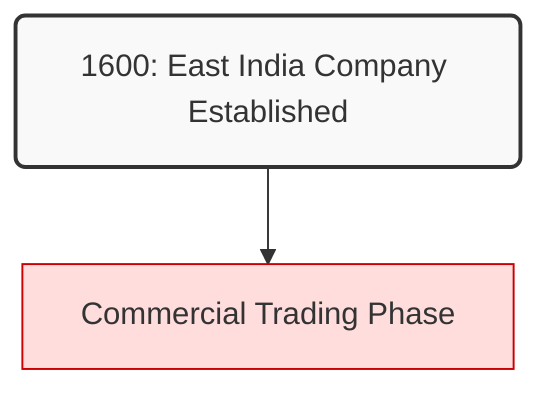

## Frame 5

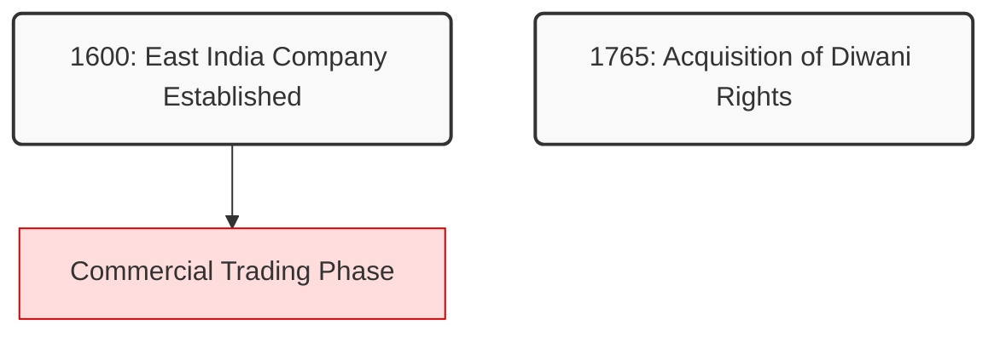

## Frame 6

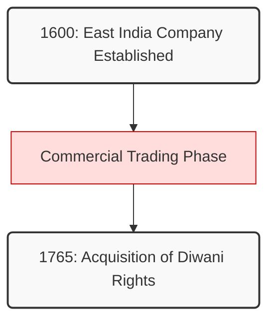

## Frame 7

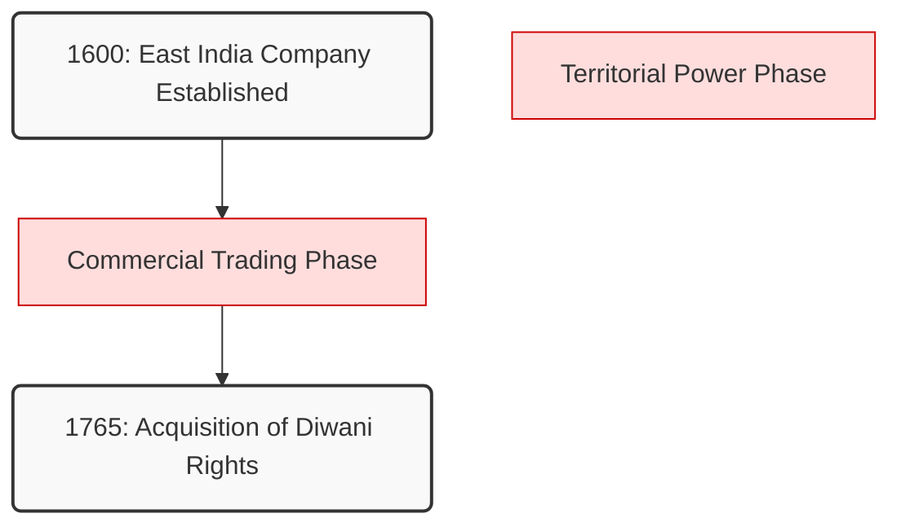

## Frame 8

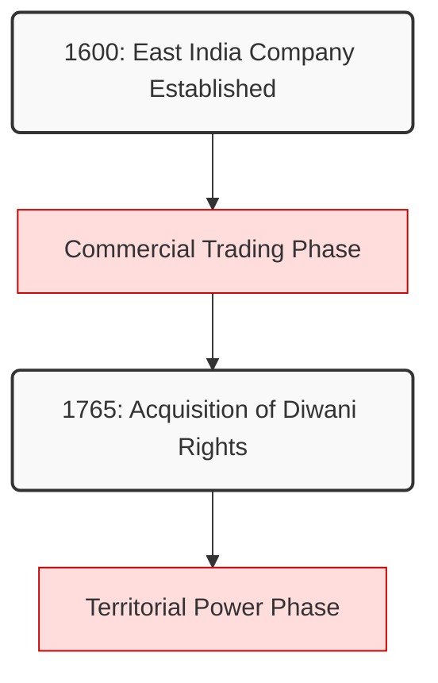

## Frame 9

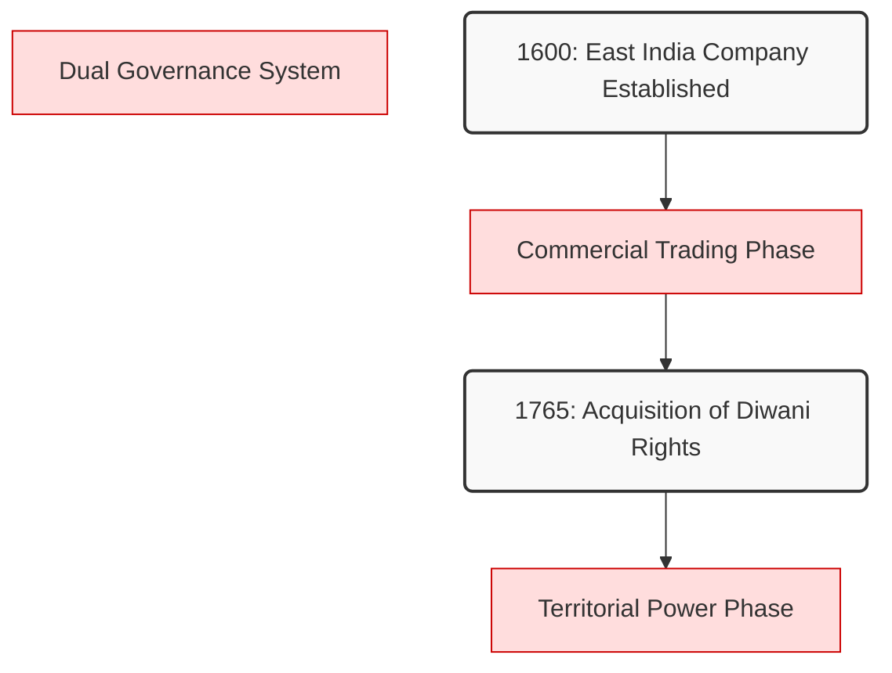

## Frame 10

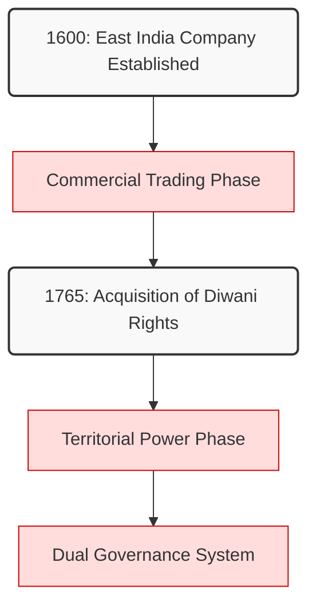

## Frame 11

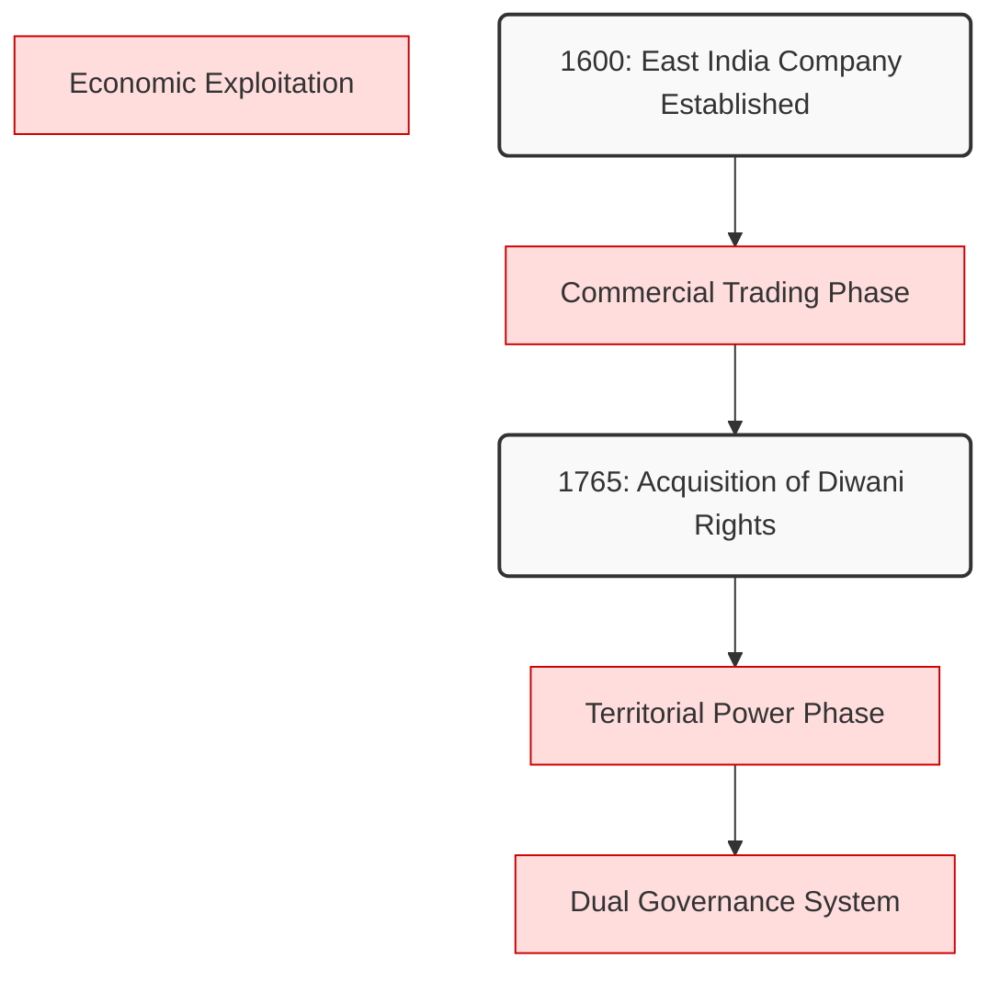

## Frame 12

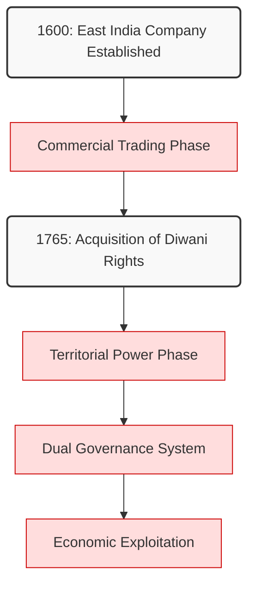

## Frame 13

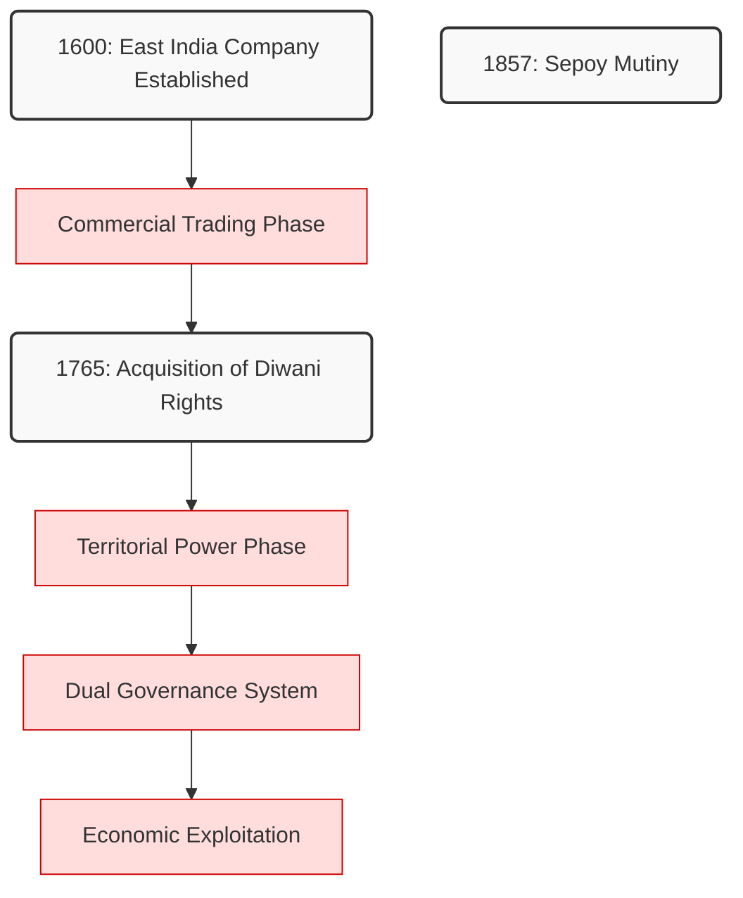

## Frame 14

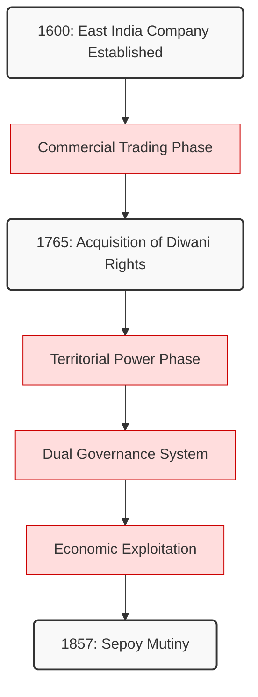

## Frame 15

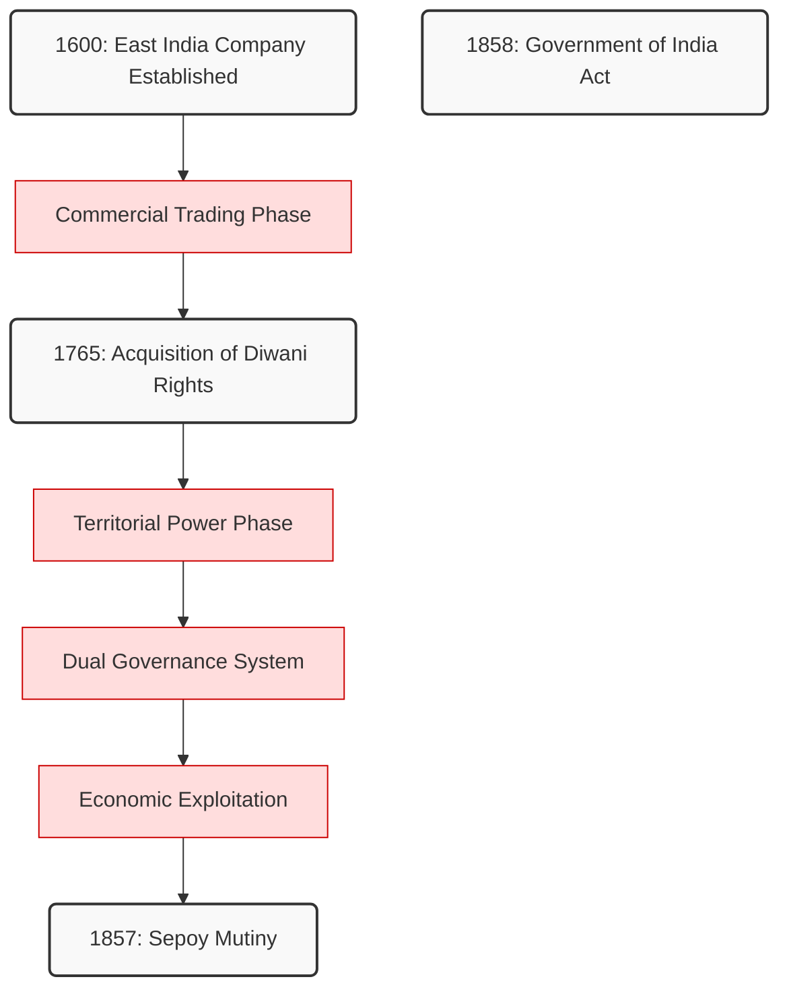

## Frame 16

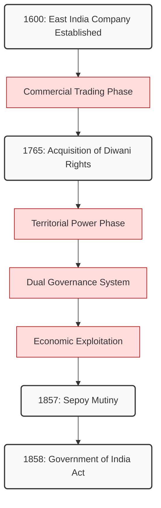

## Frame 17

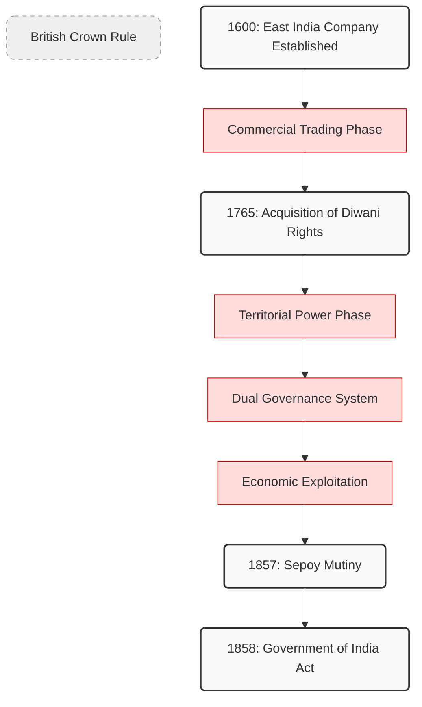

## Frame 18

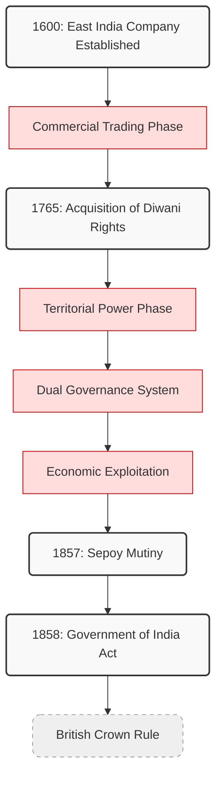

## Frame 19

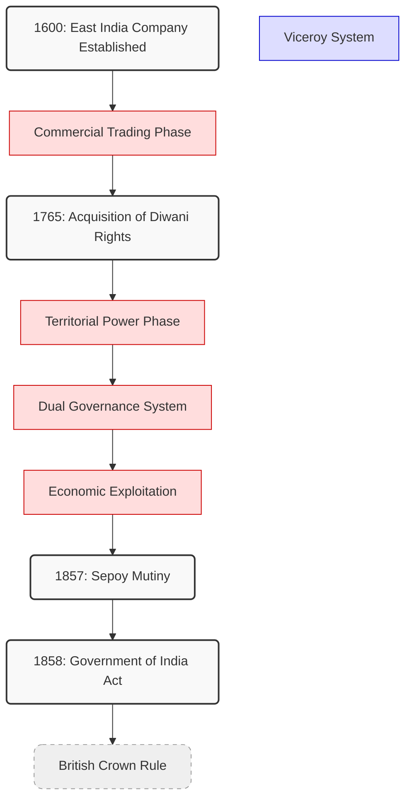

## Frame 20

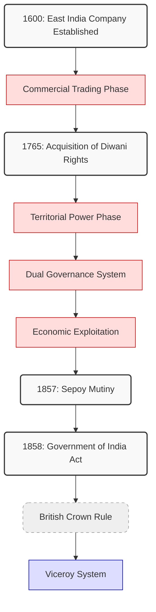

## Frame 21

```mermaid
graph TD

    %% Class Definitions
    classDef timeNode fill:#f9f9f9,stroke:#333,stroke-width:2px,rx:5px,ry:5px
    classDef eicNode fill:#ffdddd,stroke:#cc0000
    classDef crownNode fill:#ddddff,stroke:#0000cc
    classDef indiaNode fill:#ddffdd,stroke:#00cc00
    classDef phaseNode fill:#efefef,stroke:#999999,stroke-width:1px,stroke-dasharray:5 5,rx:10px,ry:10px

    %% Node Definitions
    commercial[Commercial Trading Phase]:::eicNode
    crown[British Crown Rule]:::phaseNode
    dual[Dual Governance System]:::eicNode
    exploitation[Economic Exploitation]:::eicNode
    ics[Indian Civil Service]:::crownNode
    n1600[1600: East India Company Established]:::timeNode
    n1765[1765: Acquisition of Diwani Rights]:::timeNode
    n1857[1857: Sepoy Mutiny]:::timeNode
    n1858[1858: Government of India Act]:::timeNode
    territorial[Territorial Power Phase]:::eicNode
    viceroy[Viceroy System]:::crownNode

    %% Connections
    commercial --> n1765
    crown --> viceroy
    dual --> exploitation
    exploitation --> n1857
    n1600 --> commercial
    n1765 --> territorial
    n1857 --> n1858
    n1858 --> crown
    territorial --> dual
```

## Frame 22

```mermaid
graph TD

    %% Class Definitions
    classDef timeNode fill:#f9f9f9,stroke:#333,stroke-width:2px,rx:5px,ry:5px
    classDef eicNode fill:#ffdddd,stroke:#cc0000
    classDef crownNode fill:#ddddff,stroke:#0000cc
    classDef indiaNode fill:#ddffdd,stroke:#00cc00
    classDef phaseNode fill:#efefef,stroke:#999999,stroke-width:1px,stroke-dasharray:5 5,rx:10px,ry:10px

    %% Node Definitions
    commercial[Commercial Trading Phase]:::eicNode
    crown[British Crown Rule]:::phaseNode
    dual[Dual Governance System]:::eicNode
    exploitation[Economic Exploitation]:::eicNode
    ics[Indian Civil Service]:::crownNode
    n1600[1600: East India Company Established]:::timeNode
    n1765[1765: Acquisition of Diwani Rights]:::timeNode
    n1857[1857: Sepoy Mutiny]:::timeNode
    n1858[1858: Government of India Act]:::timeNode
    territorial[Territorial Power Phase]:::eicNode
    viceroy[Viceroy System]:::crownNode

    %% Connections
    commercial --> n1765
    crown --> ics
    crown --> viceroy
    dual --> exploitation
    exploitation --> n1857
    n1600 --> commercial
    n1765 --> territorial
    n1857 --> n1858
    n1858 --> crown
    territorial --> dual
```

## Frame 23

```mermaid
graph TD

    %% Class Definitions
    classDef timeNode fill:#f9f9f9,stroke:#333,stroke-width:2px,rx:5px,ry:5px
    classDef eicNode fill:#ffdddd,stroke:#cc0000
    classDef crownNode fill:#ddddff,stroke:#0000cc
    classDef indiaNode fill:#ddffdd,stroke:#00cc00
    classDef phaseNode fill:#efefef,stroke:#999999,stroke-width:1px,stroke-dasharray:5 5,rx:10px,ry:10px

    %% Node Definitions
    commercial[Commercial Trading Phase]:::eicNode
    crown[British Crown Rule]:::phaseNode
    dual[Dual Governance System]:::eicNode
    exploitation[Economic Exploitation]:::eicNode
    ics[Indian Civil Service]:::crownNode
    n1600[1600: East India Company Established]:::timeNode
    n1765[1765: Acquisition of Diwani Rights]:::timeNode
    n1857[1857: Sepoy Mutiny]:::timeNode
    n1858[1858: Government of India Act]:::timeNode
    nationalism[Indian Nationalism]:::crownNode
    territorial[Territorial Power Phase]:::eicNode
    viceroy[Viceroy System]:::crownNode

    %% Connections
    commercial --> n1765
    crown --> ics
    crown --> viceroy
    dual --> exploitation
    exploitation --> n1857
    n1600 --> commercial
    n1765 --> territorial
    n1857 --> n1858
    n1858 --> crown
    territorial --> dual
```

## Frame 24

```mermaid
graph TD

    %% Class Definitions
    classDef timeNode fill:#f9f9f9,stroke:#333,stroke-width:2px,rx:5px,ry:5px
    classDef eicNode fill:#ffdddd,stroke:#cc0000
    classDef crownNode fill:#ddddff,stroke:#0000cc
    classDef indiaNode fill:#ddffdd,stroke:#00cc00
    classDef phaseNode fill:#efefef,stroke:#999999,stroke-width:1px,stroke-dasharray:5 5,rx:10px,ry:10px

    %% Node Definitions
    commercial[Commercial Trading Phase]:::eicNode
    crown[British Crown Rule]:::phaseNode
    dual[Dual Governance System]:::eicNode
    exploitation[Economic Exploitation]:::eicNode
    ics[Indian Civil Service]:::crownNode
    n1600[1600: East India Company Established]:::timeNode
    n1765[1765: Acquisition of Diwani Rights]:::timeNode
    n1857[1857: Sepoy Mutiny]:::timeNode
    n1858[1858: Government of India Act]:::timeNode
    nationalism[Indian Nationalism]:::crownNode
    territorial[Territorial Power Phase]:::eicNode
    viceroy[Viceroy System]:::crownNode

    %% Connections
    commercial --> n1765
    crown --> ics
    crown --> nationalism
    crown --> viceroy
    dual --> exploitation
    exploitation --> n1857
    n1600 --> commercial
    n1765 --> territorial
    n1857 --> n1858
    n1858 --> crown
    territorial --> dual
```

## Frame 25

```mermaid
graph TD

    %% Class Definitions
    classDef timeNode fill:#f9f9f9,stroke:#333,stroke-width:2px,rx:5px,ry:5px
    classDef eicNode fill:#ffdddd,stroke:#cc0000
    classDef crownNode fill:#ddddff,stroke:#0000cc
    classDef indiaNode fill:#ddffdd,stroke:#00cc00
    classDef phaseNode fill:#efefef,stroke:#999999,stroke-width:1px,stroke-dasharray:5 5,rx:10px,ry:10px

    %% Node Definitions
    commercial[Commercial Trading Phase]:::eicNode
    crown[British Crown Rule]:::phaseNode
    dual[Dual Governance System]:::eicNode
    exploitation[Economic Exploitation]:::eicNode
    ics[Indian Civil Service]:::crownNode
    n1600[1600: East India Company Established]:::timeNode
    n1765[1765: Acquisition of Diwani Rights]:::timeNode
    n1857[1857: Sepoy Mutiny]:::timeNode
    n1858[1858: Government of India Act]:::timeNode
    n1885[1885: Indian National Congress Founded]:::timeNode
    nationalism[Indian Nationalism]:::crownNode
    territorial[Territorial Power Phase]:::eicNode
    viceroy[Viceroy System]:::crownNode

    %% Connections
    commercial --> n1765
    crown --> ics
    crown --> nationalism
    crown --> viceroy
    dual --> exploitation
    exploitation --> n1857
    n1600 --> commercial
    n1765 --> territorial
    n1857 --> n1858
    n1858 --> crown
    territorial --> dual
```

## Frame 26

```mermaid
graph TD

    %% Class Definitions
    classDef timeNode fill:#f9f9f9,stroke:#333,stroke-width:2px,rx:5px,ry:5px
    classDef eicNode fill:#ffdddd,stroke:#cc0000
    classDef crownNode fill:#ddddff,stroke:#0000cc
    classDef indiaNode fill:#ddffdd,stroke:#00cc00
    classDef phaseNode fill:#efefef,stroke:#999999,stroke-width:1px,stroke-dasharray:5 5,rx:10px,ry:10px

    %% Node Definitions
    commercial[Commercial Trading Phase]:::eicNode
    crown[British Crown Rule]:::phaseNode
    dual[Dual Governance System]:::eicNode
    exploitation[Economic Exploitation]:::eicNode
    ics[Indian Civil Service]:::crownNode
    n1600[1600: East India Company Established]:::timeNode
    n1765[1765: Acquisition of Diwani Rights]:::timeNode
    n1857[1857: Sepoy Mutiny]:::timeNode
    n1858[1858: Government of India Act]:::timeNode
    n1885[1885: Indian National Congress Founded]:::timeNode
    nationalism[Indian Nationalism]:::crownNode
    territorial[Territorial Power Phase]:::eicNode
    viceroy[Viceroy System]:::crownNode

    %% Connections
    commercial --> n1765
    crown --> ics
    crown --> nationalism
    crown --> viceroy
    dual --> exploitation
    exploitation --> n1857
    n1600 --> commercial
    n1765 --> territorial
    n1857 --> n1858
    n1858 --> crown
    nationalism --> n1885
    territorial --> dual
```

## Frame 27

```mermaid
graph TD

    %% Class Definitions
    classDef timeNode fill:#f9f9f9,stroke:#333,stroke-width:2px,rx:5px,ry:5px
    classDef eicNode fill:#ffdddd,stroke:#cc0000
    classDef crownNode fill:#ddddff,stroke:#0000cc
    classDef indiaNode fill:#ddffdd,stroke:#00cc00
    classDef phaseNode fill:#efefef,stroke:#999999,stroke-width:1px,stroke-dasharray:5 5,rx:10px,ry:10px

    %% Node Definitions
    commercial[Commercial Trading Phase]:::eicNode
    crown[British Crown Rule]:::phaseNode
    dual[Dual Governance System]:::eicNode
    exploitation[Economic Exploitation]:::eicNode
    ics[Indian Civil Service]:::crownNode
    n1600[1600: East India Company Established]:::timeNode
    n1765[1765: Acquisition of Diwani Rights]:::timeNode
    n1857[1857: Sepoy Mutiny]:::timeNode
    n1858[1858: Government of India Act]:::timeNode
    n1885[1885: Indian National Congress Founded]:::timeNode
    nationalism[Indian Nationalism]:::crownNode
    reforms[Constitutional Reforms]:::crownNode
    territorial[Territorial Power Phase]:::eicNode
    viceroy[Viceroy System]:::crownNode

    %% Connections
    commercial --> n1765
    crown --> ics
    crown --> nationalism
    crown --> viceroy
    dual --> exploitation
    exploitation --> n1857
    n1600 --> commercial
    n1765 --> territorial
    n1857 --> n1858
    n1858 --> crown
    nationalism --> n1885
    territorial --> dual
```

## Frame 28

```mermaid
graph TD

    %% Class Definitions
    classDef timeNode fill:#f9f9f9,stroke:#333,stroke-width:2px,rx:5px,ry:5px
    classDef eicNode fill:#ffdddd,stroke:#cc0000
    classDef crownNode fill:#ddddff,stroke:#0000cc
    classDef indiaNode fill:#ddffdd,stroke:#00cc00
    classDef phaseNode fill:#efefef,stroke:#999999,stroke-width:1px,stroke-dasharray:5 5,rx:10px,ry:10px

    %% Node Definitions
    commercial[Commercial Trading Phase]:::eicNode
    crown[British Crown Rule]:::phaseNode
    dual[Dual Governance System]:::eicNode
    exploitation[Economic Exploitation]:::eicNode
    ics[Indian Civil Service]:::crownNode
    n1600[1600: East India Company Established]:::timeNode
    n1765[1765: Acquisition of Diwani Rights]:::timeNode
    n1857[1857: Sepoy Mutiny]:::timeNode
    n1858[1858: Government of India Act]:::timeNode
    n1885[1885: Indian National Congress Founded]:::timeNode
    nationalism[Indian Nationalism]:::crownNode
    reforms[Constitutional Reforms]:::crownNode
    territorial[Territorial Power Phase]:::eicNode
    viceroy[Viceroy System]:::crownNode

    %% Connections
    commercial --> n1765
    crown --> ics
    crown --> nationalism
    crown --> viceroy
    dual --> exploitation
    exploitation --> n1857
    n1600 --> commercial
    n1765 --> territorial
    n1857 --> n1858
    n1858 --> crown
    n1885 --> reforms
    nationalism --> n1885
    territorial --> dual
```

## Frame 29

```mermaid
graph TD

    %% Class Definitions
    classDef timeNode fill:#f9f9f9,stroke:#333,stroke-width:2px,rx:5px,ry:5px
    classDef eicNode fill:#ffdddd,stroke:#cc0000
    classDef crownNode fill:#ddddff,stroke:#0000cc
    classDef indiaNode fill:#ddffdd,stroke:#00cc00
    classDef phaseNode fill:#efefef,stroke:#999999,stroke-width:1px,stroke-dasharray:5 5,rx:10px,ry:10px

    %% Node Definitions
    commercial[Commercial Trading Phase]:::eicNode
    crown[British Crown Rule]:::phaseNode
    dual[Dual Governance System]:::eicNode
    exploitation[Economic Exploitation]:::eicNode
    ics[Indian Civil Service]:::crownNode
    n1600[1600: East India Company Established]:::timeNode
    n1765[1765: Acquisition of Diwani Rights]:::timeNode
    n1857[1857: Sepoy Mutiny]:::timeNode
    n1858[1858: Government of India Act]:::timeNode
    n1885[1885: Indian National Congress Founded]:::timeNode
    n1919[1919: Government of India Act]:::timeNode
    nationalism[Indian Nationalism]:::crownNode
    reforms[Constitutional Reforms]:::crownNode
    territorial[Territorial Power Phase]:::eicNode
    viceroy[Viceroy System]:::crownNode

    %% Connections
    commercial --> n1765
    crown --> ics
    crown --> nationalism
    crown --> viceroy
    dual --> exploitation
    exploitation --> n1857
    n1600 --> commercial
    n1765 --> territorial
    n1857 --> n1858
    n1858 --> crown
    n1885 --> reforms
    nationalism --> n1885
    territorial --> dual
```

## Frame 30

```mermaid
graph TD

    %% Class Definitions
    classDef timeNode fill:#f9f9f9,stroke:#333,stroke-width:2px,rx:5px,ry:5px
    classDef eicNode fill:#ffdddd,stroke:#cc0000
    classDef crownNode fill:#ddddff,stroke:#0000cc
    classDef indiaNode fill:#ddffdd,stroke:#00cc00
    classDef phaseNode fill:#efefef,stroke:#999999,stroke-width:1px,stroke-dasharray:5 5,rx:10px,ry:10px

    %% Node Definitions
    commercial[Commercial Trading Phase]:::eicNode
    crown[British Crown Rule]:::phaseNode
    dual[Dual Governance System]:::eicNode
    exploitation[Economic Exploitation]:::eicNode
    ics[Indian Civil Service]:::crownNode
    n1600[1600: East India Company Established]:::timeNode
    n1765[1765: Acquisition of Diwani Rights]:::timeNode
    n1857[1857: Sepoy Mutiny]:::timeNode
    n1858[1858: Government of India Act]:::timeNode
    n1885[1885: Indian National Congress Founded]:::timeNode
    n1919[1919: Government of India Act]:::timeNode
    nationalism[Indian Nationalism]:::crownNode
    reforms[Constitutional Reforms]:::crownNode
    territorial[Territorial Power Phase]:::eicNode
    viceroy[Viceroy System]:::crownNode

    %% Connections
    commercial --> n1765
    crown --> ics
    crown --> nationalism
    crown --> viceroy
    dual --> exploitation
    exploitation --> n1857
    n1600 --> commercial
    n1765 --> territorial
    n1857 --> n1858
    n1858 --> crown
    n1885 --> reforms
    nationalism --> n1885
    reforms --> n1919
    territorial --> dual
```

## Frame 31

```mermaid
graph TD

    %% Class Definitions
    classDef timeNode fill:#f9f9f9,stroke:#333,stroke-width:2px,rx:5px,ry:5px
    classDef eicNode fill:#ffdddd,stroke:#cc0000
    classDef crownNode fill:#ddddff,stroke:#0000cc
    classDef indiaNode fill:#ddffdd,stroke:#00cc00
    classDef phaseNode fill:#efefef,stroke:#999999,stroke-width:1px,stroke-dasharray:5 5,rx:10px,ry:10px

    %% Node Definitions
    commercial[Commercial Trading Phase]:::eicNode
    crown[British Crown Rule]:::phaseNode
    dual[Dual Governance System]:::eicNode
    dyarchy[Dyarchy System]:::crownNode
    exploitation[Economic Exploitation]:::eicNode
    ics[Indian Civil Service]:::crownNode
    n1600[1600: East India Company Established]:::timeNode
    n1765[1765: Acquisition of Diwani Rights]:::timeNode
    n1857[1857: Sepoy Mutiny]:::timeNode
    n1858[1858: Government of India Act]:::timeNode
    n1885[1885: Indian National Congress Founded]:::timeNode
    n1919[1919: Government of India Act]:::timeNode
    nationalism[Indian Nationalism]:::crownNode
    reforms[Constitutional Reforms]:::crownNode
    territorial[Territorial Power Phase]:::eicNode
    viceroy[Viceroy System]:::crownNode

    %% Connections
    commercial --> n1765
    crown --> ics
    crown --> nationalism
    crown --> viceroy
    dual --> exploitation
    exploitation --> n1857
    n1600 --> commercial
    n1765 --> territorial
    n1857 --> n1858
    n1858 --> crown
    n1885 --> reforms
    nationalism --> n1885
    reforms --> n1919
    territorial --> dual
```

## Frame 32

```mermaid
graph TD

    %% Class Definitions
    classDef timeNode fill:#f9f9f9,stroke:#333,stroke-width:2px,rx:5px,ry:5px
    classDef eicNode fill:#ffdddd,stroke:#cc0000
    classDef crownNode fill:#ddddff,stroke:#0000cc
    classDef indiaNode fill:#ddffdd,stroke:#00cc00
    classDef phaseNode fill:#efefef,stroke:#999999,stroke-width:1px,stroke-dasharray:5 5,rx:10px,ry:10px

    %% Node Definitions
    commercial[Commercial Trading Phase]:::eicNode
    crown[British Crown Rule]:::phaseNode
    dual[Dual Governance System]:::eicNode
    dyarchy[Dyarchy System]:::crownNode
    exploitation[Economic Exploitation]:::eicNode
    ics[Indian Civil Service]:::crownNode
    n1600[1600: East India Company Established]:::timeNode
    n1765[1765: Acquisition of Diwani Rights]:::timeNode
    n1857[1857: Sepoy Mutiny]:::timeNode
    n1858[1858: Government of India Act]:::timeNode
    n1885[1885: Indian National Congress Founded]:::timeNode
    n1919[1919: Government of India Act]:::timeNode
    nationalism[Indian Nationalism]:::crownNode
    reforms[Constitutional Reforms]:::crownNode
    territorial[Territorial Power Phase]:::eicNode
    viceroy[Viceroy System]:::crownNode

    %% Connections
    commercial --> n1765
    crown --> ics
    crown --> nationalism
    crown --> viceroy
    dual --> exploitation
    exploitation --> n1857
    n1600 --> commercial
    n1765 --> territorial
    n1857 --> n1858
    n1858 --> crown
    n1885 --> reforms
    n1919 --> dyarchy
    nationalism --> n1885
    reforms --> n1919
    territorial --> dual
```

## Frame 33

```mermaid
graph TD

    %% Class Definitions
    classDef timeNode fill:#f9f9f9,stroke:#333,stroke-width:2px,rx:5px,ry:5px
    classDef eicNode fill:#ffdddd,stroke:#cc0000
    classDef crownNode fill:#ddddff,stroke:#0000cc
    classDef indiaNode fill:#ddffdd,stroke:#00cc00
    classDef phaseNode fill:#efefef,stroke:#999999,stroke-width:1px,stroke-dasharray:5 5,rx:10px,ry:10px

    %% Node Definitions
    commercial[Commercial Trading Phase]:::eicNode
    crown[British Crown Rule]:::phaseNode
    dual[Dual Governance System]:::eicNode
    dyarchy[Dyarchy System]:::crownNode
    exploitation[Economic Exploitation]:::eicNode
    ics[Indian Civil Service]:::crownNode
    n1600[1600: East India Company Established]:::timeNode
    n1765[1765: Acquisition of Diwani Rights]:::timeNode
    n1857[1857: Sepoy Mutiny]:::timeNode
    n1858[1858: Government of India Act]:::timeNode
    n1885[1885: Indian National Congress Founded]:::timeNode
    n1919[1919: Government of India Act]:::timeNode
    n1935[1935: Government of India Act]:::timeNode
    nationalism[Indian Nationalism]:::crownNode
    reforms[Constitutional Reforms]:::crownNode
    territorial[Territorial Power Phase]:::eicNode
    viceroy[Viceroy System]:::crownNode

    %% Connections
    commercial --> n1765
    crown --> ics
    crown --> nationalism
    crown --> viceroy
    dual --> exploitation
    exploitation --> n1857
    n1600 --> commercial
    n1765 --> territorial
    n1857 --> n1858
    n1858 --> crown
    n1885 --> reforms
    n1919 --> dyarchy
    nationalism --> n1885
    reforms --> n1919
    territorial --> dual
```

## Frame 34

```mermaid
graph TD

    %% Class Definitions
    classDef timeNode fill:#f9f9f9,stroke:#333,stroke-width:2px,rx:5px,ry:5px
    classDef eicNode fill:#ffdddd,stroke:#cc0000
    classDef crownNode fill:#ddddff,stroke:#0000cc
    classDef indiaNode fill:#ddffdd,stroke:#00cc00
    classDef phaseNode fill:#efefef,stroke:#999999,stroke-width:1px,stroke-dasharray:5 5,rx:10px,ry:10px

    %% Node Definitions
    commercial[Commercial Trading Phase]:::eicNode
    crown[British Crown Rule]:::phaseNode
    dual[Dual Governance System]:::eicNode
    dyarchy[Dyarchy System]:::crownNode
    exploitation[Economic Exploitation]:::eicNode
    ics[Indian Civil Service]:::crownNode
    n1600[1600: East India Company Established]:::timeNode
    n1765[1765: Acquisition of Diwani Rights]:::timeNode
    n1857[1857: Sepoy Mutiny]:::timeNode
    n1858[1858: Government of India Act]:::timeNode
    n1885[1885: Indian National Congress Founded]:::timeNode
    n1919[1919: Government of India Act]:::timeNode
    n1935[1935: Government of India Act]:::timeNode
    nationalism[Indian Nationalism]:::crownNode
    reforms[Constitutional Reforms]:::crownNode
    territorial[Territorial Power Phase]:::eicNode
    viceroy[Viceroy System]:::crownNode

    %% Connections
    commercial --> n1765
    crown --> ics
    crown --> nationalism
    crown --> viceroy
    dual --> exploitation
    dyarchy --> n1935
    exploitation --> n1857
    n1600 --> commercial
    n1765 --> territorial
    n1857 --> n1858
    n1858 --> crown
    n1885 --> reforms
    n1919 --> dyarchy
    nationalism --> n1885
    reforms --> n1919
    territorial --> dual
```

## Frame 35

```mermaid
graph TD

    %% Class Definitions
    classDef timeNode fill:#f9f9f9,stroke:#333,stroke-width:2px,rx:5px,ry:5px
    classDef eicNode fill:#ffdddd,stroke:#cc0000
    classDef crownNode fill:#ddddff,stroke:#0000cc
    classDef indiaNode fill:#ddffdd,stroke:#00cc00
    classDef phaseNode fill:#efefef,stroke:#999999,stroke-width:1px,stroke-dasharray:5 5,rx:10px,ry:10px

    %% Node Definitions
    autonomy[Provincial Autonomy]:::crownNode
    commercial[Commercial Trading Phase]:::eicNode
    crown[British Crown Rule]:::phaseNode
    dual[Dual Governance System]:::eicNode
    dyarchy[Dyarchy System]:::crownNode
    exploitation[Economic Exploitation]:::eicNode
    ics[Indian Civil Service]:::crownNode
    n1600[1600: East India Company Established]:::timeNode
    n1765[1765: Acquisition of Diwani Rights]:::timeNode
    n1857[1857: Sepoy Mutiny]:::timeNode
    n1858[1858: Government of India Act]:::timeNode
    n1885[1885: Indian National Congress Founded]:::timeNode
    n1919[1919: Government of India Act]:::timeNode
    n1935[1935: Government of India Act]:::timeNode
    nationalism[Indian Nationalism]:::crownNode
    reforms[Constitutional Reforms]:::crownNode
    territorial[Territorial Power Phase]:::eicNode
    viceroy[Viceroy System]:::crownNode

    %% Connections
    commercial --> n1765
    crown --> ics
    crown --> nationalism
    crown --> viceroy
    dual --> exploitation
    dyarchy --> n1935
    exploitation --> n1857
    n1600 --> commercial
    n1765 --> territorial
    n1857 --> n1858
    n1858 --> crown
    n1885 --> reforms
    n1919 --> dyarchy
    nationalism --> n1885
    reforms --> n1919
    territorial --> dual
```

## Frame 36

```mermaid
graph TD

    %% Class Definitions
    classDef timeNode fill:#f9f9f9,stroke:#333,stroke-width:2px,rx:5px,ry:5px
    classDef eicNode fill:#ffdddd,stroke:#cc0000
    classDef crownNode fill:#ddddff,stroke:#0000cc
    classDef indiaNode fill:#ddffdd,stroke:#00cc00
    classDef phaseNode fill:#efefef,stroke:#999999,stroke-width:1px,stroke-dasharray:5 5,rx:10px,ry:10px

    %% Node Definitions
    autonomy[Provincial Autonomy]:::crownNode
    commercial[Commercial Trading Phase]:::eicNode
    crown[British Crown Rule]:::phaseNode
    dual[Dual Governance System]:::eicNode
    dyarchy[Dyarchy System]:::crownNode
    exploitation[Economic Exploitation]:::eicNode
    ics[Indian Civil Service]:::crownNode
    n1600[1600: East India Company Established]:::timeNode
    n1765[1765: Acquisition of Diwani Rights]:::timeNode
    n1857[1857: Sepoy Mutiny]:::timeNode
    n1858[1858: Government of India Act]:::timeNode
    n1885[1885: Indian National Congress Founded]:::timeNode
    n1919[1919: Government of India Act]:::timeNode
    n1935[1935: Government of India Act]:::timeNode
    nationalism[Indian Nationalism]:::crownNode
    reforms[Constitutional Reforms]:::crownNode
    territorial[Territorial Power Phase]:::eicNode
    viceroy[Viceroy System]:::crownNode

    %% Connections
    commercial --> n1765
    crown --> ics
    crown --> nationalism
    crown --> viceroy
    dual --> exploitation
    dyarchy --> n1935
    exploitation --> n1857
    n1600 --> commercial
    n1765 --> territorial
    n1857 --> n1858
    n1858 --> crown
    n1885 --> reforms
    n1919 --> dyarchy
    n1935 --> autonomy
    nationalism --> n1885
    reforms --> n1919
    territorial --> dual
```

## Frame 37

```mermaid
graph TD

    %% Class Definitions
    classDef timeNode fill:#f9f9f9,stroke:#333,stroke-width:2px,rx:5px,ry:5px
    classDef eicNode fill:#ffdddd,stroke:#cc0000
    classDef crownNode fill:#ddddff,stroke:#0000cc
    classDef indiaNode fill:#ddffdd,stroke:#00cc00
    classDef phaseNode fill:#efefef,stroke:#999999,stroke-width:1px,stroke-dasharray:5 5,rx:10px,ry:10px

    %% Node Definitions
    autonomy[Provincial Autonomy]:::crownNode
    commercial[Commercial Trading Phase]:::eicNode
    crown[British Crown Rule]:::phaseNode
    dual[Dual Governance System]:::eicNode
    dyarchy[Dyarchy System]:::crownNode
    exploitation[Economic Exploitation]:::eicNode
    freedom[Freedom Movement]:::crownNode
    ics[Indian Civil Service]:::crownNode
    n1600[1600: East India Company Established]:::timeNode
    n1765[1765: Acquisition of Diwani Rights]:::timeNode
    n1857[1857: Sepoy Mutiny]:::timeNode
    n1858[1858: Government of India Act]:::timeNode
    n1885[1885: Indian National Congress Founded]:::timeNode
    n1919[1919: Government of India Act]:::timeNode
    n1935[1935: Government of India Act]:::timeNode
    nationalism[Indian Nationalism]:::crownNode
    reforms[Constitutional Reforms]:::crownNode
    territorial[Territorial Power Phase]:::eicNode
    viceroy[Viceroy System]:::crownNode

    %% Connections
    commercial --> n1765
    crown --> ics
    crown --> nationalism
    crown --> viceroy
    dual --> exploitation
    dyarchy --> n1935
    exploitation --> n1857
    n1600 --> commercial
    n1765 --> territorial
    n1857 --> n1858
    n1858 --> crown
    n1885 --> reforms
    n1919 --> dyarchy
    n1935 --> autonomy
    nationalism --> n1885
    reforms --> n1919
    territorial --> dual
```

## Frame 38

```mermaid
graph TD

    %% Class Definitions
    classDef timeNode fill:#f9f9f9,stroke:#333,stroke-width:2px,rx:5px,ry:5px
    classDef eicNode fill:#ffdddd,stroke:#cc0000
    classDef crownNode fill:#ddddff,stroke:#0000cc
    classDef indiaNode fill:#ddffdd,stroke:#00cc00
    classDef phaseNode fill:#efefef,stroke:#999999,stroke-width:1px,stroke-dasharray:5 5,rx:10px,ry:10px

    %% Node Definitions
    autonomy[Provincial Autonomy]:::crownNode
    commercial[Commercial Trading Phase]:::eicNode
    crown[British Crown Rule]:::phaseNode
    dual[Dual Governance System]:::eicNode
    dyarchy[Dyarchy System]:::crownNode
    exploitation[Economic Exploitation]:::eicNode
    freedom[Freedom Movement]:::crownNode
    ics[Indian Civil Service]:::crownNode
    n1600[1600: East India Company Established]:::timeNode
    n1765[1765: Acquisition of Diwani Rights]:::timeNode
    n1857[1857: Sepoy Mutiny]:::timeNode
    n1858[1858: Government of India Act]:::timeNode
    n1885[1885: Indian National Congress Founded]:::timeNode
    n1919[1919: Government of India Act]:::timeNode
    n1935[1935: Government of India Act]:::timeNode
    nationalism[Indian Nationalism]:::crownNode
    reforms[Constitutional Reforms]:::crownNode
    territorial[Territorial Power Phase]:::eicNode
    viceroy[Viceroy System]:::crownNode

    %% Connections
    autonomy --> freedom
    commercial --> n1765
    crown --> ics
    crown --> nationalism
    crown --> viceroy
    dual --> exploitation
    dyarchy --> n1935
    exploitation --> n1857
    n1600 --> commercial
    n1765 --> territorial
    n1857 --> n1858
    n1858 --> crown
    n1885 --> reforms
    n1919 --> dyarchy
    n1935 --> autonomy
    nationalism --> n1885
    reforms --> n1919
    territorial --> dual
```

## Frame 39

```mermaid
graph TD

    %% Class Definitions
    classDef timeNode fill:#f9f9f9,stroke:#333,stroke-width:2px,rx:5px,ry:5px
    classDef eicNode fill:#ffdddd,stroke:#cc0000
    classDef crownNode fill:#ddddff,stroke:#0000cc
    classDef indiaNode fill:#ddffdd,stroke:#00cc00
    classDef phaseNode fill:#efefef,stroke:#999999,stroke-width:1px,stroke-dasharray:5 5,rx:10px,ry:10px

    %% Node Definitions
    autonomy[Provincial Autonomy]:::crownNode
    commercial[Commercial Trading Phase]:::eicNode
    crown[British Crown Rule]:::phaseNode
    dual[Dual Governance System]:::eicNode
    dyarchy[Dyarchy System]:::crownNode
    exploitation[Economic Exploitation]:::eicNode
    freedom[Freedom Movement]:::crownNode
    ics[Indian Civil Service]:::crownNode
    n1600[1600: East India Company Established]:::timeNode
    n1765[1765: Acquisition of Diwani Rights]:::timeNode
    n1857[1857: Sepoy Mutiny]:::timeNode
    n1858[1858: Government of India Act]:::timeNode
    n1885[1885: Indian National Congress Founded]:::timeNode
    n1919[1919: Government of India Act]:::timeNode
    n1935[1935: Government of India Act]:::timeNode
    n1947[1947: Indian Independence]:::timeNode
    nationalism[Indian Nationalism]:::crownNode
    reforms[Constitutional Reforms]:::crownNode
    territorial[Territorial Power Phase]:::eicNode
    viceroy[Viceroy System]:::crownNode

    %% Connections
    autonomy --> freedom
    commercial --> n1765
    crown --> ics
    crown --> nationalism
    crown --> viceroy
    dual --> exploitation
    dyarchy --> n1935
    exploitation --> n1857
    n1600 --> commercial
    n1765 --> territorial
    n1857 --> n1858
    n1858 --> crown
    n1885 --> reforms
    n1919 --> dyarchy
    n1935 --> autonomy
    nationalism --> n1885
    reforms --> n1919
    territorial --> dual
```

## Frame 40

```mermaid
graph TD

    %% Class Definitions
    classDef timeNode fill:#f9f9f9,stroke:#333,stroke-width:2px,rx:5px,ry:5px
    classDef eicNode fill:#ffdddd,stroke:#cc0000
    classDef crownNode fill:#ddddff,stroke:#0000cc
    classDef indiaNode fill:#ddffdd,stroke:#00cc00
    classDef phaseNode fill:#efefef,stroke:#999999,stroke-width:1px,stroke-dasharray:5 5,rx:10px,ry:10px

    %% Node Definitions
    autonomy[Provincial Autonomy]:::crownNode
    commercial[Commercial Trading Phase]:::eicNode
    crown[British Crown Rule]:::phaseNode
    dual[Dual Governance System]:::eicNode
    dyarchy[Dyarchy System]:::crownNode
    exploitation[Economic Exploitation]:::eicNode
    freedom[Freedom Movement]:::crownNode
    ics[Indian Civil Service]:::crownNode
    n1600[1600: East India Company Established]:::timeNode
    n1765[1765: Acquisition of Diwani Rights]:::timeNode
    n1857[1857: Sepoy Mutiny]:::timeNode
    n1858[1858: Government of India Act]:::timeNode
    n1885[1885: Indian National Congress Founded]:::timeNode
    n1919[1919: Government of India Act]:::timeNode
    n1935[1935: Government of India Act]:::timeNode
    n1947[1947: Indian Independence]:::timeNode
    nationalism[Indian Nationalism]:::crownNode
    reforms[Constitutional Reforms]:::crownNode
    territorial[Territorial Power Phase]:::eicNode
    viceroy[Viceroy System]:::crownNode

    %% Connections
    autonomy --> freedom
    commercial --> n1765
    crown --> ics
    crown --> nationalism
    crown --> viceroy
    dual --> exploitation
    dyarchy --> n1935
    exploitation --> n1857
    freedom --> n1947
    n1600 --> commercial
    n1765 --> territorial
    n1857 --> n1858
    n1858 --> crown
    n1885 --> reforms
    n1919 --> dyarchy
    n1935 --> autonomy
    nationalism --> n1885
    reforms --> n1919
    territorial --> dual
```

## Frame 41

```mermaid
graph TD

    %% Class Definitions
    classDef timeNode fill:#f9f9f9,stroke:#333,stroke-width:2px,rx:5px,ry:5px
    classDef eicNode fill:#ffdddd,stroke:#cc0000
    classDef crownNode fill:#ddddff,stroke:#0000cc
    classDef indiaNode fill:#ddffdd,stroke:#00cc00
    classDef phaseNode fill:#efefef,stroke:#999999,stroke-width:1px,stroke-dasharray:5 5,rx:10px,ry:10px

    %% Node Definitions
    autonomy[Provincial Autonomy]:::crownNode
    commercial[Commercial Trading Phase]:::eicNode
    crown[British Crown Rule]:::phaseNode
    drafting[Constitutional Drafting]:::indiaNode
    dual[Dual Governance System]:::eicNode
    dyarchy[Dyarchy System]:::crownNode
    exploitation[Economic Exploitation]:::eicNode
    freedom[Freedom Movement]:::crownNode
    ics[Indian Civil Service]:::crownNode
    n1600[1600: East India Company Established]:::timeNode
    n1765[1765: Acquisition of Diwani Rights]:::timeNode
    n1857[1857: Sepoy Mutiny]:::timeNode
    n1858[1858: Government of India Act]:::timeNode
    n1885[1885: Indian National Congress Founded]:::timeNode
    n1919[1919: Government of India Act]:::timeNode
    n1935[1935: Government of India Act]:::timeNode
    n1947[1947: Indian Independence]:::timeNode
    nationalism[Indian Nationalism]:::crownNode
    reforms[Constitutional Reforms]:::crownNode
    territorial[Territorial Power Phase]:::eicNode
    viceroy[Viceroy System]:::crownNode

    %% Connections
    autonomy --> freedom
    commercial --> n1765
    crown --> ics
    crown --> nationalism
    crown --> viceroy
    dual --> exploitation
    dyarchy --> n1935
    exploitation --> n1857
    freedom --> n1947
    n1600 --> commercial
    n1765 --> territorial
    n1857 --> n1858
    n1858 --> crown
    n1885 --> reforms
    n1919 --> dyarchy
    n1935 --> autonomy
    nationalism --> n1885
    reforms --> n1919
    territorial --> dual
```

## Frame 42

```mermaid
graph TD

    %% Class Definitions
    classDef timeNode fill:#f9f9f9,stroke:#333,stroke-width:2px,rx:5px,ry:5px
    classDef eicNode fill:#ffdddd,stroke:#cc0000
    classDef crownNode fill:#ddddff,stroke:#0000cc
    classDef indiaNode fill:#ddffdd,stroke:#00cc00
    classDef phaseNode fill:#efefef,stroke:#999999,stroke-width:1px,stroke-dasharray:5 5,rx:10px,ry:10px

    %% Node Definitions
    autonomy[Provincial Autonomy]:::crownNode
    commercial[Commercial Trading Phase]:::eicNode
    crown[British Crown Rule]:::phaseNode
    drafting[Constitutional Drafting]:::indiaNode
    dual[Dual Governance System]:::eicNode
    dyarchy[Dyarchy System]:::crownNode
    exploitation[Economic Exploitation]:::eicNode
    freedom[Freedom Movement]:::crownNode
    ics[Indian Civil Service]:::crownNode
    n1600[1600: East India Company Established]:::timeNode
    n1765[1765: Acquisition of Diwani Rights]:::timeNode
    n1857[1857: Sepoy Mutiny]:::timeNode
    n1858[1858: Government of India Act]:::timeNode
    n1885[1885: Indian National Congress Founded]:::timeNode
    n1919[1919: Government of India Act]:::timeNode
    n1935[1935: Government of India Act]:::timeNode
    n1947[1947: Indian Independence]:::timeNode
    nationalism[Indian Nationalism]:::crownNode
    reforms[Constitutional Reforms]:::crownNode
    territorial[Territorial Power Phase]:::eicNode
    viceroy[Viceroy System]:::crownNode

    %% Connections
    autonomy --> freedom
    commercial --> n1765
    crown --> ics
    crown --> nationalism
    crown --> viceroy
    dual --> exploitation
    dyarchy --> n1935
    exploitation --> n1857
    freedom --> n1947
    n1600 --> commercial
    n1765 --> territorial
    n1857 --> n1858
    n1858 --> crown
    n1885 --> reforms
    n1919 --> dyarchy
    n1935 --> autonomy
    n1947 --> drafting
    nationalism --> n1885
    reforms --> n1919
    territorial --> dual
```

## Frame 43

```mermaid
graph TD

    %% Class Definitions
    classDef timeNode fill:#f9f9f9,stroke:#333,stroke-width:2px,rx:5px,ry:5px
    classDef eicNode fill:#ffdddd,stroke:#cc0000
    classDef crownNode fill:#ddddff,stroke:#0000cc
    classDef indiaNode fill:#ddffdd,stroke:#00cc00
    classDef phaseNode fill:#efefef,stroke:#999999,stroke-width:1px,stroke-dasharray:5 5,rx:10px,ry:10px

    %% Node Definitions
    autonomy[Provincial Autonomy]:::crownNode
    commercial[Commercial Trading Phase]:::eicNode
    crown[British Crown Rule]:::phaseNode
    drafting[Constitutional Drafting]:::indiaNode
    dual[Dual Governance System]:::eicNode
    dyarchy[Dyarchy System]:::crownNode
    exploitation[Economic Exploitation]:::eicNode
    freedom[Freedom Movement]:::crownNode
    ics[Indian Civil Service]:::crownNode
    n1600[1600: East India Company Established]:::timeNode
    n1765[1765: Acquisition of Diwani Rights]:::timeNode
    n1857[1857: Sepoy Mutiny]:::timeNode
    n1858[1858: Government of India Act]:::timeNode
    n1885[1885: Indian National Congress Founded]:::timeNode
    n1919[1919: Government of India Act]:::timeNode
    n1935[1935: Government of India Act]:::timeNode
    n1947[1947: Indian Independence]:::timeNode
    n1950[1950: Constitution Adopted]:::timeNode
    nationalism[Indian Nationalism]:::crownNode
    reforms[Constitutional Reforms]:::crownNode
    territorial[Territorial Power Phase]:::eicNode
    viceroy[Viceroy System]:::crownNode

    %% Connections
    autonomy --> freedom
    commercial --> n1765
    crown --> ics
    crown --> nationalism
    crown --> viceroy
    dual --> exploitation
    dyarchy --> n1935
    exploitation --> n1857
    freedom --> n1947
    n1600 --> commercial
    n1765 --> territorial
    n1857 --> n1858
    n1858 --> crown
    n1885 --> reforms
    n1919 --> dyarchy
    n1935 --> autonomy
    n1947 --> drafting
    nationalism --> n1885
    reforms --> n1919
    territorial --> dual
```

## Frame 44

```mermaid
graph TD

    %% Class Definitions
    classDef timeNode fill:#f9f9f9,stroke:#333,stroke-width:2px,rx:5px,ry:5px
    classDef eicNode fill:#ffdddd,stroke:#cc0000
    classDef crownNode fill:#ddddff,stroke:#0000cc
    classDef indiaNode fill:#ddffdd,stroke:#00cc00
    classDef phaseNode fill:#efefef,stroke:#999999,stroke-width:1px,stroke-dasharray:5 5,rx:10px,ry:10px

    %% Node Definitions
    autonomy[Provincial Autonomy]:::crownNode
    commercial[Commercial Trading Phase]:::eicNode
    crown[British Crown Rule]:::phaseNode
    drafting[Constitutional Drafting]:::indiaNode
    dual[Dual Governance System]:::eicNode
    dyarchy[Dyarchy System]:::crownNode
    exploitation[Economic Exploitation]:::eicNode
    freedom[Freedom Movement]:::crownNode
    ics[Indian Civil Service]:::crownNode
    n1600[1600: East India Company Established]:::timeNode
    n1765[1765: Acquisition of Diwani Rights]:::timeNode
    n1857[1857: Sepoy Mutiny]:::timeNode
    n1858[1858: Government of India Act]:::timeNode
    n1885[1885: Indian National Congress Founded]:::timeNode
    n1919[1919: Government of India Act]:::timeNode
    n1935[1935: Government of India Act]:::timeNode
    n1947[1947: Indian Independence]:::timeNode
    n1950[1950: Constitution Adopted]:::timeNode
    nationalism[Indian Nationalism]:::crownNode
    reforms[Constitutional Reforms]:::crownNode
    territorial[Territorial Power Phase]:::eicNode
    viceroy[Viceroy System]:::crownNode

    %% Connections
    autonomy --> freedom
    commercial --> n1765
    crown --> ics
    crown --> nationalism
    crown --> viceroy
    drafting --> n1950
    dual --> exploitation
    dyarchy --> n1935
    exploitation --> n1857
    freedom --> n1947
    n1600 --> commercial
    n1765 --> territorial
    n1857 --> n1858
    n1858 --> crown
    n1885 --> reforms
    n1919 --> dyarchy
    n1935 --> autonomy
    n1947 --> drafting
    nationalism --> n1885
    reforms --> n1919
    territorial --> dual
```

## Frame 45

```mermaid
graph TD

    %% Class Definitions
    classDef timeNode fill:#f9f9f9,stroke:#333,stroke-width:2px,rx:5px,ry:5px
    classDef eicNode fill:#ffdddd,stroke:#cc0000
    classDef crownNode fill:#ddddff,stroke:#0000cc
    classDef indiaNode fill:#ddffdd,stroke:#00cc00
    classDef phaseNode fill:#efefef,stroke:#999999,stroke-width:1px,stroke-dasharray:5 5,rx:10px,ry:10px

    %% Node Definitions
    autonomy[Provincial Autonomy]:::crownNode
    commercial[Commercial Trading Phase]:::eicNode
    crown[British Crown Rule]:::phaseNode
    democracy[Parliamentary Democracy]:::indiaNode
    drafting[Constitutional Drafting]:::indiaNode
    dual[Dual Governance System]:::eicNode
    dyarchy[Dyarchy System]:::crownNode
    exploitation[Economic Exploitation]:::eicNode
    freedom[Freedom Movement]:::crownNode
    ics[Indian Civil Service]:::crownNode
    n1600[1600: East India Company Established]:::timeNode
    n1765[1765: Acquisition of Diwani Rights]:::timeNode
    n1857[1857: Sepoy Mutiny]:::timeNode
    n1858[1858: Government of India Act]:::timeNode
    n1885[1885: Indian National Congress Founded]:::timeNode
    n1919[1919: Government of India Act]:::timeNode
    n1935[1935: Government of India Act]:::timeNode
    n1947[1947: Indian Independence]:::timeNode
    n1950[1950: Constitution Adopted]:::timeNode
    nationalism[Indian Nationalism]:::crownNode
    reforms[Constitutional Reforms]:::crownNode
    territorial[Territorial Power Phase]:::eicNode
    viceroy[Viceroy System]:::crownNode

    %% Connections
    autonomy --> freedom
    commercial --> n1765
    crown --> ics
    crown --> nationalism
    crown --> viceroy
    drafting --> n1950
    dual --> exploitation
    dyarchy --> n1935
    exploitation --> n1857
    freedom --> n1947
    n1600 --> commercial
    n1765 --> territorial
    n1857 --> n1858
    n1858 --> crown
    n1885 --> reforms
    n1919 --> dyarchy
    n1935 --> autonomy
    n1947 --> drafting
    nationalism --> n1885
    reforms --> n1919
    territorial --> dual
```

## Frame 46

```mermaid
graph TD

    %% Class Definitions
    classDef timeNode fill:#f9f9f9,stroke:#333,stroke-width:2px,rx:5px,ry:5px
    classDef eicNode fill:#ffdddd,stroke:#cc0000
    classDef crownNode fill:#ddddff,stroke:#0000cc
    classDef indiaNode fill:#ddffdd,stroke:#00cc00
    classDef phaseNode fill:#efefef,stroke:#999999,stroke-width:1px,stroke-dasharray:5 5,rx:10px,ry:10px

    %% Node Definitions
    autonomy[Provincial Autonomy]:::crownNode
    commercial[Commercial Trading Phase]:::eicNode
    crown[British Crown Rule]:::phaseNode
    democracy[Parliamentary Democracy]:::indiaNode
    drafting[Constitutional Drafting]:::indiaNode
    dual[Dual Governance System]:::eicNode
    dyarchy[Dyarchy System]:::crownNode
    exploitation[Economic Exploitation]:::eicNode
    freedom[Freedom Movement]:::crownNode
    ics[Indian Civil Service]:::crownNode
    n1600[1600: East India Company Established]:::timeNode
    n1765[1765: Acquisition of Diwani Rights]:::timeNode
    n1857[1857: Sepoy Mutiny]:::timeNode
    n1858[1858: Government of India Act]:::timeNode
    n1885[1885: Indian National Congress Founded]:::timeNode
    n1919[1919: Government of India Act]:::timeNode
    n1935[1935: Government of India Act]:::timeNode
    n1947[1947: Indian Independence]:::timeNode
    n1950[1950: Constitution Adopted]:::timeNode
    nationalism[Indian Nationalism]:::crownNode
    reforms[Constitutional Reforms]:::crownNode
    territorial[Territorial Power Phase]:::eicNode
    viceroy[Viceroy System]:::crownNode

    %% Connections
    autonomy --> freedom
    commercial --> n1765
    crown --> ics
    crown --> nationalism
    crown --> viceroy
    drafting --> n1950
    dual --> exploitation
    dyarchy --> n1935
    exploitation --> n1857
    freedom --> n1947
    n1600 --> commercial
    n1765 --> territorial
    n1857 --> n1858
    n1858 --> crown
    n1885 --> reforms
    n1919 --> dyarchy
    n1935 --> autonomy
    n1947 --> drafting
    n1950 --> democracy
    nationalism --> n1885
    reforms --> n1919
    territorial --> dual
```

## Frame 47

```mermaid
graph TD

    %% Class Definitions
    classDef timeNode fill:#f9f9f9,stroke:#333,stroke-width:2px,rx:5px,ry:5px
    classDef eicNode fill:#ffdddd,stroke:#cc0000
    classDef crownNode fill:#ddddff,stroke:#0000cc
    classDef indiaNode fill:#ddffdd,stroke:#00cc00
    classDef phaseNode fill:#efefef,stroke:#999999,stroke-width:1px,stroke-dasharray:5 5,rx:10px,ry:10px

    %% Node Definitions
    autonomy[Provincial Autonomy]:::crownNode
    commercial[Commercial Trading Phase]:::eicNode
    crown[British Crown Rule]:::phaseNode
    democracy[Parliamentary Democracy]:::indiaNode
    drafting[Constitutional Drafting]:::indiaNode
    dual[Dual Governance System]:::eicNode
    dyarchy[Dyarchy System]:::crownNode
    exploitation[Economic Exploitation]:::eicNode
    federal[Federal Structure]:::indiaNode
    freedom[Freedom Movement]:::crownNode
    ics[Indian Civil Service]:::crownNode
    n1600[1600: East India Company Established]:::timeNode
    n1765[1765: Acquisition of Diwani Rights]:::timeNode
    n1857[1857: Sepoy Mutiny]:::timeNode
    n1858[1858: Government of India Act]:::timeNode
    n1885[1885: Indian National Congress Founded]:::timeNode
    n1919[1919: Government of India Act]:::timeNode
    n1935[1935: Government of India Act]:::timeNode
    n1947[1947: Indian Independence]:::timeNode
    n1950[1950: Constitution Adopted]:::timeNode
    nationalism[Indian Nationalism]:::crownNode
    reforms[Constitutional Reforms]:::crownNode
    territorial[Territorial Power Phase]:::eicNode
    viceroy[Viceroy System]:::crownNode

    %% Connections
    autonomy --> freedom
    commercial --> n1765
    crown --> ics
    crown --> nationalism
    crown --> viceroy
    drafting --> n1950
    dual --> exploitation
    dyarchy --> n1935
    exploitation --> n1857
    freedom --> n1947
    n1600 --> commercial
    n1765 --> territorial
    n1857 --> n1858
    n1858 --> crown
    n1885 --> reforms
    n1919 --> dyarchy
    n1935 --> autonomy
    n1947 --> drafting
    n1950 --> democracy
    nationalism --> n1885
    reforms --> n1919
    territorial --> dual
```

## Frame 48

```mermaid
graph TD

    %% Class Definitions
    classDef timeNode fill:#f9f9f9,stroke:#333,stroke-width:2px,rx:5px,ry:5px
    classDef eicNode fill:#ffdddd,stroke:#cc0000
    classDef crownNode fill:#ddddff,stroke:#0000cc
    classDef indiaNode fill:#ddffdd,stroke:#00cc00
    classDef phaseNode fill:#efefef,stroke:#999999,stroke-width:1px,stroke-dasharray:5 5,rx:10px,ry:10px

    %% Node Definitions
    autonomy[Provincial Autonomy]:::crownNode
    commercial[Commercial Trading Phase]:::eicNode
    crown[British Crown Rule]:::phaseNode
    democracy[Parliamentary Democracy]:::indiaNode
    drafting[Constitutional Drafting]:::indiaNode
    dual[Dual Governance System]:::eicNode
    dyarchy[Dyarchy System]:::crownNode
    exploitation[Economic Exploitation]:::eicNode
    federal[Federal Structure]:::indiaNode
    freedom[Freedom Movement]:::crownNode
    ics[Indian Civil Service]:::crownNode
    n1600[1600: East India Company Established]:::timeNode
    n1765[1765: Acquisition of Diwani Rights]:::timeNode
    n1857[1857: Sepoy Mutiny]:::timeNode
    n1858[1858: Government of India Act]:::timeNode
    n1885[1885: Indian National Congress Founded]:::timeNode
    n1919[1919: Government of India Act]:::timeNode
    n1935[1935: Government of India Act]:::timeNode
    n1947[1947: Indian Independence]:::timeNode
    n1950[1950: Constitution Adopted]:::timeNode
    nationalism[Indian Nationalism]:::crownNode
    reforms[Constitutional Reforms]:::crownNode
    territorial[Territorial Power Phase]:::eicNode
    viceroy[Viceroy System]:::crownNode

    %% Connections
    autonomy --> freedom
    commercial --> n1765
    crown --> ics
    crown --> nationalism
    crown --> viceroy
    drafting --> n1950
    dual --> exploitation
    dyarchy --> n1935
    exploitation --> n1857
    freedom --> n1947
    n1600 --> commercial
    n1765 --> territorial
    n1857 --> n1858
    n1858 --> crown
    n1885 --> reforms
    n1919 --> dyarchy
    n1935 --> autonomy
    n1947 --> drafting
    n1950 --> democracy
    n1950 --> federal
    nationalism --> n1885
    reforms --> n1919
    territorial --> dual
```

## Frame 49

```mermaid
graph TD

    %% Class Definitions
    classDef timeNode fill:#f9f9f9,stroke:#333,stroke-width:2px,rx:5px,ry:5px
    classDef eicNode fill:#ffdddd,stroke:#cc0000
    classDef crownNode fill:#ddddff,stroke:#0000cc
    classDef indiaNode fill:#ddffdd,stroke:#00cc00
    classDef phaseNode fill:#efefef,stroke:#999999,stroke-width:1px,stroke-dasharray:5 5,rx:10px,ry:10px

    %% Node Definitions
    autonomy[Provincial Autonomy]:::crownNode
    commercial[Commercial Trading Phase]:::eicNode
    crown[British Crown Rule]:::phaseNode
    democracy[Parliamentary Democracy]:::indiaNode
    drafting[Constitutional Drafting]:::indiaNode
    dual[Dual Governance System]:::eicNode
    dyarchy[Dyarchy System]:::crownNode
    exploitation[Economic Exploitation]:::eicNode
    federal[Federal Structure]:::indiaNode
    freedom[Freedom Movement]:::crownNode
    ics[Indian Civil Service]:::crownNode
    n1600[1600: East India Company Established]:::timeNode
    n1765[1765: Acquisition of Diwani Rights]:::timeNode
    n1857[1857: Sepoy Mutiny]:::timeNode
    n1858[1858: Government of India Act]:::timeNode
    n1885[1885: Indian National Congress Founded]:::timeNode
    n1919[1919: Government of India Act]:::timeNode
    n1935[1935: Government of India Act]:::timeNode
    n1947[1947: Indian Independence]:::timeNode
    n1950[1950: Constitution Adopted]:::timeNode
    nationalism[Indian Nationalism]:::crownNode
    reforms[Constitutional Reforms]:::crownNode
    rights[Fundamental Rights]:::indiaNode
    territorial[Territorial Power Phase]:::eicNode
    viceroy[Viceroy System]:::crownNode

    %% Connections
    autonomy --> freedom
    commercial --> n1765
    crown --> ics
    crown --> nationalism
    crown --> viceroy
    drafting --> n1950
    dual --> exploitation
    dyarchy --> n1935
    exploitation --> n1857
    freedom --> n1947
    n1600 --> commercial
    n1765 --> territorial
    n1857 --> n1858
    n1858 --> crown
    n1885 --> reforms
    n1919 --> dyarchy
    n1935 --> autonomy
    n1947 --> drafting
    n1950 --> democracy
    n1950 --> federal
    nationalism --> n1885
    reforms --> n1919
    territorial --> dual
```

## Frame 50

```mermaid
graph TD

    %% Class Definitions
    classDef timeNode fill:#f9f9f9,stroke:#333,stroke-width:2px,rx:5px,ry:5px
    classDef eicNode fill:#ffdddd,stroke:#cc0000
    classDef crownNode fill:#ddddff,stroke:#0000cc
    classDef indiaNode fill:#ddffdd,stroke:#00cc00
    classDef phaseNode fill:#efefef,stroke:#999999,stroke-width:1px,stroke-dasharray:5 5,rx:10px,ry:10px

    %% Node Definitions
    autonomy[Provincial Autonomy]:::crownNode
    commercial[Commercial Trading Phase]:::eicNode
    crown[British Crown Rule]:::phaseNode
    democracy[Parliamentary Democracy]:::indiaNode
    drafting[Constitutional Drafting]:::indiaNode
    dual[Dual Governance System]:::eicNode
    dyarchy[Dyarchy System]:::crownNode
    exploitation[Economic Exploitation]:::eicNode
    federal[Federal Structure]:::indiaNode
    freedom[Freedom Movement]:::crownNode
    ics[Indian Civil Service]:::crownNode
    n1600[1600: East India Company Established]:::timeNode
    n1765[1765: Acquisition of Diwani Rights]:::timeNode
    n1857[1857: Sepoy Mutiny]:::timeNode
    n1858[1858: Government of India Act]:::timeNode
    n1885[1885: Indian National Congress Founded]:::timeNode
    n1919[1919: Government of India Act]:::timeNode
    n1935[1935: Government of India Act]:::timeNode
    n1947[1947: Indian Independence]:::timeNode
    n1950[1950: Constitution Adopted]:::timeNode
    nationalism[Indian Nationalism]:::crownNode
    reforms[Constitutional Reforms]:::crownNode
    rights[Fundamental Rights]:::indiaNode
    territorial[Territorial Power Phase]:::eicNode
    viceroy[Viceroy System]:::crownNode

    %% Connections
    autonomy --> freedom
    commercial --> n1765
    crown --> ics
    crown --> nationalism
    crown --> viceroy
    drafting --> n1950
    dual --> exploitation
    dyarchy --> n1935
    exploitation --> n1857
    freedom --> n1947
    n1600 --> commercial
    n1765 --> territorial
    n1857 --> n1858
    n1858 --> crown
    n1885 --> reforms
    n1919 --> dyarchy
    n1935 --> autonomy
    n1947 --> drafting
    n1950 --> democracy
    n1950 --> federal
    n1950 --> rights
    nationalism --> n1885
    reforms --> n1919
    territorial --> dual
```

## Frame 51

```mermaid
graph TD

    %% Class Definitions
    classDef timeNode fill:#f9f9f9,stroke:#333,stroke-width:2px,rx:5px,ry:5px
    classDef eicNode fill:#ffdddd,stroke:#cc0000
    classDef crownNode fill:#ddddff,stroke:#0000cc
    classDef indiaNode fill:#ddffdd,stroke:#00cc00
    classDef phaseNode fill:#efefef,stroke:#999999,stroke-width:1px,stroke-dasharray:5 5,rx:10px,ry:10px

    %% Node Definitions
    autonomy[Provincial Autonomy]:::crownNode
    commercial[Commercial Trading Phase]:::eicNode
    crown[British Crown Rule]:::phaseNode
    democracy[Parliamentary Democracy]:::indiaNode
    drafting[Constitutional Drafting]:::indiaNode
    dual[Dual Governance System]:::eicNode
    dyarchy[Dyarchy System]:::crownNode
    eic[East India Company Rule]:::phaseNode
    exploitation[Economic Exploitation]:::eicNode
    federal[Federal Structure]:::indiaNode
    freedom[Freedom Movement]:::crownNode
    ics[Indian Civil Service]:::crownNode
    n1600[1600: East India Company Established]:::timeNode
    n1765[1765: Acquisition of Diwani Rights]:::timeNode
    n1857[1857: Sepoy Mutiny]:::timeNode
    n1858[1858: Government of India Act]:::timeNode
    n1885[1885: Indian National Congress Founded]:::timeNode
    n1919[1919: Government of India Act]:::timeNode
    n1935[1935: Government of India Act]:::timeNode
    n1947[1947: Indian Independence]:::timeNode
    n1950[1950: Constitution Adopted]:::timeNode
    nationalism[Indian Nationalism]:::crownNode
    reforms[Constitutional Reforms]:::crownNode
    rights[Fundamental Rights]:::indiaNode
    territorial[Territorial Power Phase]:::eicNode
    viceroy[Viceroy System]:::crownNode

    %% Connections
    autonomy --> freedom
    commercial --> n1765
    crown --> ics
    crown --> nationalism
    crown --> viceroy
    drafting --> n1950
    dual --> exploitation
    dyarchy --> n1935
    exploitation --> n1857
    freedom --> n1947
    n1600 --> commercial
    n1765 --> territorial
    n1857 --> n1858
    n1858 --> crown
    n1885 --> reforms
    n1919 --> dyarchy
    n1935 --> autonomy
    n1947 --> drafting
    n1950 --> democracy
    n1950 --> federal
    n1950 --> rights
    nationalism --> n1885
    reforms --> n1919
    territorial --> dual
```

## Frame 52

```mermaid
graph TD

    %% Class Definitions
    classDef timeNode fill:#f9f9f9,stroke:#333,stroke-width:2px,rx:5px,ry:5px
    classDef eicNode fill:#ffdddd,stroke:#cc0000
    classDef crownNode fill:#ddddff,stroke:#0000cc
    classDef indiaNode fill:#ddffdd,stroke:#00cc00
    classDef phaseNode fill:#efefef,stroke:#999999,stroke-width:1px,stroke-dasharray:5 5,rx:10px,ry:10px

    %% Node Definitions
    autonomy[Provincial Autonomy]:::crownNode
    commercial[Commercial Trading Phase]:::eicNode
    crown[British Crown Rule]:::phaseNode
    democracy[Parliamentary Democracy]:::indiaNode
    drafting[Constitutional Drafting]:::indiaNode
    dual[Dual Governance System]:::eicNode
    dyarchy[Dyarchy System]:::crownNode
    eic[East India Company Rule]:::phaseNode
    exploitation[Economic Exploitation]:::eicNode
    federal[Federal Structure]:::indiaNode
    freedom[Freedom Movement]:::crownNode
    ics[Indian Civil Service]:::crownNode
    n1600[1600: East India Company Established]:::timeNode
    n1765[1765: Acquisition of Diwani Rights]:::timeNode
    n1857[1857: Sepoy Mutiny]:::timeNode
    n1858[1858: Government of India Act]:::timeNode
    n1885[1885: Indian National Congress Founded]:::timeNode
    n1919[1919: Government of India Act]:::timeNode
    n1935[1935: Government of India Act]:::timeNode
    n1947[1947: Indian Independence]:::timeNode
    n1950[1950: Constitution Adopted]:::timeNode
    nationalism[Indian Nationalism]:::crownNode
    reforms[Constitutional Reforms]:::crownNode
    rights[Fundamental Rights]:::indiaNode
    territorial[Territorial Power Phase]:::eicNode
    viceroy[Viceroy System]:::crownNode

    %% Connections
    autonomy --> freedom
    commercial --> n1765
    crown --> ics
    crown --> nationalism
    crown --> viceroy
    drafting --> n1950
    dual --> exploitation
    dyarchy --> n1935
    exploitation --> n1857
    freedom --> n1947
    n1600 --> commercial
    n1765 --> territorial
    n1857 -.-> eic
    n1857 --> n1858
    n1858 --> crown
    n1885 --> reforms
    n1919 --> dyarchy
    n1935 --> autonomy
    n1947 --> drafting
    n1950 --> democracy
    n1950 --> federal
    n1950 --> rights
    nationalism --> n1885
    reforms --> n1919
    territorial --> dual
```

## Frame 53

```mermaid
graph TD

    %% Class Definitions
    classDef timeNode fill:#f9f9f9,stroke:#333,stroke-width:2px,rx:5px,ry:5px
    classDef eicNode fill:#ffdddd,stroke:#cc0000
    classDef crownNode fill:#ddddff,stroke:#0000cc
    classDef indiaNode fill:#ddffdd,stroke:#00cc00
    classDef phaseNode fill:#efefef,stroke:#999999,stroke-width:1px,stroke-dasharray:5 5,rx:10px,ry:10px

    %% Node Definitions
    autonomy[Provincial Autonomy]:::crownNode
    britishRule[British Rule Phase]
    commercial[Commercial Trading Phase]:::eicNode
    crown[British Crown Rule]:::phaseNode
    democracy[Parliamentary Democracy]:::indiaNode
    drafting[Constitutional Drafting]:::indiaNode
    dual[Dual Governance System]:::eicNode
    dyarchy[Dyarchy System]:::crownNode
    eic[East India Company Rule]:::phaseNode
    exploitation[Economic Exploitation]:::eicNode
    federal[Federal Structure]:::indiaNode
    freedom[Freedom Movement]:::crownNode
    ics[Indian Civil Service]:::crownNode
    n1600[1600: East India Company Established]:::timeNode
    n1765[1765: Acquisition of Diwani Rights]:::timeNode
    n1857[1857: Sepoy Mutiny]:::timeNode
    n1858[1858: Government of India Act]:::timeNode
    n1885[1885: Indian National Congress Founded]:::timeNode
    n1919[1919: Government of India Act]:::timeNode
    n1935[1935: Government of India Act]:::timeNode
    n1947[1947: Indian Independence]:::timeNode
    n1950[1950: Constitution Adopted]:::timeNode
    nationalism[Indian Nationalism]:::crownNode
    reforms[Constitutional Reforms]:::crownNode
    rights[Fundamental Rights]:::indiaNode
    territorial[Territorial Power Phase]:::eicNode
    viceroy[Viceroy System]:::crownNode

    %% Connections
    autonomy --> freedom
    commercial --> n1765
    crown --> ics
    crown --> nationalism
    crown --> viceroy
    drafting --> n1950
    dual --> exploitation
    dyarchy --> n1935
    exploitation --> n1857
    freedom --> n1947
    n1600 --> commercial
    n1765 --> territorial
    n1857 -.-> eic
    n1857 --> n1858
    n1858 --> crown
    n1885 --> reforms
    n1919 --> dyarchy
    n1935 --> autonomy
    n1947 --> drafting
    n1950 --> democracy
    n1950 --> federal
    n1950 --> rights
    nationalism --> n1885
    reforms --> n1919
    territorial --> dual
```

## Frame 54

```mermaid
graph TD

    %% Class Definitions
    classDef timeNode fill:#f9f9f9,stroke:#333,stroke-width:2px,rx:5px,ry:5px
    classDef eicNode fill:#ffdddd,stroke:#cc0000
    classDef crownNode fill:#ddddff,stroke:#0000cc
    classDef indiaNode fill:#ddffdd,stroke:#00cc00
    classDef phaseNode fill:#efefef,stroke:#999999,stroke-width:1px,stroke-dasharray:5 5,rx:10px,ry:10px

    %% Node Definitions
    autonomy[Provincial Autonomy]:::crownNode
    britishRule[British Rule Phase]
    commercial[Commercial Trading Phase]:::eicNode
    crown[British Crown Rule]:::phaseNode
    democracy[Parliamentary Democracy]:::indiaNode
    drafting[Constitutional Drafting]:::indiaNode
    dual[Dual Governance System]:::eicNode
    dyarchy[Dyarchy System]:::crownNode
    eic[East India Company Rule]:::phaseNode
    exploitation[Economic Exploitation]:::eicNode
    federal[Federal Structure]:::indiaNode
    freedom[Freedom Movement]:::crownNode
    ics[Indian Civil Service]:::crownNode
    n1600[1600: East India Company Established]:::timeNode
    n1765[1765: Acquisition of Diwani Rights]:::timeNode
    n1857[1857: Sepoy Mutiny]:::timeNode
    n1858[1858: Government of India Act]:::timeNode
    n1885[1885: Indian National Congress Founded]:::timeNode
    n1919[1919: Government of India Act]:::timeNode
    n1935[1935: Government of India Act]:::timeNode
    n1947[1947: Indian Independence]:::timeNode
    n1950[1950: Constitution Adopted]:::timeNode
    nationalism[Indian Nationalism]:::crownNode
    reforms[Constitutional Reforms]:::crownNode
    rights[Fundamental Rights]:::indiaNode
    territorial[Territorial Power Phase]:::eicNode
    viceroy[Viceroy System]:::crownNode

    %% Connections
    autonomy --> freedom
    commercial --> n1765
    crown --> ics
    crown --> nationalism
    crown --> viceroy
    drafting --> n1950
    dual --> exploitation
    dyarchy --> n1935
    exploitation --> n1857
    freedom --> n1947
    n1600 --> commercial
    n1765 --> territorial
    n1857 -.-> eic
    n1857 --> n1858
    n1858 --> crown
    n1885 --> reforms
    n1919 --> dyarchy
    n1935 --> autonomy
    n1947 -.-> britishRule
    n1947 --> drafting
    n1950 --> democracy
    n1950 --> federal
    n1950 --> rights
    nationalism --> n1885
    reforms --> n1919
    territorial --> dual
```

## Frame 55

```mermaid
graph TD

    %% Class Definitions
    classDef timeNode fill:#f9f9f9,stroke:#333,stroke-width:2px,rx:5px,ry:5px
    classDef eicNode fill:#ffdddd,stroke:#cc0000
    classDef crownNode fill:#ddddff,stroke:#0000cc
    classDef indiaNode fill:#ddffdd,stroke:#00cc00
    classDef phaseNode fill:#efefef,stroke:#999999,stroke-width:1px,stroke-dasharray:5 5,rx:10px,ry:10px

    %% Node Definitions
    autonomy[Provincial Autonomy]:::crownNode
    britishRule[British Rule Phase]
    commercial[Commercial Trading Phase]:::eicNode
    crown[British Crown Rule]:::phaseNode
    democracy[Parliamentary Democracy]:::indiaNode
    drafting[Constitutional Drafting]:::indiaNode
    dual[Dual Governance System]:::eicNode
    dyarchy[Dyarchy System]:::crownNode
    eic[East India Company Rule]:::phaseNode
    exploitation[Economic Exploitation]:::eicNode
    federal[Federal Structure]:::indiaNode
    freedom[Freedom Movement]:::crownNode
    ics[Indian Civil Service]:::crownNode
    independent[Independent India]
    n1600[1600: East India Company Established]:::timeNode
    n1765[1765: Acquisition of Diwani Rights]:::timeNode
    n1857[1857: Sepoy Mutiny]:::timeNode
    n1858[1858: Government of India Act]:::timeNode
    n1885[1885: Indian National Congress Founded]:::timeNode
    n1919[1919: Government of India Act]:::timeNode
    n1935[1935: Government of India Act]:::timeNode
    n1947[1947: Indian Independence]:::timeNode
    n1950[1950: Constitution Adopted]:::timeNode
    nationalism[Indian Nationalism]:::crownNode
    reforms[Constitutional Reforms]:::crownNode
    rights[Fundamental Rights]:::indiaNode
    territorial[Territorial Power Phase]:::eicNode
    viceroy[Viceroy System]:::crownNode

    %% Connections
    autonomy --> freedom
    commercial --> n1765
    crown --> ics
    crown --> nationalism
    crown --> viceroy
    drafting --> n1950
    dual --> exploitation
    dyarchy --> n1935
    exploitation --> n1857
    freedom --> n1947
    n1600 --> commercial
    n1765 --> territorial
    n1857 -.-> eic
    n1857 --> n1858
    n1858 --> crown
    n1885 --> reforms
    n1919 --> dyarchy
    n1935 --> autonomy
    n1947 -.-> britishRule
    n1947 --> drafting
    n1950 --> democracy
    n1950 --> federal
    n1950 --> rights
    nationalism --> n1885
    reforms --> n1919
    territorial --> dual
```

## Frame 56

```mermaid
graph TD

    %% Class Definitions
    classDef timeNode fill:#f9f9f9,stroke:#333,stroke-width:2px,rx:5px,ry:5px
    classDef eicNode fill:#ffdddd,stroke:#cc0000
    classDef crownNode fill:#ddddff,stroke:#0000cc
    classDef indiaNode fill:#ddffdd,stroke:#00cc00
    classDef phaseNode fill:#efefef,stroke:#999999,stroke-width:1px,stroke-dasharray:5 5,rx:10px,ry:10px

    %% Node Definitions
    autonomy[Provincial Autonomy]:::crownNode
    britishRule[British Rule Phase]
    commercial[Commercial Trading Phase]:::eicNode
    crown[British Crown Rule]:::phaseNode
    democracy[Parliamentary Democracy]:::indiaNode
    drafting[Constitutional Drafting]:::indiaNode
    dual[Dual Governance System]:::eicNode
    dyarchy[Dyarchy System]:::crownNode
    eic[East India Company Rule]:::phaseNode
    exploitation[Economic Exploitation]:::eicNode
    federal[Federal Structure]:::indiaNode
    freedom[Freedom Movement]:::crownNode
    ics[Indian Civil Service]:::crownNode
    independent[Independent India]
    n1600[1600: East India Company Established]:::timeNode
    n1765[1765: Acquisition of Diwani Rights]:::timeNode
    n1857[1857: Sepoy Mutiny]:::timeNode
    n1858[1858: Government of India Act]:::timeNode
    n1885[1885: Indian National Congress Founded]:::timeNode
    n1919[1919: Government of India Act]:::timeNode
    n1935[1935: Government of India Act]:::timeNode
    n1947[1947: Indian Independence]:::timeNode
    n1950[1950: Constitution Adopted]:::timeNode
    nationalism[Indian Nationalism]:::crownNode
    reforms[Constitutional Reforms]:::crownNode
    rights[Fundamental Rights]:::indiaNode
    territorial[Territorial Power Phase]:::eicNode
    viceroy[Viceroy System]:::crownNode

    %% Connections
    autonomy --> freedom
    commercial --> n1765
    crown --> ics
    crown --> nationalism
    crown --> viceroy
    drafting --> n1950
    dual --> exploitation
    dyarchy --> n1935
    exploitation --> n1857
    freedom --> n1947
    n1600 --> commercial
    n1765 --> territorial
    n1857 -.-> eic
    n1857 --> n1858
    n1858 --> crown
    n1885 --> reforms
    n1919 --> dyarchy
    n1935 --> autonomy
    n1947 -.-> britishRule
    n1947 --> drafting
    n1950 --> democracy
    n1950 --> federal
    n1950 --> rights
    nationalism --> n1885
    reforms --> n1919
    rights -.-> independent
    territorial --> dual
```

