# Mermaid Diagram Sequence

This sequence of diagrams was automatically generated to show incremental building of the diagram.

## Diagram 1

```mermaid
flowchart TD
```

## Diagram 2

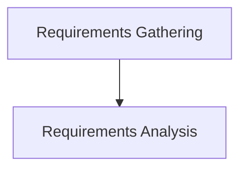

## Diagram 3

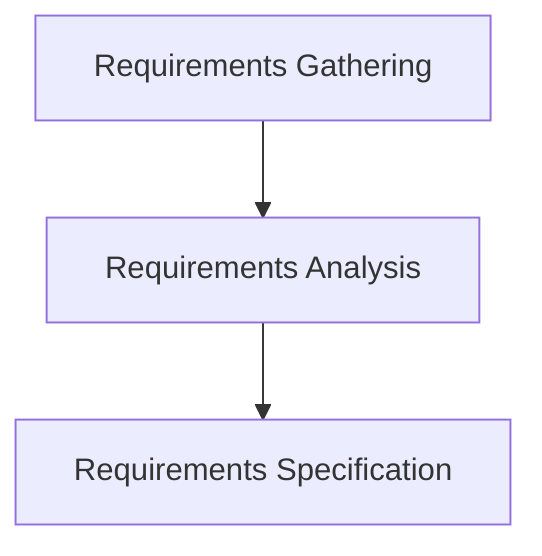

## Diagram 4

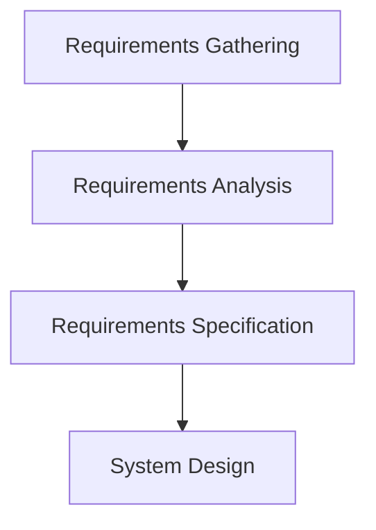

## Diagram 5

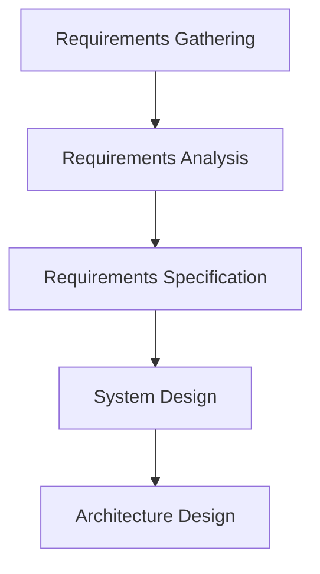

## Diagram 6

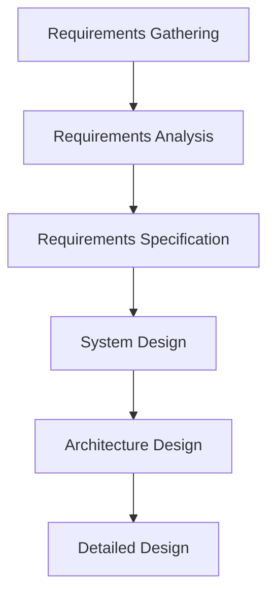

## Diagram 7

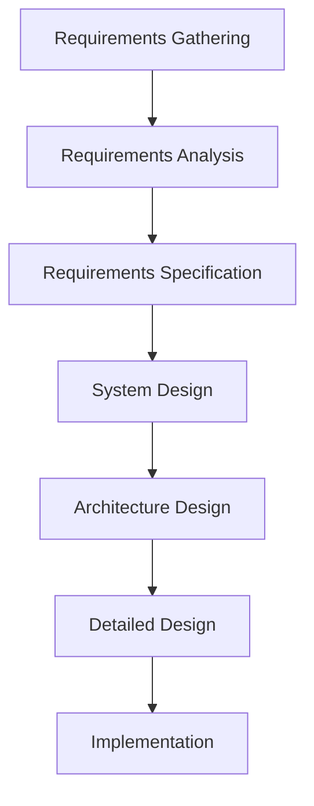

## Diagram 8

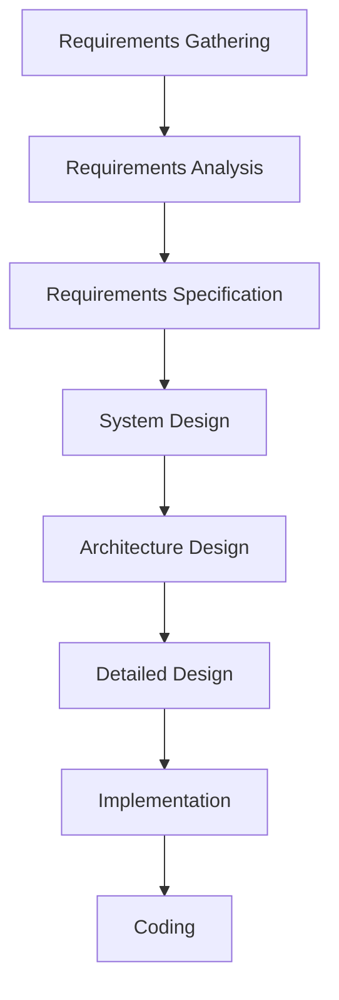

## Diagram 9

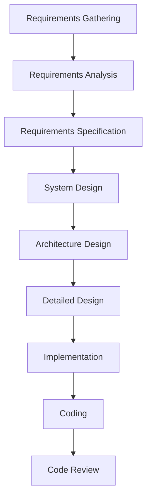

## Diagram 10

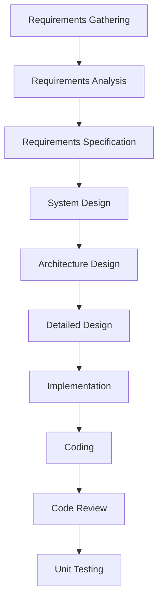

## Diagram 11

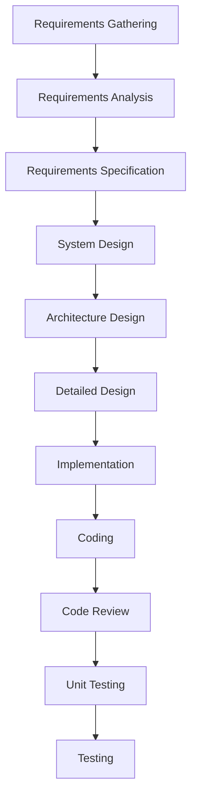

## Diagram 12

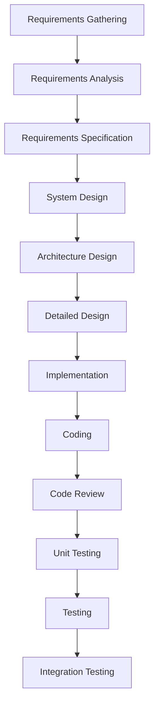

## Diagram 13

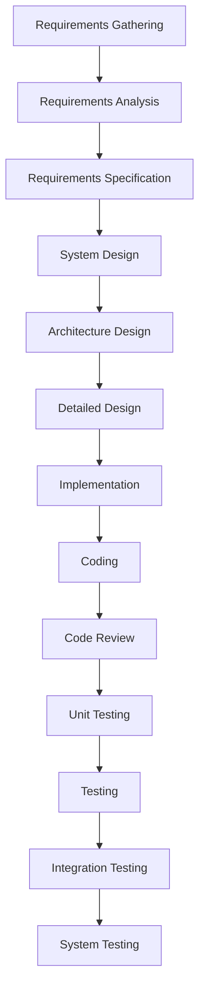

## Diagram 14

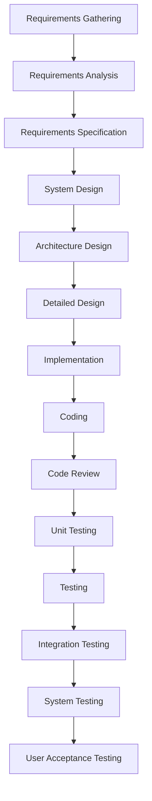

## Diagram 15

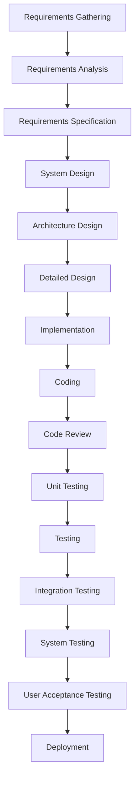

## Diagram 16

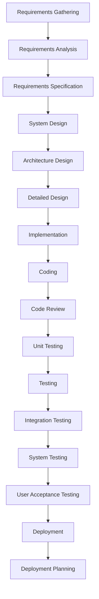

## Diagram 17

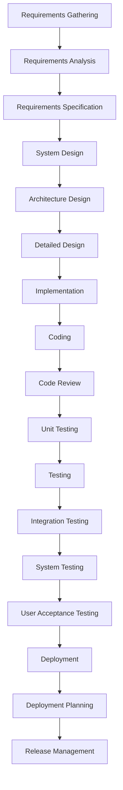

## Diagram 18

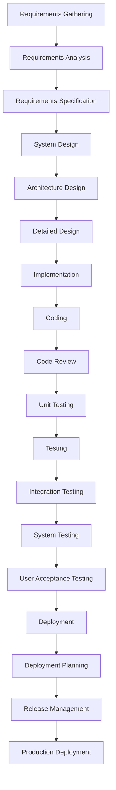

## Diagram 19

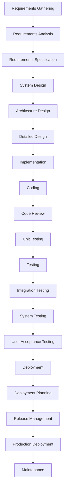

## Diagram 20

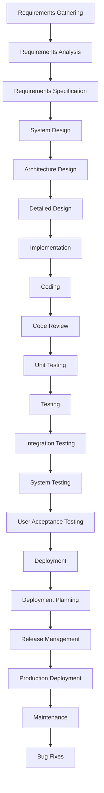

## Diagram 21

```mermaid
flowchart TD
A[Requirements Gathering] --> A1[Requirements Analysis]
A1 --> A2[Requirements Specification]
A2 --> B[System Design]
B --> B1[Architecture Design]
B1 --> B2[Detailed Design]
B2 --> C[Implementation]
C --> C1[Coding]
C1 --> C2[Code Review]
C2 --> C3[Unit Testing]
C3 --> D[Testing]
D --> D1[Integration Testing]
D1 --> D2[System Testing]
D2 --> D3[User Acceptance Testing]
D3 --> E[Deployment]
E --> E1[Deployment Planning]
E1 --> E2[Release Management]
E2 --> E3[Production Deployment]
E3 --> F[Maintenance]
F --> F1[Bug Fixes]
F1 --> F2[Updates & Patches]
```

## Diagram 22

```mermaid
flowchart TD
A[Requirements Gathering] --> A1[Requirements Analysis]
A1 --> A2[Requirements Specification]
A2 --> B[System Design]
B --> B1[Architecture Design]
B1 --> B2[Detailed Design]
B2 --> C[Implementation]
C --> C1[Coding]
C1 --> C2[Code Review]
C2 --> C3[Unit Testing]
C3 --> D[Testing]
D --> D1[Integration Testing]
D1 --> D2[System Testing]
D2 --> D3[User Acceptance Testing]
D3 --> E[Deployment]
E --> E1[Deployment Planning]
E1 --> E2[Release Management]
E2 --> E3[Production Deployment]
E3 --> F[Maintenance]
F --> F1[Bug Fixes]
F1 --> F2[Updates & Patches]
F2 --> F3[Performance Optimization]
```

## Diagram 23

```mermaid
flowchart TD
A[Requirements Gathering] --> A1[Requirements Analysis]
A1 --> A2[Requirements Specification]
A2 --> B[System Design]
B --> B1[Architecture Design]
B1 --> B2[Detailed Design]
B2 --> C[Implementation]
C --> C1[Coding]
C1 --> C2[Code Review]
C2 --> C3[Unit Testing]
C3 --> D[Testing]
D --> D1[Integration Testing]
D1 --> D2[System Testing]
D2 --> D3[User Acceptance Testing]
D3 --> E[Deployment]
E --> E1[Deployment Planning]
E1 --> E2[Release Management]
E2 --> E3[Production Deployment]
E3 --> F[Maintenance]
F --> F1[Bug Fixes]
F1 --> F2[Updates & Patches]
F2 --> F3[Performance Optimization]
D1 -->|Integration Issues| C1
```

## Diagram 24

```mermaid
flowchart TD
A[Requirements Gathering] --> A1[Requirements Analysis]
A1 --> A2[Requirements Specification]
A2 --> B[System Design]
B --> B1[Architecture Design]
B1 --> B2[Detailed Design]
B2 --> C[Implementation]
C --> C1[Coding]
C1 --> C2[Code Review]
C2 --> C3[Unit Testing]
C3 --> D[Testing]
D --> D1[Integration Testing]
D1 --> D2[System Testing]
D2 --> D3[User Acceptance Testing]
D3 --> E[Deployment]
E --> E1[Deployment Planning]
E1 --> E2[Release Management]
E2 --> E3[Production Deployment]
E3 --> F[Maintenance]
F --> F1[Bug Fixes]
F1 --> F2[Updates & Patches]
F2 --> F3[Performance Optimization]
D1 -->|Integration Issues| C1
D2 -->|System Bugs| C
```

## Diagram 25

```mermaid
flowchart TD
A[Requirements Gathering] --> A1[Requirements Analysis]
A1 --> A2[Requirements Specification]
A2 --> B[System Design]
B --> B1[Architecture Design]
B1 --> B2[Detailed Design]
B2 --> C[Implementation]
C --> C1[Coding]
C1 --> C2[Code Review]
C2 --> C3[Unit Testing]
C3 --> D[Testing]
D --> D1[Integration Testing]
D1 --> D2[System Testing]
D2 --> D3[User Acceptance Testing]
D3 --> E[Deployment]
E --> E1[Deployment Planning]
E1 --> E2[Release Management]
E2 --> E3[Production Deployment]
E3 --> F[Maintenance]
F --> F1[Bug Fixes]
F1 --> F2[Updates & Patches]
F2 --> F3[Performance Optimization]
D1 -->|Integration Issues| C1
D2 -->|System Bugs| C
D3 -->|UAT Feedback| B2
```

## Diagram 26

```mermaid
flowchart TD
A[Requirements Gathering] --> A1[Requirements Analysis]
A1 --> A2[Requirements Specification]
A2 --> B[System Design]
B --> B1[Architecture Design]
B1 --> B2[Detailed Design]
B2 --> C[Implementation]
C --> C1[Coding]
C1 --> C2[Code Review]
C2 --> C3[Unit Testing]
C3 --> D[Testing]
D --> D1[Integration Testing]
D1 --> D2[System Testing]
D2 --> D3[User Acceptance Testing]
D3 --> E[Deployment]
E --> E1[Deployment Planning]
E1 --> E2[Release Management]
E2 --> E3[Production Deployment]
E3 --> F[Maintenance]
F --> F1[Bug Fixes]
F1 --> F2[Updates & Patches]
F2 --> F3[Performance Optimization]
D1 -->|Integration Issues| C1
D2 -->|System Bugs| C
D3 -->|UAT Feedback| B2
E3 -->|Deployment Issues| D2
```

## Diagram 27

```mermaid
flowchart TD
A[Requirements Gathering] --> A1[Requirements Analysis]
A1 --> A2[Requirements Specification]
A2 --> B[System Design]
B --> B1[Architecture Design]
B1 --> B2[Detailed Design]
B2 --> C[Implementation]
C --> C1[Coding]
C1 --> C2[Code Review]
C2 --> C3[Unit Testing]
C3 --> D[Testing]
D --> D1[Integration Testing]
D1 --> D2[System Testing]
D2 --> D3[User Acceptance Testing]
D3 --> E[Deployment]
E --> E1[Deployment Planning]
E1 --> E2[Release Management]
E2 --> E3[Production Deployment]
E3 --> F[Maintenance]
F --> F1[Bug Fixes]
F1 --> F2[Updates & Patches]
F2 --> F3[Performance Optimization]
D1 -->|Integration Issues| C1
D2 -->|System Bugs| C
D3 -->|UAT Feedback| B2
E3 -->|Deployment Issues| D2
F1 -->|Critical Bugs| C1
```

## Diagram 28

```mermaid
flowchart TD
A[Requirements Gathering] --> A1[Requirements Analysis]
A1 --> A2[Requirements Specification]
A2 --> B[System Design]
B --> B1[Architecture Design]
B1 --> B2[Detailed Design]
B2 --> C[Implementation]
C --> C1[Coding]
C1 --> C2[Code Review]
C2 --> C3[Unit Testing]
C3 --> D[Testing]
D --> D1[Integration Testing]
D1 --> D2[System Testing]
D2 --> D3[User Acceptance Testing]
D3 --> E[Deployment]
E --> E1[Deployment Planning]
E1 --> E2[Release Management]
E2 --> E3[Production Deployment]
E3 --> F[Maintenance]
F --> F1[Bug Fixes]
F1 --> F2[Updates & Patches]
F2 --> F3[Performance Optimization]
D1 -->|Integration Issues| C1
D2 -->|System Bugs| C
D3 -->|UAT Feedback| B2
E3 -->|Deployment Issues| D2
F1 -->|Critical Bugs| C1
F2 -->|New Features Needed| A
```

## Diagram 29

```mermaid
flowchart TD
A[Requirements Gathering] --> A1[Requirements Analysis]
A1 --> A2[Requirements Specification]
A2 --> B[System Design]
B --> B1[Architecture Design]
B1 --> B2[Detailed Design]
B2 --> C[Implementation]
C --> C1[Coding]
C1 --> C2[Code Review]
C2 --> C3[Unit Testing]
C3 --> D[Testing]
D --> D1[Integration Testing]
D1 --> D2[System Testing]
D2 --> D3[User Acceptance Testing]
D3 --> E[Deployment]
E --> E1[Deployment Planning]
E1 --> E2[Release Management]
E2 --> E3[Production Deployment]
E3 --> F[Maintenance]
F --> F1[Bug Fixes]
F1 --> F2[Updates & Patches]
F2 --> F3[Performance Optimization]
D1 -->|Integration Issues| C1
D2 -->|System Bugs| C
D3 -->|UAT Feedback| B2
E3 -->|Deployment Issues| D2
F1 -->|Critical Bugs| C1
F2 -->|New Features Needed| A
F3 -->|Architecture Limitations| B1
```

## Diagram 30

```mermaid
flowchart TD
A[Requirements Gathering] --> A1[Requirements Analysis]
A1 --> A2[Requirements Specification]
A2 --> B[System Design]
B --> B1[Architecture Design]
B1 --> B2[Detailed Design]
B2 --> C[Implementation]
C --> C1[Coding]
C1 --> C2[Code Review]
C2 --> C3[Unit Testing]
C3 --> D[Testing]
D --> D1[Integration Testing]
D1 --> D2[System Testing]
D2 --> D3[User Acceptance Testing]
D3 --> E[Deployment]
E --> E1[Deployment Planning]
E1 --> E2[Release Management]
E2 --> E3[Production Deployment]
E3 --> F[Maintenance]
F --> F1[Bug Fixes]
F1 --> F2[Updates & Patches]
F2 --> F3[Performance Optimization]
D1 -->|Integration Issues| C1
D2 -->|System Bugs| C
D3 -->|UAT Feedback| B2
E3 -->|Deployment Issues| D2
F1 -->|Critical Bugs| C1
F2 -->|New Features Needed| A
F3 -->|Architecture Limitations| B1
A1 -.->|Feasibility Check| B1
```

## Diagram 31

```mermaid
flowchart TD
A[Requirements Gathering] --> A1[Requirements Analysis]
A1 --> A2[Requirements Specification]
A2 --> B[System Design]
B --> B1[Architecture Design]
B1 --> B2[Detailed Design]
B2 --> C[Implementation]
C --> C1[Coding]
C1 --> C2[Code Review]
C2 --> C3[Unit Testing]
C3 --> D[Testing]
D --> D1[Integration Testing]
D1 --> D2[System Testing]
D2 --> D3[User Acceptance Testing]
D3 --> E[Deployment]
E --> E1[Deployment Planning]
E1 --> E2[Release Management]
E2 --> E3[Production Deployment]
E3 --> F[Maintenance]
F --> F1[Bug Fixes]
F1 --> F2[Updates & Patches]
F2 --> F3[Performance Optimization]
D1 -->|Integration Issues| C1
D2 -->|System Bugs| C
D3 -->|UAT Feedback| B2
E3 -->|Deployment Issues| D2
F1 -->|Critical Bugs| C1
F2 -->|New Features Needed| A
F3 -->|Architecture Limitations| B1
A1 -.->|Feasibility Check| B1
B2 -.->|Design Review| A2
```

## Diagram 32

```mermaid
flowchart TD
A[Requirements Gathering] --> A1[Requirements Analysis]
A1 --> A2[Requirements Specification]
A2 --> B[System Design]
B --> B1[Architecture Design]
B1 --> B2[Detailed Design]
B2 --> C[Implementation]
C --> C1[Coding]
C1 --> C2[Code Review]
C2 --> C3[Unit Testing]
C3 --> D[Testing]
D --> D1[Integration Testing]
D1 --> D2[System Testing]
D2 --> D3[User Acceptance Testing]
D3 --> E[Deployment]
E --> E1[Deployment Planning]
E1 --> E2[Release Management]
E2 --> E3[Production Deployment]
E3 --> F[Maintenance]
F --> F1[Bug Fixes]
F1 --> F2[Updates & Patches]
F2 --> F3[Performance Optimization]
D1 -->|Integration Issues| C1
D2 -->|System Bugs| C
D3 -->|UAT Feedback| B2
E3 -->|Deployment Issues| D2
F1 -->|Critical Bugs| C1
F2 -->|New Features Needed| A
F3 -->|Architecture Limitations| B1
A1 -.->|Feasibility Check| B1
B2 -.->|Design Review| A2
C2 -.->|Standards Compliance| B2
```

## Diagram 33

```mermaid
flowchart TD
A[Requirements Gathering] --> A1[Requirements Analysis]
A1 --> A2[Requirements Specification]
A2 --> B[System Design]
B --> B1[Architecture Design]
B1 --> B2[Detailed Design]
B2 --> C[Implementation]
C --> C1[Coding]
C1 --> C2[Code Review]
C2 --> C3[Unit Testing]
C3 --> D[Testing]
D --> D1[Integration Testing]
D1 --> D2[System Testing]
D2 --> D3[User Acceptance Testing]
D3 --> E[Deployment]
E --> E1[Deployment Planning]
E1 --> E2[Release Management]
E2 --> E3[Production Deployment]
E3 --> F[Maintenance]
F --> F1[Bug Fixes]
F1 --> F2[Updates & Patches]
F2 --> F3[Performance Optimization]
D1 -->|Integration Issues| C1
D2 -->|System Bugs| C
D3 -->|UAT Feedback| B2
E3 -->|Deployment Issues| D2
F1 -->|Critical Bugs| C1
F2 -->|New Features Needed| A
F3 -->|Architecture Limitations| B1
A1 -.->|Feasibility Check| B1
B2 -.->|Design Review| A2
C2 -.->|Standards Compliance| B2
E1 -.->|Infrastructure Requirements| B1
```

## Diagram 34

```mermaid
flowchart TD
A[Requirements Gathering] --> A1[Requirements Analysis]
A1 --> A2[Requirements Specification]
A2 --> B[System Design]
B --> B1[Architecture Design]
B1 --> B2[Detailed Design]
B2 --> C[Implementation]
C --> C1[Coding]
C1 --> C2[Code Review]
C2 --> C3[Unit Testing]
C3 --> D[Testing]
D --> D1[Integration Testing]
D1 --> D2[System Testing]
D2 --> D3[User Acceptance Testing]
D3 --> E[Deployment]
E --> E1[Deployment Planning]
E1 --> E2[Release Management]
E2 --> E3[Production Deployment]
E3 --> F[Maintenance]
F --> F1[Bug Fixes]
F1 --> F2[Updates & Patches]
F2 --> F3[Performance Optimization]
D1 -->|Integration Issues| C1
D2 -->|System Bugs| C
D3 -->|UAT Feedback| B2
E3 -->|Deployment Issues| D2
F1 -->|Critical Bugs| C1
F2 -->|New Features Needed| A
F3 -->|Architecture Limitations| B1
A1 -.->|Feasibility Check| B1
B2 -.->|Design Review| A2
C2 -.->|Standards Compliance| B2
E1 -.->|Infrastructure Requirements| B1
PM[Project Initiation] --> PM1[Project Planning]
```

## Diagram 35

```mermaid
flowchart TD
A[Requirements Gathering] --> A1[Requirements Analysis]
A1 --> A2[Requirements Specification]
A2 --> B[System Design]
B --> B1[Architecture Design]
B1 --> B2[Detailed Design]
B2 --> C[Implementation]
C --> C1[Coding]
C1 --> C2[Code Review]
C2 --> C3[Unit Testing]
C3 --> D[Testing]
D --> D1[Integration Testing]
D1 --> D2[System Testing]
D2 --> D3[User Acceptance Testing]
D3 --> E[Deployment]
E --> E1[Deployment Planning]
E1 --> E2[Release Management]
E2 --> E3[Production Deployment]
E3 --> F[Maintenance]
F --> F1[Bug Fixes]
F1 --> F2[Updates & Patches]
F2 --> F3[Performance Optimization]
D1 -->|Integration Issues| C1
D2 -->|System Bugs| C
D3 -->|UAT Feedback| B2
E3 -->|Deployment Issues| D2
F1 -->|Critical Bugs| C1
F2 -->|New Features Needed| A
F3 -->|Architecture Limitations| B1
A1 -.->|Feasibility Check| B1
B2 -.->|Design Review| A2
C2 -.->|Standards Compliance| B2
E1 -.->|Infrastructure Requirements| B1
PM[Project Initiation] --> PM1[Project Planning]
PM1 --> PM2[Resource Allocation]
```

## Diagram 36

```mermaid
flowchart TD
A[Requirements Gathering] --> A1[Requirements Analysis]
A1 --> A2[Requirements Specification]
A2 --> B[System Design]
B --> B1[Architecture Design]
B1 --> B2[Detailed Design]
B2 --> C[Implementation]
C --> C1[Coding]
C1 --> C2[Code Review]
C2 --> C3[Unit Testing]
C3 --> D[Testing]
D --> D1[Integration Testing]
D1 --> D2[System Testing]
D2 --> D3[User Acceptance Testing]
D3 --> E[Deployment]
E --> E1[Deployment Planning]
E1 --> E2[Release Management]
E2 --> E3[Production Deployment]
E3 --> F[Maintenance]
F --> F1[Bug Fixes]
F1 --> F2[Updates & Patches]
F2 --> F3[Performance Optimization]
D1 -->|Integration Issues| C1
D2 -->|System Bugs| C
D3 -->|UAT Feedback| B2
E3 -->|Deployment Issues| D2
F1 -->|Critical Bugs| C1
F2 -->|New Features Needed| A
F3 -->|Architecture Limitations| B1
A1 -.->|Feasibility Check| B1
B2 -.->|Design Review| A2
C2 -.->|Standards Compliance| B2
E1 -.->|Infrastructure Requirements| B1
PM[Project Initiation] --> PM1[Project Planning]
PM1 --> PM2[Resource Allocation]
PM2 --> PM3[Schedule Management]
```

## Diagram 37

```mermaid
flowchart TD
A[Requirements Gathering] --> A1[Requirements Analysis]
A1 --> A2[Requirements Specification]
A2 --> B[System Design]
B --> B1[Architecture Design]
B1 --> B2[Detailed Design]
B2 --> C[Implementation]
C --> C1[Coding]
C1 --> C2[Code Review]
C2 --> C3[Unit Testing]
C3 --> D[Testing]
D --> D1[Integration Testing]
D1 --> D2[System Testing]
D2 --> D3[User Acceptance Testing]
D3 --> E[Deployment]
E --> E1[Deployment Planning]
E1 --> E2[Release Management]
E2 --> E3[Production Deployment]
E3 --> F[Maintenance]
F --> F1[Bug Fixes]
F1 --> F2[Updates & Patches]
F2 --> F3[Performance Optimization]
D1 -->|Integration Issues| C1
D2 -->|System Bugs| C
D3 -->|UAT Feedback| B2
E3 -->|Deployment Issues| D2
F1 -->|Critical Bugs| C1
F2 -->|New Features Needed| A
F3 -->|Architecture Limitations| B1
A1 -.->|Feasibility Check| B1
B2 -.->|Design Review| A2
C2 -.->|Standards Compliance| B2
E1 -.->|Infrastructure Requirements| B1
PM[Project Initiation] --> PM1[Project Planning]
PM1 --> PM2[Resource Allocation]
PM2 --> PM3[Schedule Management]
PM3 --> PM4[Risk Management]
```

## Diagram 38

```mermaid
flowchart TD
A[Requirements Gathering] --> A1[Requirements Analysis]
A1 --> A2[Requirements Specification]
A2 --> B[System Design]
B --> B1[Architecture Design]
B1 --> B2[Detailed Design]
B2 --> C[Implementation]
C --> C1[Coding]
C1 --> C2[Code Review]
C2 --> C3[Unit Testing]
C3 --> D[Testing]
D --> D1[Integration Testing]
D1 --> D2[System Testing]
D2 --> D3[User Acceptance Testing]
D3 --> E[Deployment]
E --> E1[Deployment Planning]
E1 --> E2[Release Management]
E2 --> E3[Production Deployment]
E3 --> F[Maintenance]
F --> F1[Bug Fixes]
F1 --> F2[Updates & Patches]
F2 --> F3[Performance Optimization]
D1 -->|Integration Issues| C1
D2 -->|System Bugs| C
D3 -->|UAT Feedback| B2
E3 -->|Deployment Issues| D2
F1 -->|Critical Bugs| C1
F2 -->|New Features Needed| A
F3 -->|Architecture Limitations| B1
A1 -.->|Feasibility Check| B1
B2 -.->|Design Review| A2
C2 -.->|Standards Compliance| B2
E1 -.->|Infrastructure Requirements| B1
PM[Project Initiation] --> PM1[Project Planning]
PM1 --> PM2[Resource Allocation]
PM2 --> PM3[Schedule Management]
PM3 --> PM4[Risk Management]
PM4 --> PM5[Project Monitoring]
```

## Diagram 39

```mermaid
flowchart TD
A[Requirements Gathering] --> A1[Requirements Analysis]
A1 --> A2[Requirements Specification]
A2 --> B[System Design]
B --> B1[Architecture Design]
B1 --> B2[Detailed Design]
B2 --> C[Implementation]
C --> C1[Coding]
C1 --> C2[Code Review]
C2 --> C3[Unit Testing]
C3 --> D[Testing]
D --> D1[Integration Testing]
D1 --> D2[System Testing]
D2 --> D3[User Acceptance Testing]
D3 --> E[Deployment]
E --> E1[Deployment Planning]
E1 --> E2[Release Management]
E2 --> E3[Production Deployment]
E3 --> F[Maintenance]
F --> F1[Bug Fixes]
F1 --> F2[Updates & Patches]
F2 --> F3[Performance Optimization]
D1 -->|Integration Issues| C1
D2 -->|System Bugs| C
D3 -->|UAT Feedback| B2
E3 -->|Deployment Issues| D2
F1 -->|Critical Bugs| C1
F2 -->|New Features Needed| A
F3 -->|Architecture Limitations| B1
A1 -.->|Feasibility Check| B1
B2 -.->|Design Review| A2
C2 -.->|Standards Compliance| B2
E1 -.->|Infrastructure Requirements| B1
PM[Project Initiation] --> PM1[Project Planning]
PM1 --> PM2[Resource Allocation]
PM2 --> PM3[Schedule Management]
PM3 --> PM4[Risk Management]
PM4 --> PM5[Project Monitoring]
PM5 --> PM6[Project Closure]
```

## Diagram 40

```mermaid
flowchart TD
A[Requirements Gathering] --> A1[Requirements Analysis]
A1 --> A2[Requirements Specification]
A2 --> B[System Design]
B --> B1[Architecture Design]
B1 --> B2[Detailed Design]
B2 --> C[Implementation]
C --> C1[Coding]
C1 --> C2[Code Review]
C2 --> C3[Unit Testing]
C3 --> D[Testing]
D --> D1[Integration Testing]
D1 --> D2[System Testing]
D2 --> D3[User Acceptance Testing]
D3 --> E[Deployment]
E --> E1[Deployment Planning]
E1 --> E2[Release Management]
E2 --> E3[Production Deployment]
E3 --> F[Maintenance]
F --> F1[Bug Fixes]
F1 --> F2[Updates & Patches]
F2 --> F3[Performance Optimization]
D1 -->|Integration Issues| C1
D2 -->|System Bugs| C
D3 -->|UAT Feedback| B2
E3 -->|Deployment Issues| D2
F1 -->|Critical Bugs| C1
F2 -->|New Features Needed| A
F3 -->|Architecture Limitations| B1
A1 -.->|Feasibility Check| B1
B2 -.->|Design Review| A2
C2 -.->|Standards Compliance| B2
E1 -.->|Infrastructure Requirements| B1
PM[Project Initiation] --> PM1[Project Planning]
PM1 --> PM2[Resource Allocation]
PM2 --> PM3[Schedule Management]
PM3 --> PM4[Risk Management]
PM4 --> PM5[Project Monitoring]
PM5 --> PM6[Project Closure]
PM1 -.-> A
```

## Diagram 41

```mermaid
flowchart TD
A[Requirements Gathering] --> A1[Requirements Analysis]
A1 --> A2[Requirements Specification]
A2 --> B[System Design]
B --> B1[Architecture Design]
B1 --> B2[Detailed Design]
B2 --> C[Implementation]
C --> C1[Coding]
C1 --> C2[Code Review]
C2 --> C3[Unit Testing]
C3 --> D[Testing]
D --> D1[Integration Testing]
D1 --> D2[System Testing]
D2 --> D3[User Acceptance Testing]
D3 --> E[Deployment]
E --> E1[Deployment Planning]
E1 --> E2[Release Management]
E2 --> E3[Production Deployment]
E3 --> F[Maintenance]
F --> F1[Bug Fixes]
F1 --> F2[Updates & Patches]
F2 --> F3[Performance Optimization]
D1 -->|Integration Issues| C1
D2 -->|System Bugs| C
D3 -->|UAT Feedback| B2
E3 -->|Deployment Issues| D2
F1 -->|Critical Bugs| C1
F2 -->|New Features Needed| A
F3 -->|Architecture Limitations| B1
A1 -.->|Feasibility Check| B1
B2 -.->|Design Review| A2
C2 -.->|Standards Compliance| B2
E1 -.->|Infrastructure Requirements| B1
PM[Project Initiation] --> PM1[Project Planning]
PM1 --> PM2[Resource Allocation]
PM2 --> PM3[Schedule Management]
PM3 --> PM4[Risk Management]
PM4 --> PM5[Project Monitoring]
PM5 --> PM6[Project Closure]
PM1 -.-> A
PM2 -.-> B
```

## Diagram 42

```mermaid
flowchart TD
A[Requirements Gathering] --> A1[Requirements Analysis]
A1 --> A2[Requirements Specification]
A2 --> B[System Design]
B --> B1[Architecture Design]
B1 --> B2[Detailed Design]
B2 --> C[Implementation]
C --> C1[Coding]
C1 --> C2[Code Review]
C2 --> C3[Unit Testing]
C3 --> D[Testing]
D --> D1[Integration Testing]
D1 --> D2[System Testing]
D2 --> D3[User Acceptance Testing]
D3 --> E[Deployment]
E --> E1[Deployment Planning]
E1 --> E2[Release Management]
E2 --> E3[Production Deployment]
E3 --> F[Maintenance]
F --> F1[Bug Fixes]
F1 --> F2[Updates & Patches]
F2 --> F3[Performance Optimization]
D1 -->|Integration Issues| C1
D2 -->|System Bugs| C
D3 -->|UAT Feedback| B2
E3 -->|Deployment Issues| D2
F1 -->|Critical Bugs| C1
F2 -->|New Features Needed| A
F3 -->|Architecture Limitations| B1
A1 -.->|Feasibility Check| B1
B2 -.->|Design Review| A2
C2 -.->|Standards Compliance| B2
E1 -.->|Infrastructure Requirements| B1
PM[Project Initiation] --> PM1[Project Planning]
PM1 --> PM2[Resource Allocation]
PM2 --> PM3[Schedule Management]
PM3 --> PM4[Risk Management]
PM4 --> PM5[Project Monitoring]
PM5 --> PM6[Project Closure]
PM1 -.-> A
PM2 -.-> B
PM3 -.-> C
```

## Diagram 43

```mermaid
flowchart TD
A[Requirements Gathering] --> A1[Requirements Analysis]
A1 --> A2[Requirements Specification]
A2 --> B[System Design]
B --> B1[Architecture Design]
B1 --> B2[Detailed Design]
B2 --> C[Implementation]
C --> C1[Coding]
C1 --> C2[Code Review]
C2 --> C3[Unit Testing]
C3 --> D[Testing]
D --> D1[Integration Testing]
D1 --> D2[System Testing]
D2 --> D3[User Acceptance Testing]
D3 --> E[Deployment]
E --> E1[Deployment Planning]
E1 --> E2[Release Management]
E2 --> E3[Production Deployment]
E3 --> F[Maintenance]
F --> F1[Bug Fixes]
F1 --> F2[Updates & Patches]
F2 --> F3[Performance Optimization]
D1 -->|Integration Issues| C1
D2 -->|System Bugs| C
D3 -->|UAT Feedback| B2
E3 -->|Deployment Issues| D2
F1 -->|Critical Bugs| C1
F2 -->|New Features Needed| A
F3 -->|Architecture Limitations| B1
A1 -.->|Feasibility Check| B1
B2 -.->|Design Review| A2
C2 -.->|Standards Compliance| B2
E1 -.->|Infrastructure Requirements| B1
PM[Project Initiation] --> PM1[Project Planning]
PM1 --> PM2[Resource Allocation]
PM2 --> PM3[Schedule Management]
PM3 --> PM4[Risk Management]
PM4 --> PM5[Project Monitoring]
PM5 --> PM6[Project Closure]
PM1 -.-> A
PM2 -.-> B
PM3 -.-> C
PM4 -.-> D
```

## Diagram 44

```mermaid
flowchart TD
A[Requirements Gathering] --> A1[Requirements Analysis]
A1 --> A2[Requirements Specification]
A2 --> B[System Design]
B --> B1[Architecture Design]
B1 --> B2[Detailed Design]
B2 --> C[Implementation]
C --> C1[Coding]
C1 --> C2[Code Review]
C2 --> C3[Unit Testing]
C3 --> D[Testing]
D --> D1[Integration Testing]
D1 --> D2[System Testing]
D2 --> D3[User Acceptance Testing]
D3 --> E[Deployment]
E --> E1[Deployment Planning]
E1 --> E2[Release Management]
E2 --> E3[Production Deployment]
E3 --> F[Maintenance]
F --> F1[Bug Fixes]
F1 --> F2[Updates & Patches]
F2 --> F3[Performance Optimization]
D1 -->|Integration Issues| C1
D2 -->|System Bugs| C
D3 -->|UAT Feedback| B2
E3 -->|Deployment Issues| D2
F1 -->|Critical Bugs| C1
F2 -->|New Features Needed| A
F3 -->|Architecture Limitations| B1
A1 -.->|Feasibility Check| B1
B2 -.->|Design Review| A2
C2 -.->|Standards Compliance| B2
E1 -.->|Infrastructure Requirements| B1
PM[Project Initiation] --> PM1[Project Planning]
PM1 --> PM2[Resource Allocation]
PM2 --> PM3[Schedule Management]
PM3 --> PM4[Risk Management]
PM4 --> PM5[Project Monitoring]
PM5 --> PM6[Project Closure]
PM1 -.-> A
PM2 -.-> B
PM3 -.-> C
PM4 -.-> D
PM5 -.-> E
```

## Diagram 45

```mermaid
flowchart TD
A[Requirements Gathering] --> A1[Requirements Analysis]
A1 --> A2[Requirements Specification]
A2 --> B[System Design]
B --> B1[Architecture Design]
B1 --> B2[Detailed Design]
B2 --> C[Implementation]
C --> C1[Coding]
C1 --> C2[Code Review]
C2 --> C3[Unit Testing]
C3 --> D[Testing]
D --> D1[Integration Testing]
D1 --> D2[System Testing]
D2 --> D3[User Acceptance Testing]
D3 --> E[Deployment]
E --> E1[Deployment Planning]
E1 --> E2[Release Management]
E2 --> E3[Production Deployment]
E3 --> F[Maintenance]
F --> F1[Bug Fixes]
F1 --> F2[Updates & Patches]
F2 --> F3[Performance Optimization]
D1 -->|Integration Issues| C1
D2 -->|System Bugs| C
D3 -->|UAT Feedback| B2
E3 -->|Deployment Issues| D2
F1 -->|Critical Bugs| C1
F2 -->|New Features Needed| A
F3 -->|Architecture Limitations| B1
A1 -.->|Feasibility Check| B1
B2 -.->|Design Review| A2
C2 -.->|Standards Compliance| B2
E1 -.->|Infrastructure Requirements| B1
PM[Project Initiation] --> PM1[Project Planning]
PM1 --> PM2[Resource Allocation]
PM2 --> PM3[Schedule Management]
PM3 --> PM4[Risk Management]
PM4 --> PM5[Project Monitoring]
PM5 --> PM6[Project Closure]
PM1 -.-> A
PM2 -.-> B
PM3 -.-> C
PM4 -.-> D
PM5 -.-> E
PM6 -.-> F
```

## Diagram 46

```mermaid
flowchart TD
A[Requirements Gathering] --> A1[Requirements Analysis]
A1 --> A2[Requirements Specification]
A2 --> B[System Design]
B --> B1[Architecture Design]
B1 --> B2[Detailed Design]
B2 --> C[Implementation]
C --> C1[Coding]
C1 --> C2[Code Review]
C2 --> C3[Unit Testing]
C3 --> D[Testing]
D --> D1[Integration Testing]
D1 --> D2[System Testing]
D2 --> D3[User Acceptance Testing]
D3 --> E[Deployment]
E --> E1[Deployment Planning]
E1 --> E2[Release Management]
E2 --> E3[Production Deployment]
E3 --> F[Maintenance]
F --> F1[Bug Fixes]
F1 --> F2[Updates & Patches]
F2 --> F3[Performance Optimization]
D1 -->|Integration Issues| C1
D2 -->|System Bugs| C
D3 -->|UAT Feedback| B2
E3 -->|Deployment Issues| D2
F1 -->|Critical Bugs| C1
F2 -->|New Features Needed| A
F3 -->|Architecture Limitations| B1
A1 -.->|Feasibility Check| B1
B2 -.->|Design Review| A2
C2 -.->|Standards Compliance| B2
E1 -.->|Infrastructure Requirements| B1
PM[Project Initiation] --> PM1[Project Planning]
PM1 --> PM2[Resource Allocation]
PM2 --> PM3[Schedule Management]
PM3 --> PM4[Risk Management]
PM4 --> PM5[Project Monitoring]
PM5 --> PM6[Project Closure]
PM1 -.-> A
PM2 -.-> B
PM3 -.-> C
PM4 -.-> D
PM5 -.-> E
PM6 -.-> F
QA[Quality Planning] --> QA1[Quality Standards]
```

## Diagram 47

```mermaid
flowchart TD
A[Requirements Gathering] --> A1[Requirements Analysis]
A1 --> A2[Requirements Specification]
A2 --> B[System Design]
B --> B1[Architecture Design]
B1 --> B2[Detailed Design]
B2 --> C[Implementation]
C --> C1[Coding]
C1 --> C2[Code Review]
C2 --> C3[Unit Testing]
C3 --> D[Testing]
D --> D1[Integration Testing]
D1 --> D2[System Testing]
D2 --> D3[User Acceptance Testing]
D3 --> E[Deployment]
E --> E1[Deployment Planning]
E1 --> E2[Release Management]
E2 --> E3[Production Deployment]
E3 --> F[Maintenance]
F --> F1[Bug Fixes]
F1 --> F2[Updates & Patches]
F2 --> F3[Performance Optimization]
D1 -->|Integration Issues| C1
D2 -->|System Bugs| C
D3 -->|UAT Feedback| B2
E3 -->|Deployment Issues| D2
F1 -->|Critical Bugs| C1
F2 -->|New Features Needed| A
F3 -->|Architecture Limitations| B1
A1 -.->|Feasibility Check| B1
B2 -.->|Design Review| A2
C2 -.->|Standards Compliance| B2
E1 -.->|Infrastructure Requirements| B1
PM[Project Initiation] --> PM1[Project Planning]
PM1 --> PM2[Resource Allocation]
PM2 --> PM3[Schedule Management]
PM3 --> PM4[Risk Management]
PM4 --> PM5[Project Monitoring]
PM5 --> PM6[Project Closure]
PM1 -.-> A
PM2 -.-> B
PM3 -.-> C
PM4 -.-> D
PM5 -.-> E
PM6 -.-> F
QA[Quality Planning] --> QA1[Quality Standards]
QA1 --> QA2[Quality Assurance]
```

## Diagram 48

```mermaid
flowchart TD
A[Requirements Gathering] --> A1[Requirements Analysis]
A1 --> A2[Requirements Specification]
A2 --> B[System Design]
B --> B1[Architecture Design]
B1 --> B2[Detailed Design]
B2 --> C[Implementation]
C --> C1[Coding]
C1 --> C2[Code Review]
C2 --> C3[Unit Testing]
C3 --> D[Testing]
D --> D1[Integration Testing]
D1 --> D2[System Testing]
D2 --> D3[User Acceptance Testing]
D3 --> E[Deployment]
E --> E1[Deployment Planning]
E1 --> E2[Release Management]
E2 --> E3[Production Deployment]
E3 --> F[Maintenance]
F --> F1[Bug Fixes]
F1 --> F2[Updates & Patches]
F2 --> F3[Performance Optimization]
D1 -->|Integration Issues| C1
D2 -->|System Bugs| C
D3 -->|UAT Feedback| B2
E3 -->|Deployment Issues| D2
F1 -->|Critical Bugs| C1
F2 -->|New Features Needed| A
F3 -->|Architecture Limitations| B1
A1 -.->|Feasibility Check| B1
B2 -.->|Design Review| A2
C2 -.->|Standards Compliance| B2
E1 -.->|Infrastructure Requirements| B1
PM[Project Initiation] --> PM1[Project Planning]
PM1 --> PM2[Resource Allocation]
PM2 --> PM3[Schedule Management]
PM3 --> PM4[Risk Management]
PM4 --> PM5[Project Monitoring]
PM5 --> PM6[Project Closure]
PM1 -.-> A
PM2 -.-> B
PM3 -.-> C
PM4 -.-> D
PM5 -.-> E
PM6 -.-> F
QA[Quality Planning] --> QA1[Quality Standards]
QA1 --> QA2[Quality Assurance]
QA2 --> QA3[Quality Control]
```

## Diagram 49

```mermaid
flowchart TD
A[Requirements Gathering] --> A1[Requirements Analysis]
A1 --> A2[Requirements Specification]
A2 --> B[System Design]
B --> B1[Architecture Design]
B1 --> B2[Detailed Design]
B2 --> C[Implementation]
C --> C1[Coding]
C1 --> C2[Code Review]
C2 --> C3[Unit Testing]
C3 --> D[Testing]
D --> D1[Integration Testing]
D1 --> D2[System Testing]
D2 --> D3[User Acceptance Testing]
D3 --> E[Deployment]
E --> E1[Deployment Planning]
E1 --> E2[Release Management]
E2 --> E3[Production Deployment]
E3 --> F[Maintenance]
F --> F1[Bug Fixes]
F1 --> F2[Updates & Patches]
F2 --> F3[Performance Optimization]
D1 -->|Integration Issues| C1
D2 -->|System Bugs| C
D3 -->|UAT Feedback| B2
E3 -->|Deployment Issues| D2
F1 -->|Critical Bugs| C1
F2 -->|New Features Needed| A
F3 -->|Architecture Limitations| B1
A1 -.->|Feasibility Check| B1
B2 -.->|Design Review| A2
C2 -.->|Standards Compliance| B2
E1 -.->|Infrastructure Requirements| B1
PM[Project Initiation] --> PM1[Project Planning]
PM1 --> PM2[Resource Allocation]
PM2 --> PM3[Schedule Management]
PM3 --> PM4[Risk Management]
PM4 --> PM5[Project Monitoring]
PM5 --> PM6[Project Closure]
PM1 -.-> A
PM2 -.-> B
PM3 -.-> C
PM4 -.-> D
PM5 -.-> E
PM6 -.-> F
QA[Quality Planning] --> QA1[Quality Standards]
QA1 --> QA2[Quality Assurance]
QA2 --> QA3[Quality Control]
QA3 --> QA4[Process Improvement]
```

## Diagram 50

```mermaid
flowchart TD
A[Requirements Gathering] --> A1[Requirements Analysis]
A1 --> A2[Requirements Specification]
A2 --> B[System Design]
B --> B1[Architecture Design]
B1 --> B2[Detailed Design]
B2 --> C[Implementation]
C --> C1[Coding]
C1 --> C2[Code Review]
C2 --> C3[Unit Testing]
C3 --> D[Testing]
D --> D1[Integration Testing]
D1 --> D2[System Testing]
D2 --> D3[User Acceptance Testing]
D3 --> E[Deployment]
E --> E1[Deployment Planning]
E1 --> E2[Release Management]
E2 --> E3[Production Deployment]
E3 --> F[Maintenance]
F --> F1[Bug Fixes]
F1 --> F2[Updates & Patches]
F2 --> F3[Performance Optimization]
D1 -->|Integration Issues| C1
D2 -->|System Bugs| C
D3 -->|UAT Feedback| B2
E3 -->|Deployment Issues| D2
F1 -->|Critical Bugs| C1
F2 -->|New Features Needed| A
F3 -->|Architecture Limitations| B1
A1 -.->|Feasibility Check| B1
B2 -.->|Design Review| A2
C2 -.->|Standards Compliance| B2
E1 -.->|Infrastructure Requirements| B1
PM[Project Initiation] --> PM1[Project Planning]
PM1 --> PM2[Resource Allocation]
PM2 --> PM3[Schedule Management]
PM3 --> PM4[Risk Management]
PM4 --> PM5[Project Monitoring]
PM5 --> PM6[Project Closure]
PM1 -.-> A
PM2 -.-> B
PM3 -.-> C
PM4 -.-> D
PM5 -.-> E
PM6 -.-> F
QA[Quality Planning] --> QA1[Quality Standards]
QA1 --> QA2[Quality Assurance]
QA2 --> QA3[Quality Control]
QA3 --> QA4[Process Improvement]
QA1 -.-> A2
```

## Diagram 51

```mermaid
flowchart TD
A[Requirements Gathering] --> A1[Requirements Analysis]
A1 --> A2[Requirements Specification]
A2 --> B[System Design]
B --> B1[Architecture Design]
B1 --> B2[Detailed Design]
B2 --> C[Implementation]
C --> C1[Coding]
C1 --> C2[Code Review]
C2 --> C3[Unit Testing]
C3 --> D[Testing]
D --> D1[Integration Testing]
D1 --> D2[System Testing]
D2 --> D3[User Acceptance Testing]
D3 --> E[Deployment]
E --> E1[Deployment Planning]
E1 --> E2[Release Management]
E2 --> E3[Production Deployment]
E3 --> F[Maintenance]
F --> F1[Bug Fixes]
F1 --> F2[Updates & Patches]
F2 --> F3[Performance Optimization]
D1 -->|Integration Issues| C1
D2 -->|System Bugs| C
D3 -->|UAT Feedback| B2
E3 -->|Deployment Issues| D2
F1 -->|Critical Bugs| C1
F2 -->|New Features Needed| A
F3 -->|Architecture Limitations| B1
A1 -.->|Feasibility Check| B1
B2 -.->|Design Review| A2
C2 -.->|Standards Compliance| B2
E1 -.->|Infrastructure Requirements| B1
PM[Project Initiation] --> PM1[Project Planning]
PM1 --> PM2[Resource Allocation]
PM2 --> PM3[Schedule Management]
PM3 --> PM4[Risk Management]
PM4 --> PM5[Project Monitoring]
PM5 --> PM6[Project Closure]
PM1 -.-> A
PM2 -.-> B
PM3 -.-> C
PM4 -.-> D
PM5 -.-> E
PM6 -.-> F
QA[Quality Planning] --> QA1[Quality Standards]
QA1 --> QA2[Quality Assurance]
QA2 --> QA3[Quality Control]
QA3 --> QA4[Process Improvement]
QA1 -.-> A2
QA2 -.-> B2
```

## Diagram 52

```mermaid
flowchart TD
A[Requirements Gathering] --> A1[Requirements Analysis]
A1 --> A2[Requirements Specification]
A2 --> B[System Design]
B --> B1[Architecture Design]
B1 --> B2[Detailed Design]
B2 --> C[Implementation]
C --> C1[Coding]
C1 --> C2[Code Review]
C2 --> C3[Unit Testing]
C3 --> D[Testing]
D --> D1[Integration Testing]
D1 --> D2[System Testing]
D2 --> D3[User Acceptance Testing]
D3 --> E[Deployment]
E --> E1[Deployment Planning]
E1 --> E2[Release Management]
E2 --> E3[Production Deployment]
E3 --> F[Maintenance]
F --> F1[Bug Fixes]
F1 --> F2[Updates & Patches]
F2 --> F3[Performance Optimization]
D1 -->|Integration Issues| C1
D2 -->|System Bugs| C
D3 -->|UAT Feedback| B2
E3 -->|Deployment Issues| D2
F1 -->|Critical Bugs| C1
F2 -->|New Features Needed| A
F3 -->|Architecture Limitations| B1
A1 -.->|Feasibility Check| B1
B2 -.->|Design Review| A2
C2 -.->|Standards Compliance| B2
E1 -.->|Infrastructure Requirements| B1
PM[Project Initiation] --> PM1[Project Planning]
PM1 --> PM2[Resource Allocation]
PM2 --> PM3[Schedule Management]
PM3 --> PM4[Risk Management]
PM4 --> PM5[Project Monitoring]
PM5 --> PM6[Project Closure]
PM1 -.-> A
PM2 -.-> B
PM3 -.-> C
PM4 -.-> D
PM5 -.-> E
PM6 -.-> F
QA[Quality Planning] --> QA1[Quality Standards]
QA1 --> QA2[Quality Assurance]
QA2 --> QA3[Quality Control]
QA3 --> QA4[Process Improvement]
QA1 -.-> A2
QA2 -.-> B2
QA3 -.-> C2
```

## Diagram 53

```mermaid
flowchart TD
A[Requirements Gathering] --> A1[Requirements Analysis]
A1 --> A2[Requirements Specification]
A2 --> B[System Design]
B --> B1[Architecture Design]
B1 --> B2[Detailed Design]
B2 --> C[Implementation]
C --> C1[Coding]
C1 --> C2[Code Review]
C2 --> C3[Unit Testing]
C3 --> D[Testing]
D --> D1[Integration Testing]
D1 --> D2[System Testing]
D2 --> D3[User Acceptance Testing]
D3 --> E[Deployment]
E --> E1[Deployment Planning]
E1 --> E2[Release Management]
E2 --> E3[Production Deployment]
E3 --> F[Maintenance]
F --> F1[Bug Fixes]
F1 --> F2[Updates & Patches]
F2 --> F3[Performance Optimization]
D1 -->|Integration Issues| C1
D2 -->|System Bugs| C
D3 -->|UAT Feedback| B2
E3 -->|Deployment Issues| D2
F1 -->|Critical Bugs| C1
F2 -->|New Features Needed| A
F3 -->|Architecture Limitations| B1
A1 -.->|Feasibility Check| B1
B2 -.->|Design Review| A2
C2 -.->|Standards Compliance| B2
E1 -.->|Infrastructure Requirements| B1
PM[Project Initiation] --> PM1[Project Planning]
PM1 --> PM2[Resource Allocation]
PM2 --> PM3[Schedule Management]
PM3 --> PM4[Risk Management]
PM4 --> PM5[Project Monitoring]
PM5 --> PM6[Project Closure]
PM1 -.-> A
PM2 -.-> B
PM3 -.-> C
PM4 -.-> D
PM5 -.-> E
PM6 -.-> F
QA[Quality Planning] --> QA1[Quality Standards]
QA1 --> QA2[Quality Assurance]
QA2 --> QA3[Quality Control]
QA3 --> QA4[Process Improvement]
QA1 -.-> A2
QA2 -.-> B2
QA3 -.-> C2
QA3 -.-> D
```

## Diagram 54

```mermaid
flowchart TD
A[Requirements Gathering] --> A1[Requirements Analysis]
A1 --> A2[Requirements Specification]
A2 --> B[System Design]
B --> B1[Architecture Design]
B1 --> B2[Detailed Design]
B2 --> C[Implementation]
C --> C1[Coding]
C1 --> C2[Code Review]
C2 --> C3[Unit Testing]
C3 --> D[Testing]
D --> D1[Integration Testing]
D1 --> D2[System Testing]
D2 --> D3[User Acceptance Testing]
D3 --> E[Deployment]
E --> E1[Deployment Planning]
E1 --> E2[Release Management]
E2 --> E3[Production Deployment]
E3 --> F[Maintenance]
F --> F1[Bug Fixes]
F1 --> F2[Updates & Patches]
F2 --> F3[Performance Optimization]
D1 -->|Integration Issues| C1
D2 -->|System Bugs| C
D3 -->|UAT Feedback| B2
E3 -->|Deployment Issues| D2
F1 -->|Critical Bugs| C1
F2 -->|New Features Needed| A
F3 -->|Architecture Limitations| B1
A1 -.->|Feasibility Check| B1
B2 -.->|Design Review| A2
C2 -.->|Standards Compliance| B2
E1 -.->|Infrastructure Requirements| B1
PM[Project Initiation] --> PM1[Project Planning]
PM1 --> PM2[Resource Allocation]
PM2 --> PM3[Schedule Management]
PM3 --> PM4[Risk Management]
PM4 --> PM5[Project Monitoring]
PM5 --> PM6[Project Closure]
PM1 -.-> A
PM2 -.-> B
PM3 -.-> C
PM4 -.-> D
PM5 -.-> E
PM6 -.-> F
QA[Quality Planning] --> QA1[Quality Standards]
QA1 --> QA2[Quality Assurance]
QA2 --> QA3[Quality Control]
QA3 --> QA4[Process Improvement]
QA1 -.-> A2
QA2 -.-> B2
QA3 -.-> C2
QA3 -.-> D
QA4 -.-> F
```

## Diagram 55

```mermaid
flowchart TD
A[Requirements Gathering] --> A1[Requirements Analysis]
A1 --> A2[Requirements Specification]
A2 --> B[System Design]
B --> B1[Architecture Design]
B1 --> B2[Detailed Design]
B2 --> C[Implementation]
C --> C1[Coding]
C1 --> C2[Code Review]
C2 --> C3[Unit Testing]
C3 --> D[Testing]
D --> D1[Integration Testing]
D1 --> D2[System Testing]
D2 --> D3[User Acceptance Testing]
D3 --> E[Deployment]
E --> E1[Deployment Planning]
E1 --> E2[Release Management]
E2 --> E3[Production Deployment]
E3 --> F[Maintenance]
F --> F1[Bug Fixes]
F1 --> F2[Updates & Patches]
F2 --> F3[Performance Optimization]
D1 -->|Integration Issues| C1
D2 -->|System Bugs| C
D3 -->|UAT Feedback| B2
E3 -->|Deployment Issues| D2
F1 -->|Critical Bugs| C1
F2 -->|New Features Needed| A
F3 -->|Architecture Limitations| B1
A1 -.->|Feasibility Check| B1
B2 -.->|Design Review| A2
C2 -.->|Standards Compliance| B2
E1 -.->|Infrastructure Requirements| B1
PM[Project Initiation] --> PM1[Project Planning]
PM1 --> PM2[Resource Allocation]
PM2 --> PM3[Schedule Management]
PM3 --> PM4[Risk Management]
PM4 --> PM5[Project Monitoring]
PM5 --> PM6[Project Closure]
PM1 -.-> A
PM2 -.-> B
PM3 -.-> C
PM4 -.-> D
PM5 -.-> E
PM6 -.-> F
QA[Quality Planning] --> QA1[Quality Standards]
QA1 --> QA2[Quality Assurance]
QA2 --> QA3[Quality Control]
QA3 --> QA4[Process Improvement]
QA1 -.-> A2
QA2 -.-> B2
QA3 -.-> C2
QA3 -.-> D
QA4 -.-> F
subgraph Planning
    A
    A1
    A2
    B
    B1
    B2
    PM
    PM1
    PM2
    QA
    QA1
    end
```

## Diagram 56

```mermaid
flowchart TD
A[Requirements Gathering] --> A1[Requirements Analysis]
A1 --> A2[Requirements Specification]
A2 --> B[System Design]
B --> B1[Architecture Design]
B1 --> B2[Detailed Design]
B2 --> C[Implementation]
C --> C1[Coding]
C1 --> C2[Code Review]
C2 --> C3[Unit Testing]
C3 --> D[Testing]
D --> D1[Integration Testing]
D1 --> D2[System Testing]
D2 --> D3[User Acceptance Testing]
D3 --> E[Deployment]
E --> E1[Deployment Planning]
E1 --> E2[Release Management]
E2 --> E3[Production Deployment]
E3 --> F[Maintenance]
F --> F1[Bug Fixes]
F1 --> F2[Updates & Patches]
F2 --> F3[Performance Optimization]
D1 -->|Integration Issues| C1
D2 -->|System Bugs| C
D3 -->|UAT Feedback| B2
E3 -->|Deployment Issues| D2
F1 -->|Critical Bugs| C1
F2 -->|New Features Needed| A
F3 -->|Architecture Limitations| B1
A1 -.->|Feasibility Check| B1
B2 -.->|Design Review| A2
C2 -.->|Standards Compliance| B2
E1 -.->|Infrastructure Requirements| B1
PM[Project Initiation] --> PM1[Project Planning]
PM1 --> PM2[Resource Allocation]
PM2 --> PM3[Schedule Management]
PM3 --> PM4[Risk Management]
PM4 --> PM5[Project Monitoring]
PM5 --> PM6[Project Closure]
PM1 -.-> A
PM2 -.-> B
PM3 -.-> C
PM4 -.-> D
PM5 -.-> E
PM6 -.-> F
QA[Quality Planning] --> QA1[Quality Standards]
QA1 --> QA2[Quality Assurance]
QA2 --> QA3[Quality Control]
QA3 --> QA4[Process Improvement]
QA1 -.-> A2
QA2 -.-> B2
QA3 -.-> C2
QA3 -.-> D
QA4 -.-> F
subgraph Planning
    A
    A1
    A2
    B
    B1
    B2
    PM
    PM1
    PM2
    QA
    QA1
    end
subgraph Development
    C
    C1
    C2
    C3
    D
    D1
    D2
    D3
    PM3
    PM4
    QA2
    QA3
    end
```

## Diagram 57

```mermaid
flowchart TD
A[Requirements Gathering] --> A1[Requirements Analysis]
A1 --> A2[Requirements Specification]
A2 --> B[System Design]
B --> B1[Architecture Design]
B1 --> B2[Detailed Design]
B2 --> C[Implementation]
C --> C1[Coding]
C1 --> C2[Code Review]
C2 --> C3[Unit Testing]
C3 --> D[Testing]
D --> D1[Integration Testing]
D1 --> D2[System Testing]
D2 --> D3[User Acceptance Testing]
D3 --> E[Deployment]
E --> E1[Deployment Planning]
E1 --> E2[Release Management]
E2 --> E3[Production Deployment]
E3 --> F[Maintenance]
F --> F1[Bug Fixes]
F1 --> F2[Updates & Patches]
F2 --> F3[Performance Optimization]
D1 -->|Integration Issues| C1
D2 -->|System Bugs| C
D3 -->|UAT Feedback| B2
E3 -->|Deployment Issues| D2
F1 -->|Critical Bugs| C1
F2 -->|New Features Needed| A
F3 -->|Architecture Limitations| B1
A1 -.->|Feasibility Check| B1
B2 -.->|Design Review| A2
C2 -.->|Standards Compliance| B2
E1 -.->|Infrastructure Requirements| B1
PM[Project Initiation] --> PM1[Project Planning]
PM1 --> PM2[Resource Allocation]
PM2 --> PM3[Schedule Management]
PM3 --> PM4[Risk Management]
PM4 --> PM5[Project Monitoring]
PM5 --> PM6[Project Closure]
PM1 -.-> A
PM2 -.-> B
PM3 -.-> C
PM4 -.-> D
PM5 -.-> E
PM6 -.-> F
QA[Quality Planning] --> QA1[Quality Standards]
QA1 --> QA2[Quality Assurance]
QA2 --> QA3[Quality Control]
QA3 --> QA4[Process Improvement]
QA1 -.-> A2
QA2 -.-> B2
QA3 -.-> C2
QA3 -.-> D
QA4 -.-> F
subgraph Planning
    A
    A1
    A2
    B
    B1
    B2
    PM
    PM1
    PM2
    QA
    QA1
    end
subgraph Development
    C
    C1
    C2
    C3
    D
    D1
    D2
    D3
    PM3
    PM4
    QA2
    QA3
    end
subgraph Operations
    E
    E1
    E2
    E3
    F
    F1
    F2
    F3
    PM5
    PM6
    QA4
    end
```

