# Mermaid Diagram Animation

This sequence of diagrams shows the step-by-step building of the flowchart.

## Diagram 1

```mermaid
flowchart TD
```

## Diagram 2

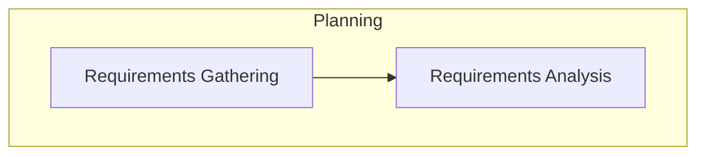

## Diagram 3

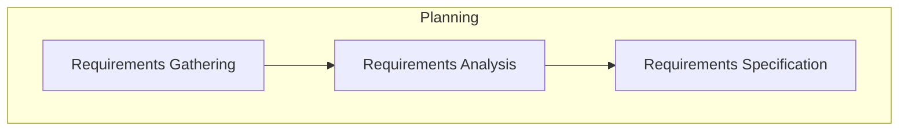

## Diagram 4

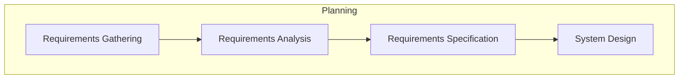

## Diagram 5

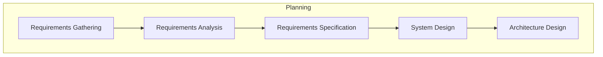

## Diagram 6

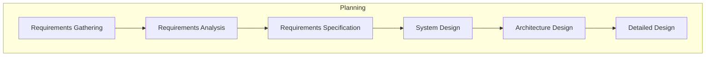

## Diagram 7

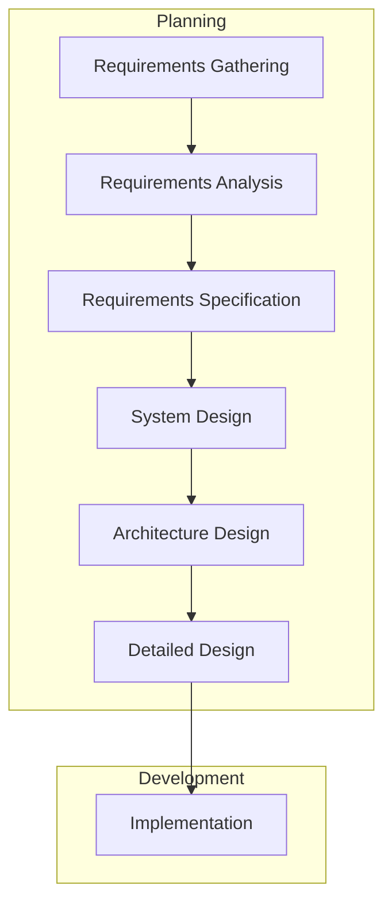

## Diagram 8

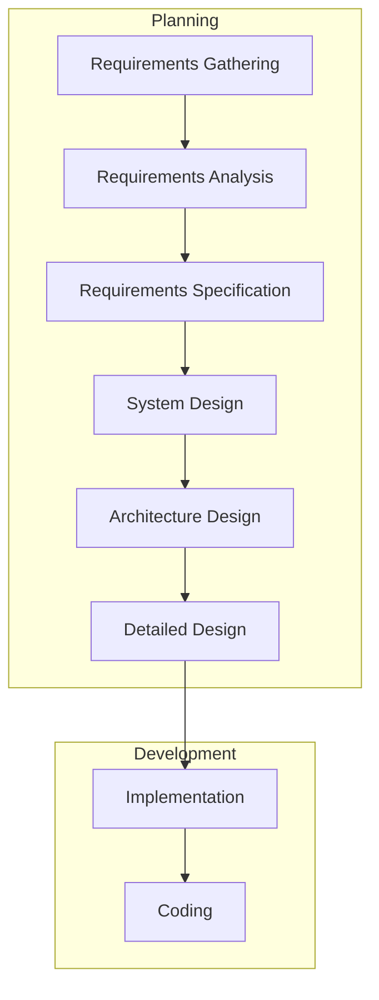

## Diagram 9

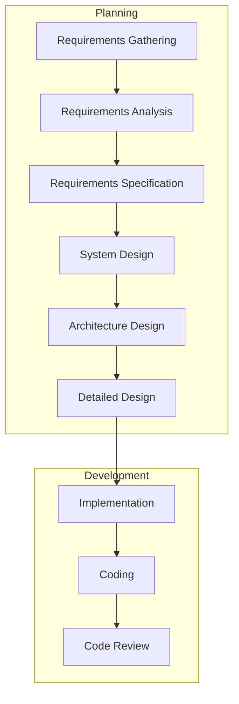

## Diagram 10

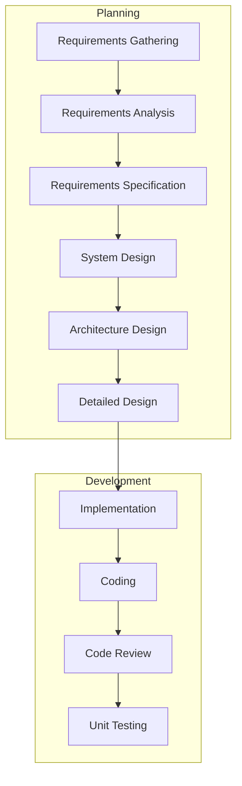

## Diagram 11

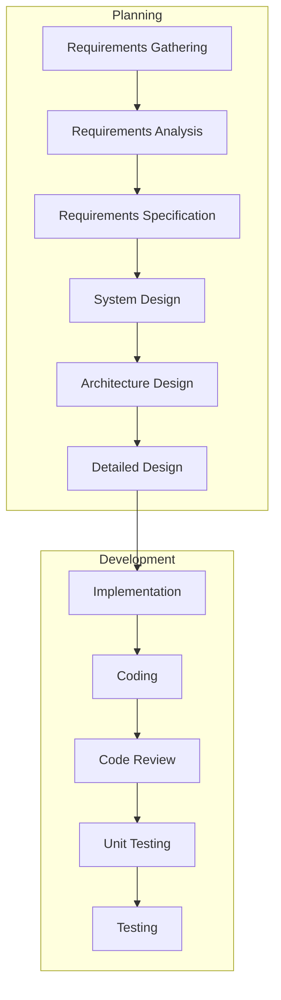

## Diagram 12

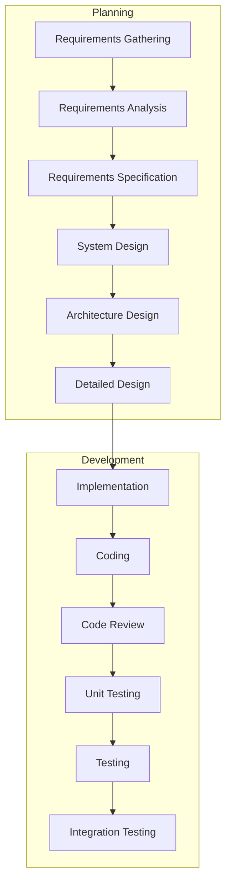

## Diagram 13

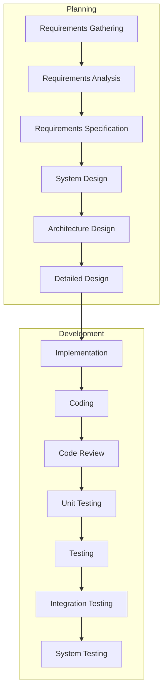

## Diagram 14

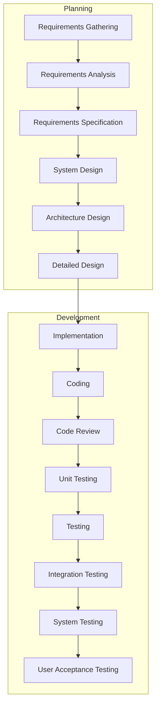

## Diagram 15

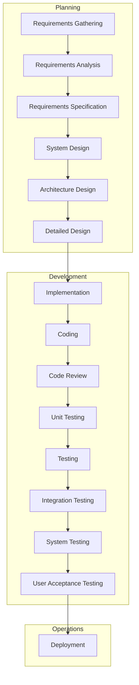

## Diagram 16

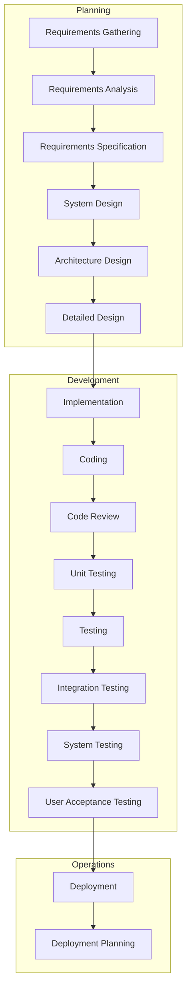

## Diagram 17

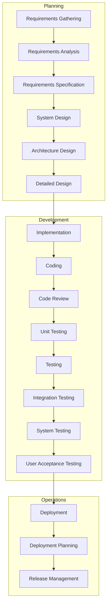

## Diagram 18

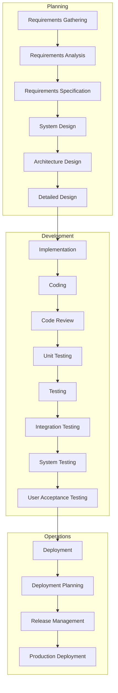

## Diagram 19

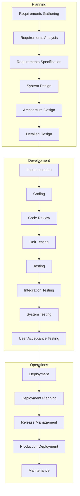

## Diagram 20

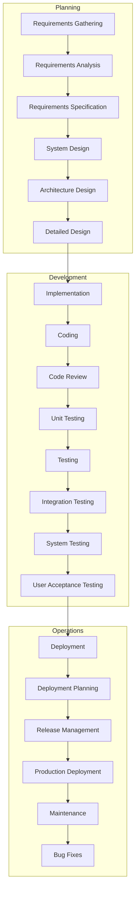

## Diagram 21

```mermaid
flowchart TD
    A[Requirements Gathering] --> A1[Requirements Analysis]
    A1 --> A2[Requirements Specification]
    A2 --> B[System Design]
    B --> B1[Architecture Design]
    B1 --> B2[Detailed Design]
    B2 --> C[Implementation]
    C --> C1[Coding]
    C1 --> C2[Code Review]
    C2 --> C3[Unit Testing]
    C3 --> D[Testing]
    D --> D1[Integration Testing]
    D1 --> D2[System Testing]
    D2 --> D3[User Acceptance Testing]
    D3 --> E[Deployment]
    E --> E1[Deployment Planning]
    E1 --> E2[Release Management]
    E2 --> E3[Production Deployment]
    E3 --> F[Maintenance]
    F --> F1[Bug Fixes]
    F1 --> F2[Updates & Patches]

subgraph Planning
A
A1
A2
B
B1
B2
end

subgraph Development
C
C1
C2
C3
D
D1
D2
D3
end

subgraph Operations
E
E1
E2
E3
F
F1
F2
end
```

## Diagram 22

```mermaid
flowchart TD
    A[Requirements Gathering] --> A1[Requirements Analysis]
    A1 --> A2[Requirements Specification]
    A2 --> B[System Design]
    B --> B1[Architecture Design]
    B1 --> B2[Detailed Design]
    B2 --> C[Implementation]
    C --> C1[Coding]
    C1 --> C2[Code Review]
    C2 --> C3[Unit Testing]
    C3 --> D[Testing]
    D --> D1[Integration Testing]
    D1 --> D2[System Testing]
    D2 --> D3[User Acceptance Testing]
    D3 --> E[Deployment]
    E --> E1[Deployment Planning]
    E1 --> E2[Release Management]
    E2 --> E3[Production Deployment]
    E3 --> F[Maintenance]
    F --> F1[Bug Fixes]
    F1 --> F2[Updates & Patches]
    F2 --> F3[Performance Optimization]

subgraph Planning
A
A1
A2
B
B1
B2
end

subgraph Development
C
C1
C2
C3
D
D1
D2
D3
end

subgraph Operations
E
E1
E2
E3
F
F1
F2
F3
end
```

## Diagram 23

```mermaid
flowchart TD
    A[Requirements Gathering] --> A1[Requirements Analysis]
    A1 --> A2[Requirements Specification]
    A2 --> B[System Design]
    B --> B1[Architecture Design]
    B1 --> B2[Detailed Design]
    B2 --> C[Implementation]
    C --> C1[Coding]
    C1 --> C2[Code Review]
    C2 --> C3[Unit Testing]
    C3 --> D[Testing]
    D --> D1[Integration Testing]
    D1 --> D2[System Testing]
    D2 --> D3[User Acceptance Testing]
    D3 --> E[Deployment]
    E --> E1[Deployment Planning]
    E1 --> E2[Release Management]
    E2 --> E3[Production Deployment]
    E3 --> F[Maintenance]
    F --> F1[Bug Fixes]
    F1 --> F2[Updates & Patches]
    F2 --> F3[Performance Optimization]
    D1 -->|Integration Issues| C1

subgraph Planning
A
A1
A2
B
B1
B2
end

subgraph Development
C
C1
C2
C3
D
D1
D2
D3
end

subgraph Operations
E
E1
E2
E3
F
F1
F2
F3
end
```

## Diagram 24

```mermaid
flowchart TD
    A[Requirements Gathering] --> A1[Requirements Analysis]
    A1 --> A2[Requirements Specification]
    A2 --> B[System Design]
    B --> B1[Architecture Design]
    B1 --> B2[Detailed Design]
    B2 --> C[Implementation]
    C --> C1[Coding]
    C1 --> C2[Code Review]
    C2 --> C3[Unit Testing]
    C3 --> D[Testing]
    D --> D1[Integration Testing]
    D1 --> D2[System Testing]
    D2 --> D3[User Acceptance Testing]
    D3 --> E[Deployment]
    E --> E1[Deployment Planning]
    E1 --> E2[Release Management]
    E2 --> E3[Production Deployment]
    E3 --> F[Maintenance]
    F --> F1[Bug Fixes]
    F1 --> F2[Updates & Patches]
    F2 --> F3[Performance Optimization]
    D1 -->|Integration Issues| C1
    D2 -->|System Bugs| C

subgraph Planning
A
A1
A2
B
B1
B2
end

subgraph Development
C
C1
C2
C3
D
D1
D2
D3
end

subgraph Operations
E
E1
E2
E3
F
F1
F2
F3
end
```

## Diagram 25

```mermaid
flowchart TD
    A[Requirements Gathering] --> A1[Requirements Analysis]
    A1 --> A2[Requirements Specification]
    A2 --> B[System Design]
    B --> B1[Architecture Design]
    B1 --> B2[Detailed Design]
    B2 --> C[Implementation]
    C --> C1[Coding]
    C1 --> C2[Code Review]
    C2 --> C3[Unit Testing]
    C3 --> D[Testing]
    D --> D1[Integration Testing]
    D1 --> D2[System Testing]
    D2 --> D3[User Acceptance Testing]
    D3 --> E[Deployment]
    E --> E1[Deployment Planning]
    E1 --> E2[Release Management]
    E2 --> E3[Production Deployment]
    E3 --> F[Maintenance]
    F --> F1[Bug Fixes]
    F1 --> F2[Updates & Patches]
    F2 --> F3[Performance Optimization]
    D1 -->|Integration Issues| C1
    D2 -->|System Bugs| C
    D3 -->|UAT Feedback| B2

subgraph Planning
A
A1
A2
B
B1
B2
end

subgraph Development
C
C1
C2
C3
D
D1
D2
D3
end

subgraph Operations
E
E1
E2
E3
F
F1
F2
F3
end
```

## Diagram 26

```mermaid
flowchart TD
    A[Requirements Gathering] --> A1[Requirements Analysis]
    A1 --> A2[Requirements Specification]
    A2 --> B[System Design]
    B --> B1[Architecture Design]
    B1 --> B2[Detailed Design]
    B2 --> C[Implementation]
    C --> C1[Coding]
    C1 --> C2[Code Review]
    C2 --> C3[Unit Testing]
    C3 --> D[Testing]
    D --> D1[Integration Testing]
    D1 --> D2[System Testing]
    D2 --> D3[User Acceptance Testing]
    D3 --> E[Deployment]
    E --> E1[Deployment Planning]
    E1 --> E2[Release Management]
    E2 --> E3[Production Deployment]
    E3 --> F[Maintenance]
    F --> F1[Bug Fixes]
    F1 --> F2[Updates & Patches]
    F2 --> F3[Performance Optimization]
    D1 -->|Integration Issues| C1
    D2 -->|System Bugs| C
    D3 -->|UAT Feedback| B2
    E3 -->|Deployment Issues| D2

subgraph Planning
A
A1
A2
B
B1
B2
end

subgraph Development
C
C1
C2
C3
D
D1
D2
D3
end

subgraph Operations
E
E1
E2
E3
F
F1
F2
F3
end
```

## Diagram 27

```mermaid
flowchart TD
    A[Requirements Gathering] --> A1[Requirements Analysis]
    A1 --> A2[Requirements Specification]
    A2 --> B[System Design]
    B --> B1[Architecture Design]
    B1 --> B2[Detailed Design]
    B2 --> C[Implementation]
    C --> C1[Coding]
    C1 --> C2[Code Review]
    C2 --> C3[Unit Testing]
    C3 --> D[Testing]
    D --> D1[Integration Testing]
    D1 --> D2[System Testing]
    D2 --> D3[User Acceptance Testing]
    D3 --> E[Deployment]
    E --> E1[Deployment Planning]
    E1 --> E2[Release Management]
    E2 --> E3[Production Deployment]
    E3 --> F[Maintenance]
    F --> F1[Bug Fixes]
    F1 --> F2[Updates & Patches]
    F2 --> F3[Performance Optimization]
    D1 -->|Integration Issues| C1
    D2 -->|System Bugs| C
    D3 -->|UAT Feedback| B2
    E3 -->|Deployment Issues| D2
    F1 -->|Critical Bugs| C1

subgraph Planning
A
A1
A2
B
B1
B2
end

subgraph Development
C
C1
C2
C3
D
D1
D2
D3
end

subgraph Operations
E
E1
E2
E3
F
F1
F2
F3
end
```

## Diagram 28

```mermaid
flowchart TD
    A[Requirements Gathering] --> A1[Requirements Analysis]
    A1 --> A2[Requirements Specification]
    A2 --> B[System Design]
    B --> B1[Architecture Design]
    B1 --> B2[Detailed Design]
    B2 --> C[Implementation]
    C --> C1[Coding]
    C1 --> C2[Code Review]
    C2 --> C3[Unit Testing]
    C3 --> D[Testing]
    D --> D1[Integration Testing]
    D1 --> D2[System Testing]
    D2 --> D3[User Acceptance Testing]
    D3 --> E[Deployment]
    E --> E1[Deployment Planning]
    E1 --> E2[Release Management]
    E2 --> E3[Production Deployment]
    E3 --> F[Maintenance]
    F --> F1[Bug Fixes]
    F1 --> F2[Updates & Patches]
    F2 --> F3[Performance Optimization]
    D1 -->|Integration Issues| C1
    D2 -->|System Bugs| C
    D3 -->|UAT Feedback| B2
    E3 -->|Deployment Issues| D2
    F1 -->|Critical Bugs| C1
    F2 -->|New Features Needed| A

subgraph Planning
A
A1
A2
B
B1
B2
end

subgraph Development
C
C1
C2
C3
D
D1
D2
D3
end

subgraph Operations
E
E1
E2
E3
F
F1
F2
F3
end
```

## Diagram 29

```mermaid
flowchart TD
    A[Requirements Gathering] --> A1[Requirements Analysis]
    A1 --> A2[Requirements Specification]
    A2 --> B[System Design]
    B --> B1[Architecture Design]
    B1 --> B2[Detailed Design]
    B2 --> C[Implementation]
    C --> C1[Coding]
    C1 --> C2[Code Review]
    C2 --> C3[Unit Testing]
    C3 --> D[Testing]
    D --> D1[Integration Testing]
    D1 --> D2[System Testing]
    D2 --> D3[User Acceptance Testing]
    D3 --> E[Deployment]
    E --> E1[Deployment Planning]
    E1 --> E2[Release Management]
    E2 --> E3[Production Deployment]
    E3 --> F[Maintenance]
    F --> F1[Bug Fixes]
    F1 --> F2[Updates & Patches]
    F2 --> F3[Performance Optimization]
    D1 -->|Integration Issues| C1
    D2 -->|System Bugs| C
    D3 -->|UAT Feedback| B2
    E3 -->|Deployment Issues| D2
    F1 -->|Critical Bugs| C1
    F2 -->|New Features Needed| A
    F3 -->|Architecture Limitations| B1

subgraph Planning
A
A1
A2
B
B1
B2
end

subgraph Development
C
C1
C2
C3
D
D1
D2
D3
end

subgraph Operations
E
E1
E2
E3
F
F1
F2
F3
end
```

## Diagram 30

```mermaid
flowchart TD
    A[Requirements Gathering] --> A1[Requirements Analysis]
    A1 --> A2[Requirements Specification]
    A2 --> B[System Design]
    B --> B1[Architecture Design]
    B1 --> B2[Detailed Design]
    B2 --> C[Implementation]
    C --> C1[Coding]
    C1 --> C2[Code Review]
    C2 --> C3[Unit Testing]
    C3 --> D[Testing]
    D --> D1[Integration Testing]
    D1 --> D2[System Testing]
    D2 --> D3[User Acceptance Testing]
    D3 --> E[Deployment]
    E --> E1[Deployment Planning]
    E1 --> E2[Release Management]
    E2 --> E3[Production Deployment]
    E3 --> F[Maintenance]
    F --> F1[Bug Fixes]
    F1 --> F2[Updates & Patches]
    F2 --> F3[Performance Optimization]
    D1 -->|Integration Issues| C1
    D2 -->|System Bugs| C
    D3 -->|UAT Feedback| B2
    E3 -->|Deployment Issues| D2
    F1 -->|Critical Bugs| C1
    F2 -->|New Features Needed| A
    F3 -->|Architecture Limitations| B1
    A1 -.->|Feasibility Check| B1

subgraph Planning
A
A1
A2
B
B1
B2
end

subgraph Development
C
C1
C2
C3
D
D1
D2
D3
end

subgraph Operations
E
E1
E2
E3
F
F1
F2
F3
end
```

## Diagram 31

```mermaid
flowchart TD
    A[Requirements Gathering] --> A1[Requirements Analysis]
    A1 --> A2[Requirements Specification]
    A2 --> B[System Design]
    B --> B1[Architecture Design]
    B1 --> B2[Detailed Design]
    B2 --> C[Implementation]
    C --> C1[Coding]
    C1 --> C2[Code Review]
    C2 --> C3[Unit Testing]
    C3 --> D[Testing]
    D --> D1[Integration Testing]
    D1 --> D2[System Testing]
    D2 --> D3[User Acceptance Testing]
    D3 --> E[Deployment]
    E --> E1[Deployment Planning]
    E1 --> E2[Release Management]
    E2 --> E3[Production Deployment]
    E3 --> F[Maintenance]
    F --> F1[Bug Fixes]
    F1 --> F2[Updates & Patches]
    F2 --> F3[Performance Optimization]
    D1 -->|Integration Issues| C1
    D2 -->|System Bugs| C
    D3 -->|UAT Feedback| B2
    E3 -->|Deployment Issues| D2
    F1 -->|Critical Bugs| C1
    F2 -->|New Features Needed| A
    F3 -->|Architecture Limitations| B1
    A1 -.->|Feasibility Check| B1
    B2 -.->|Design Review| A2

subgraph Planning
A
A1
A2
B
B1
B2
end

subgraph Development
C
C1
C2
C3
D
D1
D2
D3
end

subgraph Operations
E
E1
E2
E3
F
F1
F2
F3
end
```

## Diagram 32

```mermaid
flowchart TD
    A[Requirements Gathering] --> A1[Requirements Analysis]
    A1 --> A2[Requirements Specification]
    A2 --> B[System Design]
    B --> B1[Architecture Design]
    B1 --> B2[Detailed Design]
    B2 --> C[Implementation]
    C --> C1[Coding]
    C1 --> C2[Code Review]
    C2 --> C3[Unit Testing]
    C3 --> D[Testing]
    D --> D1[Integration Testing]
    D1 --> D2[System Testing]
    D2 --> D3[User Acceptance Testing]
    D3 --> E[Deployment]
    E --> E1[Deployment Planning]
    E1 --> E2[Release Management]
    E2 --> E3[Production Deployment]
    E3 --> F[Maintenance]
    F --> F1[Bug Fixes]
    F1 --> F2[Updates & Patches]
    F2 --> F3[Performance Optimization]
    D1 -->|Integration Issues| C1
    D2 -->|System Bugs| C
    D3 -->|UAT Feedback| B2
    E3 -->|Deployment Issues| D2
    F1 -->|Critical Bugs| C1
    F2 -->|New Features Needed| A
    F3 -->|Architecture Limitations| B1
    A1 -.->|Feasibility Check| B1
    B2 -.->|Design Review| A2
    C2 -.->|Standards Compliance| B2

subgraph Planning
A
A1
A2
B
B1
B2
end

subgraph Development
C
C1
C2
C3
D
D1
D2
D3
end

subgraph Operations
E
E1
E2
E3
F
F1
F2
F3
end
```

## Diagram 33

```mermaid
flowchart TD
    A[Requirements Gathering] --> A1[Requirements Analysis]
    A1 --> A2[Requirements Specification]
    A2 --> B[System Design]
    B --> B1[Architecture Design]
    B1 --> B2[Detailed Design]
    B2 --> C[Implementation]
    C --> C1[Coding]
    C1 --> C2[Code Review]
    C2 --> C3[Unit Testing]
    C3 --> D[Testing]
    D --> D1[Integration Testing]
    D1 --> D2[System Testing]
    D2 --> D3[User Acceptance Testing]
    D3 --> E[Deployment]
    E --> E1[Deployment Planning]
    E1 --> E2[Release Management]
    E2 --> E3[Production Deployment]
    E3 --> F[Maintenance]
    F --> F1[Bug Fixes]
    F1 --> F2[Updates & Patches]
    F2 --> F3[Performance Optimization]
    D1 -->|Integration Issues| C1
    D2 -->|System Bugs| C
    D3 -->|UAT Feedback| B2
    E3 -->|Deployment Issues| D2
    F1 -->|Critical Bugs| C1
    F2 -->|New Features Needed| A
    F3 -->|Architecture Limitations| B1
    A1 -.->|Feasibility Check| B1
    B2 -.->|Design Review| A2
    C2 -.->|Standards Compliance| B2
    E1 -.->|Infrastructure Requirements| B1

subgraph Planning
A
A1
A2
B
B1
B2
end

subgraph Development
C
C1
C2
C3
D
D1
D2
D3
end

subgraph Operations
E
E1
E2
E3
F
F1
F2
F3
end
```

## Diagram 34

```mermaid
flowchart TD
    A[Requirements Gathering] --> A1[Requirements Analysis]
    A1 --> A2[Requirements Specification]
    A2 --> B[System Design]
    B --> B1[Architecture Design]
    B1 --> B2[Detailed Design]
    B2 --> C[Implementation]
    C --> C1[Coding]
    C1 --> C2[Code Review]
    C2 --> C3[Unit Testing]
    C3 --> D[Testing]
    D --> D1[Integration Testing]
    D1 --> D2[System Testing]
    D2 --> D3[User Acceptance Testing]
    D3 --> E[Deployment]
    E --> E1[Deployment Planning]
    E1 --> E2[Release Management]
    E2 --> E3[Production Deployment]
    E3 --> F[Maintenance]
    F --> F1[Bug Fixes]
    F1 --> F2[Updates & Patches]
    F2 --> F3[Performance Optimization]
    D1 -->|Integration Issues| C1
    D2 -->|System Bugs| C
    D3 -->|UAT Feedback| B2
    E3 -->|Deployment Issues| D2
    F1 -->|Critical Bugs| C1
    F2 -->|New Features Needed| A
    F3 -->|Architecture Limitations| B1
    A1 -.->|Feasibility Check| B1
    B2 -.->|Design Review| A2
    C2 -.->|Standards Compliance| B2
    E1 -.->|Infrastructure Requirements| B1
    PM[Project Initiation] --> PM1[Project Planning]

subgraph Planning
A
A1
A2
B
B1
B2
PM
PM1
end

subgraph Development
C
C1
C2
C3
D
D1
D2
D3
end

subgraph Operations
E
E1
E2
E3
F
F1
F2
F3
end
```

## Diagram 35

```mermaid
flowchart TD
    A[Requirements Gathering] --> A1[Requirements Analysis]
    A1 --> A2[Requirements Specification]
    A2 --> B[System Design]
    B --> B1[Architecture Design]
    B1 --> B2[Detailed Design]
    B2 --> C[Implementation]
    C --> C1[Coding]
    C1 --> C2[Code Review]
    C2 --> C3[Unit Testing]
    C3 --> D[Testing]
    D --> D1[Integration Testing]
    D1 --> D2[System Testing]
    D2 --> D3[User Acceptance Testing]
    D3 --> E[Deployment]
    E --> E1[Deployment Planning]
    E1 --> E2[Release Management]
    E2 --> E3[Production Deployment]
    E3 --> F[Maintenance]
    F --> F1[Bug Fixes]
    F1 --> F2[Updates & Patches]
    F2 --> F3[Performance Optimization]
    D1 -->|Integration Issues| C1
    D2 -->|System Bugs| C
    D3 -->|UAT Feedback| B2
    E3 -->|Deployment Issues| D2
    F1 -->|Critical Bugs| C1
    F2 -->|New Features Needed| A
    F3 -->|Architecture Limitations| B1
    A1 -.->|Feasibility Check| B1
    B2 -.->|Design Review| A2
    C2 -.->|Standards Compliance| B2
    E1 -.->|Infrastructure Requirements| B1
    PM[Project Initiation] --> PM1[Project Planning]
    PM1 --> PM2[Resource Allocation]

subgraph Planning
A
A1
A2
B
B1
B2
PM
PM1
PM2
end

subgraph Development
C
C1
C2
C3
D
D1
D2
D3
end

subgraph Operations
E
E1
E2
E3
F
F1
F2
F3
end
```

## Diagram 36

```mermaid
flowchart TD
    A[Requirements Gathering] --> A1[Requirements Analysis]
    A1 --> A2[Requirements Specification]
    A2 --> B[System Design]
    B --> B1[Architecture Design]
    B1 --> B2[Detailed Design]
    B2 --> C[Implementation]
    C --> C1[Coding]
    C1 --> C2[Code Review]
    C2 --> C3[Unit Testing]
    C3 --> D[Testing]
    D --> D1[Integration Testing]
    D1 --> D2[System Testing]
    D2 --> D3[User Acceptance Testing]
    D3 --> E[Deployment]
    E --> E1[Deployment Planning]
    E1 --> E2[Release Management]
    E2 --> E3[Production Deployment]
    E3 --> F[Maintenance]
    F --> F1[Bug Fixes]
    F1 --> F2[Updates & Patches]
    F2 --> F3[Performance Optimization]
    D1 -->|Integration Issues| C1
    D2 -->|System Bugs| C
    D3 -->|UAT Feedback| B2
    E3 -->|Deployment Issues| D2
    F1 -->|Critical Bugs| C1
    F2 -->|New Features Needed| A
    F3 -->|Architecture Limitations| B1
    A1 -.->|Feasibility Check| B1
    B2 -.->|Design Review| A2
    C2 -.->|Standards Compliance| B2
    E1 -.->|Infrastructure Requirements| B1
    PM[Project Initiation] --> PM1[Project Planning]
    PM1 --> PM2[Resource Allocation]
    PM2 --> PM3[Schedule Management]

subgraph Planning
A
A1
A2
B
B1
B2
PM
PM1
PM2
end

subgraph Development
C
C1
C2
C3
D
D1
D2
D3
PM3
end

subgraph Operations
E
E1
E2
E3
F
F1
F2
F3
end
```

## Diagram 37

```mermaid
flowchart TD
    A[Requirements Gathering] --> A1[Requirements Analysis]
    A1 --> A2[Requirements Specification]
    A2 --> B[System Design]
    B --> B1[Architecture Design]
    B1 --> B2[Detailed Design]
    B2 --> C[Implementation]
    C --> C1[Coding]
    C1 --> C2[Code Review]
    C2 --> C3[Unit Testing]
    C3 --> D[Testing]
    D --> D1[Integration Testing]
    D1 --> D2[System Testing]
    D2 --> D3[User Acceptance Testing]
    D3 --> E[Deployment]
    E --> E1[Deployment Planning]
    E1 --> E2[Release Management]
    E2 --> E3[Production Deployment]
    E3 --> F[Maintenance]
    F --> F1[Bug Fixes]
    F1 --> F2[Updates & Patches]
    F2 --> F3[Performance Optimization]
    D1 -->|Integration Issues| C1
    D2 -->|System Bugs| C
    D3 -->|UAT Feedback| B2
    E3 -->|Deployment Issues| D2
    F1 -->|Critical Bugs| C1
    F2 -->|New Features Needed| A
    F3 -->|Architecture Limitations| B1
    A1 -.->|Feasibility Check| B1
    B2 -.->|Design Review| A2
    C2 -.->|Standards Compliance| B2
    E1 -.->|Infrastructure Requirements| B1
    PM[Project Initiation] --> PM1[Project Planning]
    PM1 --> PM2[Resource Allocation]
    PM2 --> PM3[Schedule Management]
    PM3 --> PM4[Risk Management]

subgraph Planning
A
A1
A2
B
B1
B2
PM
PM1
PM2
end

subgraph Development
C
C1
C2
C3
D
D1
D2
D3
PM3
PM4
end

subgraph Operations
E
E1
E2
E3
F
F1
F2
F3
end
```

## Diagram 38

```mermaid
flowchart TD
    A[Requirements Gathering] --> A1[Requirements Analysis]
    A1 --> A2[Requirements Specification]
    A2 --> B[System Design]
    B --> B1[Architecture Design]
    B1 --> B2[Detailed Design]
    B2 --> C[Implementation]
    C --> C1[Coding]
    C1 --> C2[Code Review]
    C2 --> C3[Unit Testing]
    C3 --> D[Testing]
    D --> D1[Integration Testing]
    D1 --> D2[System Testing]
    D2 --> D3[User Acceptance Testing]
    D3 --> E[Deployment]
    E --> E1[Deployment Planning]
    E1 --> E2[Release Management]
    E2 --> E3[Production Deployment]
    E3 --> F[Maintenance]
    F --> F1[Bug Fixes]
    F1 --> F2[Updates & Patches]
    F2 --> F3[Performance Optimization]
    D1 -->|Integration Issues| C1
    D2 -->|System Bugs| C
    D3 -->|UAT Feedback| B2
    E3 -->|Deployment Issues| D2
    F1 -->|Critical Bugs| C1
    F2 -->|New Features Needed| A
    F3 -->|Architecture Limitations| B1
    A1 -.->|Feasibility Check| B1
    B2 -.->|Design Review| A2
    C2 -.->|Standards Compliance| B2
    E1 -.->|Infrastructure Requirements| B1
    PM[Project Initiation] --> PM1[Project Planning]
    PM1 --> PM2[Resource Allocation]
    PM2 --> PM3[Schedule Management]
    PM3 --> PM4[Risk Management]
    PM4 --> PM5[Project Monitoring]

subgraph Planning
A
A1
A2
B
B1
B2
PM
PM1
PM2
end

subgraph Development
C
C1
C2
C3
D
D1
D2
D3
PM3
PM4
end

subgraph Operations
E
E1
E2
E3
F
F1
F2
F3
PM5
end
```

## Diagram 39

```mermaid
flowchart TD
    A[Requirements Gathering] --> A1[Requirements Analysis]
    A1 --> A2[Requirements Specification]
    A2 --> B[System Design]
    B --> B1[Architecture Design]
    B1 --> B2[Detailed Design]
    B2 --> C[Implementation]
    C --> C1[Coding]
    C1 --> C2[Code Review]
    C2 --> C3[Unit Testing]
    C3 --> D[Testing]
    D --> D1[Integration Testing]
    D1 --> D2[System Testing]
    D2 --> D3[User Acceptance Testing]
    D3 --> E[Deployment]
    E --> E1[Deployment Planning]
    E1 --> E2[Release Management]
    E2 --> E3[Production Deployment]
    E3 --> F[Maintenance]
    F --> F1[Bug Fixes]
    F1 --> F2[Updates & Patches]
    F2 --> F3[Performance Optimization]
    D1 -->|Integration Issues| C1
    D2 -->|System Bugs| C
    D3 -->|UAT Feedback| B2
    E3 -->|Deployment Issues| D2
    F1 -->|Critical Bugs| C1
    F2 -->|New Features Needed| A
    F3 -->|Architecture Limitations| B1
    A1 -.->|Feasibility Check| B1
    B2 -.->|Design Review| A2
    C2 -.->|Standards Compliance| B2
    E1 -.->|Infrastructure Requirements| B1
    PM[Project Initiation] --> PM1[Project Planning]
    PM1 --> PM2[Resource Allocation]
    PM2 --> PM3[Schedule Management]
    PM3 --> PM4[Risk Management]
    PM4 --> PM5[Project Monitoring]
    PM5 --> PM6[Project Closure]

subgraph Planning
A
A1
A2
B
B1
B2
PM
PM1
PM2
end

subgraph Development
C
C1
C2
C3
D
D1
D2
D3
PM3
PM4
end

subgraph Operations
E
E1
E2
E3
F
F1
F2
F3
PM5
PM6
end
```

## Diagram 40

```mermaid
flowchart TD
    A[Requirements Gathering] --> A1[Requirements Analysis]
    A1 --> A2[Requirements Specification]
    A2 --> B[System Design]
    B --> B1[Architecture Design]
    B1 --> B2[Detailed Design]
    B2 --> C[Implementation]
    C --> C1[Coding]
    C1 --> C2[Code Review]
    C2 --> C3[Unit Testing]
    C3 --> D[Testing]
    D --> D1[Integration Testing]
    D1 --> D2[System Testing]
    D2 --> D3[User Acceptance Testing]
    D3 --> E[Deployment]
    E --> E1[Deployment Planning]
    E1 --> E2[Release Management]
    E2 --> E3[Production Deployment]
    E3 --> F[Maintenance]
    F --> F1[Bug Fixes]
    F1 --> F2[Updates & Patches]
    F2 --> F3[Performance Optimization]
    D1 -->|Integration Issues| C1
    D2 -->|System Bugs| C
    D3 -->|UAT Feedback| B2
    E3 -->|Deployment Issues| D2
    F1 -->|Critical Bugs| C1
    F2 -->|New Features Needed| A
    F3 -->|Architecture Limitations| B1
    A1 -.->|Feasibility Check| B1
    B2 -.->|Design Review| A2
    C2 -.->|Standards Compliance| B2
    E1 -.->|Infrastructure Requirements| B1
    PM[Project Initiation] --> PM1[Project Planning]
    PM1 --> PM2[Resource Allocation]
    PM2 --> PM3[Schedule Management]
    PM3 --> PM4[Risk Management]
    PM4 --> PM5[Project Monitoring]
    PM5 --> PM6[Project Closure]
    PM1 -.-> A

subgraph Planning
A
A1
A2
B
B1
B2
PM
PM1
PM2
end

subgraph Development
C
C1
C2
C3
D
D1
D2
D3
PM3
PM4
end

subgraph Operations
E
E1
E2
E3
F
F1
F2
F3
PM5
PM6
end
```

## Diagram 41

```mermaid
flowchart TD
    A[Requirements Gathering] --> A1[Requirements Analysis]
    A1 --> A2[Requirements Specification]
    A2 --> B[System Design]
    B --> B1[Architecture Design]
    B1 --> B2[Detailed Design]
    B2 --> C[Implementation]
    C --> C1[Coding]
    C1 --> C2[Code Review]
    C2 --> C3[Unit Testing]
    C3 --> D[Testing]
    D --> D1[Integration Testing]
    D1 --> D2[System Testing]
    D2 --> D3[User Acceptance Testing]
    D3 --> E[Deployment]
    E --> E1[Deployment Planning]
    E1 --> E2[Release Management]
    E2 --> E3[Production Deployment]
    E3 --> F[Maintenance]
    F --> F1[Bug Fixes]
    F1 --> F2[Updates & Patches]
    F2 --> F3[Performance Optimization]
    D1 -->|Integration Issues| C1
    D2 -->|System Bugs| C
    D3 -->|UAT Feedback| B2
    E3 -->|Deployment Issues| D2
    F1 -->|Critical Bugs| C1
    F2 -->|New Features Needed| A
    F3 -->|Architecture Limitations| B1
    A1 -.->|Feasibility Check| B1
    B2 -.->|Design Review| A2
    C2 -.->|Standards Compliance| B2
    E1 -.->|Infrastructure Requirements| B1
    PM[Project Initiation] --> PM1[Project Planning]
    PM1 --> PM2[Resource Allocation]
    PM2 --> PM3[Schedule Management]
    PM3 --> PM4[Risk Management]
    PM4 --> PM5[Project Monitoring]
    PM5 --> PM6[Project Closure]
    PM1 -.-> A
    PM2 -.-> B

subgraph Planning
A
A1
A2
B
B1
B2
PM
PM1
PM2
end

subgraph Development
C
C1
C2
C3
D
D1
D2
D3
PM3
PM4
end

subgraph Operations
E
E1
E2
E3
F
F1
F2
F3
PM5
PM6
end
```

## Diagram 42

```mermaid
flowchart TD
    A[Requirements Gathering] --> A1[Requirements Analysis]
    A1 --> A2[Requirements Specification]
    A2 --> B[System Design]
    B --> B1[Architecture Design]
    B1 --> B2[Detailed Design]
    B2 --> C[Implementation]
    C --> C1[Coding]
    C1 --> C2[Code Review]
    C2 --> C3[Unit Testing]
    C3 --> D[Testing]
    D --> D1[Integration Testing]
    D1 --> D2[System Testing]
    D2 --> D3[User Acceptance Testing]
    D3 --> E[Deployment]
    E --> E1[Deployment Planning]
    E1 --> E2[Release Management]
    E2 --> E3[Production Deployment]
    E3 --> F[Maintenance]
    F --> F1[Bug Fixes]
    F1 --> F2[Updates & Patches]
    F2 --> F3[Performance Optimization]
    D1 -->|Integration Issues| C1
    D2 -->|System Bugs| C
    D3 -->|UAT Feedback| B2
    E3 -->|Deployment Issues| D2
    F1 -->|Critical Bugs| C1
    F2 -->|New Features Needed| A
    F3 -->|Architecture Limitations| B1
    A1 -.->|Feasibility Check| B1
    B2 -.->|Design Review| A2
    C2 -.->|Standards Compliance| B2
    E1 -.->|Infrastructure Requirements| B1
    PM[Project Initiation] --> PM1[Project Planning]
    PM1 --> PM2[Resource Allocation]
    PM2 --> PM3[Schedule Management]
    PM3 --> PM4[Risk Management]
    PM4 --> PM5[Project Monitoring]
    PM5 --> PM6[Project Closure]
    PM1 -.-> A
    PM2 -.-> B
    PM3 -.-> C

subgraph Planning
A
A1
A2
B
B1
B2
PM
PM1
PM2
end

subgraph Development
C
C1
C2
C3
D
D1
D2
D3
PM3
PM4
end

subgraph Operations
E
E1
E2
E3
F
F1
F2
F3
PM5
PM6
end
```

## Diagram 43

```mermaid
flowchart TD
    A[Requirements Gathering] --> A1[Requirements Analysis]
    A1 --> A2[Requirements Specification]
    A2 --> B[System Design]
    B --> B1[Architecture Design]
    B1 --> B2[Detailed Design]
    B2 --> C[Implementation]
    C --> C1[Coding]
    C1 --> C2[Code Review]
    C2 --> C3[Unit Testing]
    C3 --> D[Testing]
    D --> D1[Integration Testing]
    D1 --> D2[System Testing]
    D2 --> D3[User Acceptance Testing]
    D3 --> E[Deployment]
    E --> E1[Deployment Planning]
    E1 --> E2[Release Management]
    E2 --> E3[Production Deployment]
    E3 --> F[Maintenance]
    F --> F1[Bug Fixes]
    F1 --> F2[Updates & Patches]
    F2 --> F3[Performance Optimization]
    D1 -->|Integration Issues| C1
    D2 -->|System Bugs| C
    D3 -->|UAT Feedback| B2
    E3 -->|Deployment Issues| D2
    F1 -->|Critical Bugs| C1
    F2 -->|New Features Needed| A
    F3 -->|Architecture Limitations| B1
    A1 -.->|Feasibility Check| B1
    B2 -.->|Design Review| A2
    C2 -.->|Standards Compliance| B2
    E1 -.->|Infrastructure Requirements| B1
    PM[Project Initiation] --> PM1[Project Planning]
    PM1 --> PM2[Resource Allocation]
    PM2 --> PM3[Schedule Management]
    PM3 --> PM4[Risk Management]
    PM4 --> PM5[Project Monitoring]
    PM5 --> PM6[Project Closure]
    PM1 -.-> A
    PM2 -.-> B
    PM3 -.-> C
    PM4 -.-> D

subgraph Planning
A
A1
A2
B
B1
B2
PM
PM1
PM2
end

subgraph Development
C
C1
C2
C3
D
D1
D2
D3
PM3
PM4
end

subgraph Operations
E
E1
E2
E3
F
F1
F2
F3
PM5
PM6
end
```

## Diagram 44

```mermaid
flowchart TD
    A[Requirements Gathering] --> A1[Requirements Analysis]
    A1 --> A2[Requirements Specification]
    A2 --> B[System Design]
    B --> B1[Architecture Design]
    B1 --> B2[Detailed Design]
    B2 --> C[Implementation]
    C --> C1[Coding]
    C1 --> C2[Code Review]
    C2 --> C3[Unit Testing]
    C3 --> D[Testing]
    D --> D1[Integration Testing]
    D1 --> D2[System Testing]
    D2 --> D3[User Acceptance Testing]
    D3 --> E[Deployment]
    E --> E1[Deployment Planning]
    E1 --> E2[Release Management]
    E2 --> E3[Production Deployment]
    E3 --> F[Maintenance]
    F --> F1[Bug Fixes]
    F1 --> F2[Updates & Patches]
    F2 --> F3[Performance Optimization]
    D1 -->|Integration Issues| C1
    D2 -->|System Bugs| C
    D3 -->|UAT Feedback| B2
    E3 -->|Deployment Issues| D2
    F1 -->|Critical Bugs| C1
    F2 -->|New Features Needed| A
    F3 -->|Architecture Limitations| B1
    A1 -.->|Feasibility Check| B1
    B2 -.->|Design Review| A2
    C2 -.->|Standards Compliance| B2
    E1 -.->|Infrastructure Requirements| B1
    PM[Project Initiation] --> PM1[Project Planning]
    PM1 --> PM2[Resource Allocation]
    PM2 --> PM3[Schedule Management]
    PM3 --> PM4[Risk Management]
    PM4 --> PM5[Project Monitoring]
    PM5 --> PM6[Project Closure]
    PM1 -.-> A
    PM2 -.-> B
    PM3 -.-> C
    PM4 -.-> D
    PM5 -.-> E

subgraph Planning
A
A1
A2
B
B1
B2
PM
PM1
PM2
end

subgraph Development
C
C1
C2
C3
D
D1
D2
D3
PM3
PM4
end

subgraph Operations
E
E1
E2
E3
F
F1
F2
F3
PM5
PM6
end
```

## Diagram 45

```mermaid
flowchart TD
    A[Requirements Gathering] --> A1[Requirements Analysis]
    A1 --> A2[Requirements Specification]
    A2 --> B[System Design]
    B --> B1[Architecture Design]
    B1 --> B2[Detailed Design]
    B2 --> C[Implementation]
    C --> C1[Coding]
    C1 --> C2[Code Review]
    C2 --> C3[Unit Testing]
    C3 --> D[Testing]
    D --> D1[Integration Testing]
    D1 --> D2[System Testing]
    D2 --> D3[User Acceptance Testing]
    D3 --> E[Deployment]
    E --> E1[Deployment Planning]
    E1 --> E2[Release Management]
    E2 --> E3[Production Deployment]
    E3 --> F[Maintenance]
    F --> F1[Bug Fixes]
    F1 --> F2[Updates & Patches]
    F2 --> F3[Performance Optimization]
    D1 -->|Integration Issues| C1
    D2 -->|System Bugs| C
    D3 -->|UAT Feedback| B2
    E3 -->|Deployment Issues| D2
    F1 -->|Critical Bugs| C1
    F2 -->|New Features Needed| A
    F3 -->|Architecture Limitations| B1
    A1 -.->|Feasibility Check| B1
    B2 -.->|Design Review| A2
    C2 -.->|Standards Compliance| B2
    E1 -.->|Infrastructure Requirements| B1
    PM[Project Initiation] --> PM1[Project Planning]
    PM1 --> PM2[Resource Allocation]
    PM2 --> PM3[Schedule Management]
    PM3 --> PM4[Risk Management]
    PM4 --> PM5[Project Monitoring]
    PM5 --> PM6[Project Closure]
    PM1 -.-> A
    PM2 -.-> B
    PM3 -.-> C
    PM4 -.-> D
    PM5 -.-> E
    PM6 -.-> F

subgraph Planning
A
A1
A2
B
B1
B2
PM
PM1
PM2
end

subgraph Development
C
C1
C2
C3
D
D1
D2
D3
PM3
PM4
end

subgraph Operations
E
E1
E2
E3
F
F1
F2
F3
PM5
PM6
end
```

## Diagram 46

```mermaid
flowchart TD
    A[Requirements Gathering] --> A1[Requirements Analysis]
    A1 --> A2[Requirements Specification]
    A2 --> B[System Design]
    B --> B1[Architecture Design]
    B1 --> B2[Detailed Design]
    B2 --> C[Implementation]
    C --> C1[Coding]
    C1 --> C2[Code Review]
    C2 --> C3[Unit Testing]
    C3 --> D[Testing]
    D --> D1[Integration Testing]
    D1 --> D2[System Testing]
    D2 --> D3[User Acceptance Testing]
    D3 --> E[Deployment]
    E --> E1[Deployment Planning]
    E1 --> E2[Release Management]
    E2 --> E3[Production Deployment]
    E3 --> F[Maintenance]
    F --> F1[Bug Fixes]
    F1 --> F2[Updates & Patches]
    F2 --> F3[Performance Optimization]
    D1 -->|Integration Issues| C1
    D2 -->|System Bugs| C
    D3 -->|UAT Feedback| B2
    E3 -->|Deployment Issues| D2
    F1 -->|Critical Bugs| C1
    F2 -->|New Features Needed| A
    F3 -->|Architecture Limitations| B1
    A1 -.->|Feasibility Check| B1
    B2 -.->|Design Review| A2
    C2 -.->|Standards Compliance| B2
    E1 -.->|Infrastructure Requirements| B1
    PM[Project Initiation] --> PM1[Project Planning]
    PM1 --> PM2[Resource Allocation]
    PM2 --> PM3[Schedule Management]
    PM3 --> PM4[Risk Management]
    PM4 --> PM5[Project Monitoring]
    PM5 --> PM6[Project Closure]
    PM1 -.-> A
    PM2 -.-> B
    PM3 -.-> C
    PM4 -.-> D
    PM5 -.-> E
    PM6 -.-> F
    QA[Quality Planning] --> QA1[Quality Standards]

subgraph Planning
A
A1
A2
B
B1
B2
PM
PM1
PM2
QA
QA1
end

subgraph Development
C
C1
C2
C3
D
D1
D2
D3
PM3
PM4
end

subgraph Operations
E
E1
E2
E3
F
F1
F2
F3
PM5
PM6
end
```

## Diagram 47

```mermaid
flowchart TD
    A[Requirements Gathering] --> A1[Requirements Analysis]
    A1 --> A2[Requirements Specification]
    A2 --> B[System Design]
    B --> B1[Architecture Design]
    B1 --> B2[Detailed Design]
    B2 --> C[Implementation]
    C --> C1[Coding]
    C1 --> C2[Code Review]
    C2 --> C3[Unit Testing]
    C3 --> D[Testing]
    D --> D1[Integration Testing]
    D1 --> D2[System Testing]
    D2 --> D3[User Acceptance Testing]
    D3 --> E[Deployment]
    E --> E1[Deployment Planning]
    E1 --> E2[Release Management]
    E2 --> E3[Production Deployment]
    E3 --> F[Maintenance]
    F --> F1[Bug Fixes]
    F1 --> F2[Updates & Patches]
    F2 --> F3[Performance Optimization]
    D1 -->|Integration Issues| C1
    D2 -->|System Bugs| C
    D3 -->|UAT Feedback| B2
    E3 -->|Deployment Issues| D2
    F1 -->|Critical Bugs| C1
    F2 -->|New Features Needed| A
    F3 -->|Architecture Limitations| B1
    A1 -.->|Feasibility Check| B1
    B2 -.->|Design Review| A2
    C2 -.->|Standards Compliance| B2
    E1 -.->|Infrastructure Requirements| B1
    PM[Project Initiation] --> PM1[Project Planning]
    PM1 --> PM2[Resource Allocation]
    PM2 --> PM3[Schedule Management]
    PM3 --> PM4[Risk Management]
    PM4 --> PM5[Project Monitoring]
    PM5 --> PM6[Project Closure]
    PM1 -.-> A
    PM2 -.-> B
    PM3 -.-> C
    PM4 -.-> D
    PM5 -.-> E
    PM6 -.-> F
    QA[Quality Planning] --> QA1[Quality Standards]
    QA1 --> QA2[Quality Assurance]

subgraph Planning
A
A1
A2
B
B1
B2
PM
PM1
PM2
QA
QA1
end

subgraph Development
C
C1
C2
C3
D
D1
D2
D3
PM3
PM4
QA2
end

subgraph Operations
E
E1
E2
E3
F
F1
F2
F3
PM5
PM6
end
```

## Diagram 48

```mermaid
flowchart TD
    A[Requirements Gathering] --> A1[Requirements Analysis]
    A1 --> A2[Requirements Specification]
    A2 --> B[System Design]
    B --> B1[Architecture Design]
    B1 --> B2[Detailed Design]
    B2 --> C[Implementation]
    C --> C1[Coding]
    C1 --> C2[Code Review]
    C2 --> C3[Unit Testing]
    C3 --> D[Testing]
    D --> D1[Integration Testing]
    D1 --> D2[System Testing]
    D2 --> D3[User Acceptance Testing]
    D3 --> E[Deployment]
    E --> E1[Deployment Planning]
    E1 --> E2[Release Management]
    E2 --> E3[Production Deployment]
    E3 --> F[Maintenance]
    F --> F1[Bug Fixes]
    F1 --> F2[Updates & Patches]
    F2 --> F3[Performance Optimization]
    D1 -->|Integration Issues| C1
    D2 -->|System Bugs| C
    D3 -->|UAT Feedback| B2
    E3 -->|Deployment Issues| D2
    F1 -->|Critical Bugs| C1
    F2 -->|New Features Needed| A
    F3 -->|Architecture Limitations| B1
    A1 -.->|Feasibility Check| B1
    B2 -.->|Design Review| A2
    C2 -.->|Standards Compliance| B2
    E1 -.->|Infrastructure Requirements| B1
    PM[Project Initiation] --> PM1[Project Planning]
    PM1 --> PM2[Resource Allocation]
    PM2 --> PM3[Schedule Management]
    PM3 --> PM4[Risk Management]
    PM4 --> PM5[Project Monitoring]
    PM5 --> PM6[Project Closure]
    PM1 -.-> A
    PM2 -.-> B
    PM3 -.-> C
    PM4 -.-> D
    PM5 -.-> E
    PM6 -.-> F
    QA[Quality Planning] --> QA1[Quality Standards]
    QA1 --> QA2[Quality Assurance]
    QA2 --> QA3[Quality Control]

subgraph Planning
A
A1
A2
B
B1
B2
PM
PM1
PM2
QA
QA1
end

subgraph Development
C
C1
C2
C3
D
D1
D2
D3
PM3
PM4
QA2
QA3
end

subgraph Operations
E
E1
E2
E3
F
F1
F2
F3
PM5
PM6
end
```

## Diagram 49

```mermaid
flowchart TD
    A[Requirements Gathering] --> A1[Requirements Analysis]
    A1 --> A2[Requirements Specification]
    A2 --> B[System Design]
    B --> B1[Architecture Design]
    B1 --> B2[Detailed Design]
    B2 --> C[Implementation]
    C --> C1[Coding]
    C1 --> C2[Code Review]
    C2 --> C3[Unit Testing]
    C3 --> D[Testing]
    D --> D1[Integration Testing]
    D1 --> D2[System Testing]
    D2 --> D3[User Acceptance Testing]
    D3 --> E[Deployment]
    E --> E1[Deployment Planning]
    E1 --> E2[Release Management]
    E2 --> E3[Production Deployment]
    E3 --> F[Maintenance]
    F --> F1[Bug Fixes]
    F1 --> F2[Updates & Patches]
    F2 --> F3[Performance Optimization]
    D1 -->|Integration Issues| C1
    D2 -->|System Bugs| C
    D3 -->|UAT Feedback| B2
    E3 -->|Deployment Issues| D2
    F1 -->|Critical Bugs| C1
    F2 -->|New Features Needed| A
    F3 -->|Architecture Limitations| B1
    A1 -.->|Feasibility Check| B1
    B2 -.->|Design Review| A2
    C2 -.->|Standards Compliance| B2
    E1 -.->|Infrastructure Requirements| B1
    PM[Project Initiation] --> PM1[Project Planning]
    PM1 --> PM2[Resource Allocation]
    PM2 --> PM3[Schedule Management]
    PM3 --> PM4[Risk Management]
    PM4 --> PM5[Project Monitoring]
    PM5 --> PM6[Project Closure]
    PM1 -.-> A
    PM2 -.-> B
    PM3 -.-> C
    PM4 -.-> D
    PM5 -.-> E
    PM6 -.-> F
    QA[Quality Planning] --> QA1[Quality Standards]
    QA1 --> QA2[Quality Assurance]
    QA2 --> QA3[Quality Control]
    QA3 --> QA4[Process Improvement]

subgraph Planning
A
A1
A2
B
B1
B2
PM
PM1
PM2
QA
QA1
end

subgraph Development
C
C1
C2
C3
D
D1
D2
D3
PM3
PM4
QA2
QA3
end

subgraph Operations
E
E1
E2
E3
F
F1
F2
F3
PM5
PM6
QA4
end
```

## Diagram 50

```mermaid
flowchart TD
    A[Requirements Gathering] --> A1[Requirements Analysis]
    A1 --> A2[Requirements Specification]
    A2 --> B[System Design]
    B --> B1[Architecture Design]
    B1 --> B2[Detailed Design]
    B2 --> C[Implementation]
    C --> C1[Coding]
    C1 --> C2[Code Review]
    C2 --> C3[Unit Testing]
    C3 --> D[Testing]
    D --> D1[Integration Testing]
    D1 --> D2[System Testing]
    D2 --> D3[User Acceptance Testing]
    D3 --> E[Deployment]
    E --> E1[Deployment Planning]
    E1 --> E2[Release Management]
    E2 --> E3[Production Deployment]
    E3 --> F[Maintenance]
    F --> F1[Bug Fixes]
    F1 --> F2[Updates & Patches]
    F2 --> F3[Performance Optimization]
    D1 -->|Integration Issues| C1
    D2 -->|System Bugs| C
    D3 -->|UAT Feedback| B2
    E3 -->|Deployment Issues| D2
    F1 -->|Critical Bugs| C1
    F2 -->|New Features Needed| A
    F3 -->|Architecture Limitations| B1
    A1 -.->|Feasibility Check| B1
    B2 -.->|Design Review| A2
    C2 -.->|Standards Compliance| B2
    E1 -.->|Infrastructure Requirements| B1
    PM[Project Initiation] --> PM1[Project Planning]
    PM1 --> PM2[Resource Allocation]
    PM2 --> PM3[Schedule Management]
    PM3 --> PM4[Risk Management]
    PM4 --> PM5[Project Monitoring]
    PM5 --> PM6[Project Closure]
    PM1 -.-> A
    PM2 -.-> B
    PM3 -.-> C
    PM4 -.-> D
    PM5 -.-> E
    PM6 -.-> F
    QA[Quality Planning] --> QA1[Quality Standards]
    QA1 --> QA2[Quality Assurance]
    QA2 --> QA3[Quality Control]
    QA3 --> QA4[Process Improvement]
    QA1 -.-> A2

subgraph Planning
A
A1
A2
B
B1
B2
PM
PM1
PM2
QA
QA1
end

subgraph Development
C
C1
C2
C3
D
D1
D2
D3
PM3
PM4
QA2
QA3
end

subgraph Operations
E
E1
E2
E3
F
F1
F2
F3
PM5
PM6
QA4
end
```

## Diagram 51

```mermaid
flowchart TD
    A[Requirements Gathering] --> A1[Requirements Analysis]
    A1 --> A2[Requirements Specification]
    A2 --> B[System Design]
    B --> B1[Architecture Design]
    B1 --> B2[Detailed Design]
    B2 --> C[Implementation]
    C --> C1[Coding]
    C1 --> C2[Code Review]
    C2 --> C3[Unit Testing]
    C3 --> D[Testing]
    D --> D1[Integration Testing]
    D1 --> D2[System Testing]
    D2 --> D3[User Acceptance Testing]
    D3 --> E[Deployment]
    E --> E1[Deployment Planning]
    E1 --> E2[Release Management]
    E2 --> E3[Production Deployment]
    E3 --> F[Maintenance]
    F --> F1[Bug Fixes]
    F1 --> F2[Updates & Patches]
    F2 --> F3[Performance Optimization]
    D1 -->|Integration Issues| C1
    D2 -->|System Bugs| C
    D3 -->|UAT Feedback| B2
    E3 -->|Deployment Issues| D2
    F1 -->|Critical Bugs| C1
    F2 -->|New Features Needed| A
    F3 -->|Architecture Limitations| B1
    A1 -.->|Feasibility Check| B1
    B2 -.->|Design Review| A2
    C2 -.->|Standards Compliance| B2
    E1 -.->|Infrastructure Requirements| B1
    PM[Project Initiation] --> PM1[Project Planning]
    PM1 --> PM2[Resource Allocation]
    PM2 --> PM3[Schedule Management]
    PM3 --> PM4[Risk Management]
    PM4 --> PM5[Project Monitoring]
    PM5 --> PM6[Project Closure]
    PM1 -.-> A
    PM2 -.-> B
    PM3 -.-> C
    PM4 -.-> D
    PM5 -.-> E
    PM6 -.-> F
    QA[Quality Planning] --> QA1[Quality Standards]
    QA1 --> QA2[Quality Assurance]
    QA2 --> QA3[Quality Control]
    QA3 --> QA4[Process Improvement]
    QA1 -.-> A2
    QA2 -.-> B2

subgraph Planning
A
A1
A2
B
B1
B2
PM
PM1
PM2
QA
QA1
end

subgraph Development
C
C1
C2
C3
D
D1
D2
D3
PM3
PM4
QA2
QA3
end

subgraph Operations
E
E1
E2
E3
F
F1
F2
F3
PM5
PM6
QA4
end
```

## Diagram 52

```mermaid
flowchart TD
    A[Requirements Gathering] --> A1[Requirements Analysis]
    A1 --> A2[Requirements Specification]
    A2 --> B[System Design]
    B --> B1[Architecture Design]
    B1 --> B2[Detailed Design]
    B2 --> C[Implementation]
    C --> C1[Coding]
    C1 --> C2[Code Review]
    C2 --> C3[Unit Testing]
    C3 --> D[Testing]
    D --> D1[Integration Testing]
    D1 --> D2[System Testing]
    D2 --> D3[User Acceptance Testing]
    D3 --> E[Deployment]
    E --> E1[Deployment Planning]
    E1 --> E2[Release Management]
    E2 --> E3[Production Deployment]
    E3 --> F[Maintenance]
    F --> F1[Bug Fixes]
    F1 --> F2[Updates & Patches]
    F2 --> F3[Performance Optimization]
    D1 -->|Integration Issues| C1
    D2 -->|System Bugs| C
    D3 -->|UAT Feedback| B2
    E3 -->|Deployment Issues| D2
    F1 -->|Critical Bugs| C1
    F2 -->|New Features Needed| A
    F3 -->|Architecture Limitations| B1
    A1 -.->|Feasibility Check| B1
    B2 -.->|Design Review| A2
    C2 -.->|Standards Compliance| B2
    E1 -.->|Infrastructure Requirements| B1
    PM[Project Initiation] --> PM1[Project Planning]
    PM1 --> PM2[Resource Allocation]
    PM2 --> PM3[Schedule Management]
    PM3 --> PM4[Risk Management]
    PM4 --> PM5[Project Monitoring]
    PM5 --> PM6[Project Closure]
    PM1 -.-> A
    PM2 -.-> B
    PM3 -.-> C
    PM4 -.-> D
    PM5 -.-> E
    PM6 -.-> F
    QA[Quality Planning] --> QA1[Quality Standards]
    QA1 --> QA2[Quality Assurance]
    QA2 --> QA3[Quality Control]
    QA3 --> QA4[Process Improvement]
    QA1 -.-> A2
    QA2 -.-> B2
    QA3 -.-> C2

subgraph Planning
A
A1
A2
B
B1
B2
PM
PM1
PM2
QA
QA1
end

subgraph Development
C
C1
C2
C3
D
D1
D2
D3
PM3
PM4
QA2
QA3
end

subgraph Operations
E
E1
E2
E3
F
F1
F2
F3
PM5
PM6
QA4
end
```

## Diagram 53

```mermaid
flowchart TD
    A[Requirements Gathering] --> A1[Requirements Analysis]
    A1 --> A2[Requirements Specification]
    A2 --> B[System Design]
    B --> B1[Architecture Design]
    B1 --> B2[Detailed Design]
    B2 --> C[Implementation]
    C --> C1[Coding]
    C1 --> C2[Code Review]
    C2 --> C3[Unit Testing]
    C3 --> D[Testing]
    D --> D1[Integration Testing]
    D1 --> D2[System Testing]
    D2 --> D3[User Acceptance Testing]
    D3 --> E[Deployment]
    E --> E1[Deployment Planning]
    E1 --> E2[Release Management]
    E2 --> E3[Production Deployment]
    E3 --> F[Maintenance]
    F --> F1[Bug Fixes]
    F1 --> F2[Updates & Patches]
    F2 --> F3[Performance Optimization]
    D1 -->|Integration Issues| C1
    D2 -->|System Bugs| C
    D3 -->|UAT Feedback| B2
    E3 -->|Deployment Issues| D2
    F1 -->|Critical Bugs| C1
    F2 -->|New Features Needed| A
    F3 -->|Architecture Limitations| B1
    A1 -.->|Feasibility Check| B1
    B2 -.->|Design Review| A2
    C2 -.->|Standards Compliance| B2
    E1 -.->|Infrastructure Requirements| B1
    PM[Project Initiation] --> PM1[Project Planning]
    PM1 --> PM2[Resource Allocation]
    PM2 --> PM3[Schedule Management]
    PM3 --> PM4[Risk Management]
    PM4 --> PM5[Project Monitoring]
    PM5 --> PM6[Project Closure]
    PM1 -.-> A
    PM2 -.-> B
    PM3 -.-> C
    PM4 -.-> D
    PM5 -.-> E
    PM6 -.-> F
    QA[Quality Planning] --> QA1[Quality Standards]
    QA1 --> QA2[Quality Assurance]
    QA2 --> QA3[Quality Control]
    QA3 --> QA4[Process Improvement]
    QA1 -.-> A2
    QA2 -.-> B2
    QA3 -.-> C2
    QA3 -.-> D

subgraph Planning
A
A1
A2
B
B1
B2
PM
PM1
PM2
QA
QA1
end

subgraph Development
C
C1
C2
C3
D
D1
D2
D3
PM3
PM4
QA2
QA3
end

subgraph Operations
E
E1
E2
E3
F
F1
F2
F3
PM5
PM6
QA4
end
```

## Diagram 54

```mermaid
flowchart TD
    A[Requirements Gathering] --> A1[Requirements Analysis]
    A1 --> A2[Requirements Specification]
    A2 --> B[System Design]
    B --> B1[Architecture Design]
    B1 --> B2[Detailed Design]
    B2 --> C[Implementation]
    C --> C1[Coding]
    C1 --> C2[Code Review]
    C2 --> C3[Unit Testing]
    C3 --> D[Testing]
    D --> D1[Integration Testing]
    D1 --> D2[System Testing]
    D2 --> D3[User Acceptance Testing]
    D3 --> E[Deployment]
    E --> E1[Deployment Planning]
    E1 --> E2[Release Management]
    E2 --> E3[Production Deployment]
    E3 --> F[Maintenance]
    F --> F1[Bug Fixes]
    F1 --> F2[Updates & Patches]
    F2 --> F3[Performance Optimization]
    D1 -->|Integration Issues| C1
    D2 -->|System Bugs| C
    D3 -->|UAT Feedback| B2
    E3 -->|Deployment Issues| D2
    F1 -->|Critical Bugs| C1
    F2 -->|New Features Needed| A
    F3 -->|Architecture Limitations| B1
    A1 -.->|Feasibility Check| B1
    B2 -.->|Design Review| A2
    C2 -.->|Standards Compliance| B2
    E1 -.->|Infrastructure Requirements| B1
    PM[Project Initiation] --> PM1[Project Planning]
    PM1 --> PM2[Resource Allocation]
    PM2 --> PM3[Schedule Management]
    PM3 --> PM4[Risk Management]
    PM4 --> PM5[Project Monitoring]
    PM5 --> PM6[Project Closure]
    PM1 -.-> A
    PM2 -.-> B
    PM3 -.-> C
    PM4 -.-> D
    PM5 -.-> E
    PM6 -.-> F
    QA[Quality Planning] --> QA1[Quality Standards]
    QA1 --> QA2[Quality Assurance]
    QA2 --> QA3[Quality Control]
    QA3 --> QA4[Process Improvement]
    QA1 -.-> A2
    QA2 -.-> B2
    QA3 -.-> C2
    QA3 -.-> D
    QA4 -.-> F

subgraph Planning
A
A1
A2
B
B1
B2
PM
PM1
PM2
QA
QA1
end

subgraph Development
C
C1
C2
C3
D
D1
D2
D3
PM3
PM4
QA2
QA3
end

subgraph Operations
E
E1
E2
E3
F
F1
F2
F3
PM5
PM6
QA4
end
```

